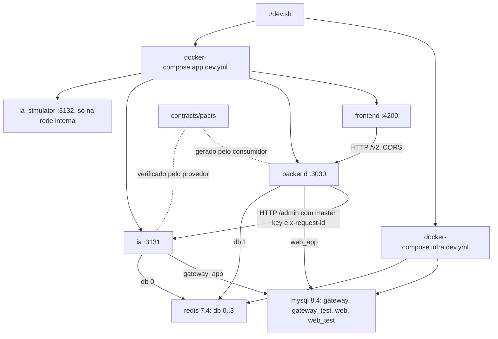

# Spec — F01. Fundação: monorepo e ambiente local

**Complexidade:** complex (quatro apps, infraestrutura em containers, dois bancos, contrato entre serviços)

## 1. Visão técnica

**O quê.** Completar os esqueletos dos quatro apps com o que o ambiente local e as features seguintes precisam:
- **Infraestrutura:**
  - dois arquivos compose (infra e apps) numa rede Docker compartilhada, e o `./dev.sh`;
  - MySQL 8 com um schema por serviço e um de teste para cada um, e usuários isolados;
  - Redis 7.4 com bancos lógicos separados.
- **Nos apps de servidor:**
  - módulo de configuração por `.env.<ambiente>`;
  - acesso a dados com Knex (`dbRead`/`dbWrite`) e Redis;
  - migrations e seeds;
  - health checks;
  - request ID W3C;
  - logs com pino.
- **Só no backend:** o CORS e o formato de erro `{ message }`.
- **Só no proxy:** a autenticação da API administrativa por master key.
- **Contratos:** o mecanismo de contratos com Pact em `contracts/`, com o primeiro contrato (o 401 da master key).
- **Testes de integração:** a infraestrutura dos testes de integração do backend e do proxy.

**Por quê.** Todas as features dependem disto:
- F02 e F05 a F18 usam o MySQL e o Redis do proxy;
- F04 e as telas usam o banco do backend e o CORS;
- toda feature que chama o proxy acrescenta um contrato;
- o request ID amarra erro, registro de uso e, no futuro, o Langfuse.

Os nomes e a organização dos arquivos seguem o [CLAUDE.md](../../CLAUDE.md) e o layout que as skills de teste do SDD
esperam (`require('../../src/app')`, `db.getDb({ operation })`, `__tests__/{unit,integration}`).

**Escopo.**

*Incluído:*
- `docker-compose.infra.dev.yml`, `docker-compose.app.dev.yml`, `dev.sh`, `scripts/dev-entrypoint.sh` e o script de init
  do MySQL;
- `config/.env.infra.example` na raiz;
- `config/.env.{development,testing,production}.example` em cada app de servidor;
- **backend:**
  - `loader.js`, `src/config/env.js`, `database.js`, `knexfile.js`, `redis-client.js`, `migrations/` e
    `data/seeds/`;
  - logger;
  - middlewares de request ID, CORS e erro;
  - `GET /health/live` e `GET /health/ready`;
  - o roteador `/v2` vazio;
  - o cliente da API administrativa do proxy;
  - o helper de UUID;
- **proxy (`apps/ia`):**
  - os mesmos módulos de configuração, dados, logger, request ID e health;
  - a autenticação de `/admin/*`;
  - o formato de erro `{ error: { message, type, code } }`;
  - o helper de UUID;
- **simulador:** configuração, logger e `GET /health/live`;
- **frontend:** `environment.ts`/`environment.prod.ts` (URL do backend) e o script `start:docker`;
- Dockerfiles de desenvolvimento dos quatro apps, com recarga automática em bind mount;
- **Pact:**
  - consumidor no backend, que gera `contracts/pacts/ai-gateway-backend-ai-gateway-ia.json`;
  - verificação no proxy;
  - a prova negativa de que uma mudança no proxy quebra a verificação;
- **harness de integração:**
  - `__tests__/utils/test-setup` e `query-counter` no backend;
  - `test-setup` no proxy;
  - a guarda contra chamadas aos provedores reais;
  - `migrations:test`;
- **chaves dos provedores:**
  - `OPENAI_API_KEY`/`GEMINI_API_KEY` saem do `.env` raiz para `apps/ia/.env.development`;
  - o `.env.example` raiz é removido.

*Pré-requisito, fora do `implement-feature` (ver §3, "Gates"):* uma rodada da `gate-builder` **antes** da implementação,
que:
- acrescenta `tests-integration-backend` e `tests-integration-ia` na cadeia padrão;
- separa os testes unitários e de contrato dos de integração nos gates `tests-*`;
- faz o `tests-backend` conferir o pact sem regravar o arquivo versionado.

Nessa rodada, os dois gates novos ainda não têm teste nem infraestrutura para provar falha → passa. Por isso entram no
`GATES.md` marcados como **ainda não provados**. Depois da implementação, uma segunda rodada curta da `gate-builder`
faz a prova e registra a data, antes do `evaluator`.

*Contratos de saída (Fornece, PRD §8 Fundação):*
- os apps e as ferramentas da raiz;
- os composes, o `./dev.sh` e as migrations;
- os health checks e o middleware de request ID;
- o CORS do backend;
- a autenticação por master key;
- o mecanismo de contratos;
- os gates de todos os apps.

*Fora do escopo:*
- tabelas de produto: o catálogo é F02, os usuários e a cópia dos domínios são F04, o `dr_domain` é F05;
- login, JWT e o `__tests__/utils/auth.js` com `generateToken` (F04);
- o tratamento de erro e o shell do frontend (F04);
- o pacote `examples/`, que fica com a F11 (ver §3);
- compose e imagens de produção, e o pm2. O `npm run prod` de cada app funciona a partir do build, mas não há ambiente
  de produção;
- conclusão do harness e2e e o gate `visual-frontend` (F04).

## 2. Impacto na arquitetura



Pipeline HTTP do backend, nesta ordem:
1. request ID;
2. log (pino-http);
3. CORS;
4. JSON body;
5. `/health`;
6. `/v2`;
7. 404;
8. erro.

No proxy, a ordem é:
1. request ID;
2. log;
3. JSON body;
4. `/health`;
5. `/admin` com a autenticação;
6. 404;
7. erro.

O request ID vem primeiro para que toda resposta, inclusive as de erro e as recusas do CORS, leve o header.

## 3. Decisões técnicas

| Decisão | Abordagem escolhida | Alternativa considerada | Trade-off |
|---|---|---|---|
| Contratos backend ↔ proxy | **Pact v15, DSL `PactV3`.** O teste do backend (consumidor) gera o pact em `contracts/pacts/`, e o proxy o verifica com o `Verifier` contra o app real. A `PactV3` mescla as interações de todos os arquivos consumidores no mesmo pact, e mesclaria também com o arquivo antigo. Por isso o pact é zerado **uma vez por execução**, fora dos arquivos de teste: o script `test:contracts` roda `__tests__/utils/reset-pacts.js` (que apaga os pacts do backend em `PACT_DIR`) e depois a suíte inteira de `__tests__/contracts` em série (`--runInBand`). Cada feature acrescenta o seu arquivo consumidor, e as interações de todos se somam no mesmo pact. O diretório de saída vem de `PACT_DIR`, com padrão `contracts/pacts`, para que o gate possa gerar numa pasta temporária e comparar com o versionado | JSON próprio + ajv | Dependência com binário nativo e mais conceitos (matchers, provider states), em troca do modelo consumer-driven que o PRD descreve |
| Gates | A rodada da `gate-builder` é **pré-requisito do `implement-feature`**, e não um passo do plano, porque o implementador não altera gates. Essa rodada: (1) cria `tests-integration-backend` (`npm run test:integration` do backend, disparado por mudança em `apps/backend/`) e `tests-integration-ia` (`test:integration` + `test:contracts` do proxy, disparado por mudança em `apps/ia/` **ou** em `contracts/**`), os dois **na cadeia padrão**, falhando com instruções quando o MySQL ou o Redis não responde e com uma válvula `INTEGRATION_SKIP=1` com banner; (2) restringe a parte com `--findRelatedTests` e cobertura do `tests-backend` e do `tests-monorepo` a `__tests__/unit`; os contratos do backend rodam **só** pelo item (3); (3) faz o `tests-backend`, sempre que muda algo em `apps/backend/` ou em `contracts/pacts/**`, rodar o `test:contracts` **inteiro** com `PACT_DIR` numa pasta temporária, e falhar se o pact gerado diferir do versionado. A comparação é semântica: interações indexadas pela descrição, ignorando a ordem e os metadados de versão. O `--findRelatedTests` não vale para essa parte, porque um subconjunto geraria um pact parcial, e o gate não regrava arquivo. O gate de integração de um app roda cada parte só quando a pasta dela existe: `test:integration` com `__tests__/integration`, e `test:contracts` com `__tests__/contracts`. Sem nenhuma das duas, é no-op. Os scripts não usam `--passWithNoTests`, então uma pasta que existe sem testes faz o gate falhar. Disparo por `contracts/**` roda a parte de contratos do proxy. Os dois gates nascem marcados como ainda não provados (§1) | Deixar a mudança de gates para o fim da implementação | A ordem garante que os gates declarados no contrato existem quando o `implement-feature` e o `evaluator` rodam |
| Senhas da infraestrutura | `.env.infra` na raiz, ignorado pelo Git; modelo em `config/.env.infra.example`. O `dev.sh` passa o arquivo ao compose de infra com `--env-file`. Cada app repete a própria senha no `.env.development`, e o `dev.sh` confere que batem, sem imprimi-las | Senhas fixas de desenvolvimento no compose | Mais um arquivo para preencher, mas nenhuma senha versionada |
| Testes do proxy com banco | Gate `tests-integration-ia` (`apps/ia/__tests__/integration` e `__tests__/contracts`), no molde do `tests-integration-backend`. A skill `monorepo-unit-test-writer` só cobre unit, então o `implement-feature` escreve esses testes pelo fallback | Só unit com mocks | Sem ele, as cotas atômicas no Redis (F13) e o uso (F10) não teriam teste contra o banco real |
| `examples/` | Fica para a F11 | Criar o pacote vazio na F01 (lista de fundação do PRD) | Desvio consciente: um pacote vazio não tem o que os gates verifiquem |
| Exports e carregamento no backend | `src/app.js` exporta com `module.exports = app`. `loader.js`, `src/config/env.js`, `knexfile.js`, `database.js`, `redis-client.js` e as migrations em CommonJS. O resto de `src/` segue em ESM via Babel | Tudo em ESM via Babel | O CLI do knex carrega o knexfile sem Babel, e os testes de integração fazem `require('../../src/app')` |
| Localização do `.env` | O loader lê `.env.${NODE_ENV}` do diretório de trabalho. Os scripts npm, o Jest e os containers sempre rodam com o app como diretório de trabalho, então a mesma regra vale para o código-fonte e para o `dist/` | Caminho relativo ao arquivo do loader | Com o caminho relativo ao arquivo, o loader compilado em `dist/` procuraria o `.env` dentro de `dist/` |
| Build do backend | O script `build` passa a compilar também os módulos da raiz (`loader`, `database`, `knexfile`, `redis-client`) para `dist/`, para que o `npm run prod` rode a partir do build | Manter só `index.js` e `src/` | O build atual deixaria o `prod` quebrado no primeiro `require` |
| Validação da configuração | `src/config/env` monta um objeto congelado a partir do ambiente (com `nodeEnv`). Variável **vazia conta como ausente**. `assertConfig()` **lança** um erro com o nome da primeira variável inválida, e o `index` o captura, loga a linha e sai com código 1 | Validar e encerrar no import do módulo | Testes unitários importam o app sem precisar de segredos. O critério "não sobe sem a variável" fica no ponto de entrada |
| Fuso do MySQL | Sessão em UTC (`timezone: 'Z'` no mysql2 e `SET time_zone = '+00:00'` no `afterCreate` do pool). As features convertem para Brasília quando a regra pedir | Sessão fixa no fuso de Brasília | O PRD mistura limites em Brasília (cota diária, F13) e em UTC (budget). Gravar em UTC evita ambiguidade |
| Health do MySQL sem SQL raw | O `ready` consulta, pelo builder, o `information_schema.SCHEMATA` do próprio schema do app | `SELECT 1` com `raw` | O gate `raw-sql-backend` barraria o `raw`. A consulta ainda confirma que o usuário enxerga o próprio schema |
| Request ID | Aceita `^[0-9a-f]{32}$`, mas recusa o valor só de zeros, que o W3C Trace Context declara inválido | Aceitar qualquer valor de 32 hex minúsculos | Vai um passo além da letra do PRD para que o ID sirva como trace ID do Langfuse |
| CORS | `Origin` diferente de `FRONTEND_ORIGIN` → 403 `{ message }`, sem `Access-Control-Allow-Origin`. Sem `Origin` (curl, healthcheck, servidor), segue | Só omitir os headers CORS (pacote `cors` puro) | A recusa fica observável no servidor, além do bloqueio do navegador |
| Logs | pino + pino-http no backend e no proxy, com o `req.id`, nível de `config.logLevel`, desligados quando `config.nodeEnv` é `testing`. Mensagens de log em inglês | Sem logger até precisar | Base do "erro registrado com o request ID" das features seguintes. O logger lê o `config`, não o `process.env` (`env-only-in-config`) |
| Redis | Cliente `redis` 4 singleton, conexão preguiçosa e listener de `error` que só loga, para que uma queda do Redis vire 503 no `ready` em vez de derrubar o processo | Sem listener | Sem ele, o `ready` não teria como reportar o Redis parado |
| Dockerfiles e recarga | Só o estágio `development`: código por bind mount, `node_modules` em volume nomeado, `npm ci` só quando o hash do lockfile muda. Recarga com polling, porque o bind mount do Docker Desktop no Windows não propaga eventos de arquivo: `nodemon --legacy-watch` no backend, `ts-node-dev --poll` no proxy e no simulador, `ng serve --poll 2000` no frontend | Multi-stage com produção | Produção sem alvo de deploy seria código sem uso. Entra quando houver ambiente |
| Variáveis de features futuras | A F01 já declara e exige as variáveis que o PRD lista na Experiência da F01: `JWT_SECRET`, `KEY_ENCRYPTION_KEY`, `PLATFORM_ADMIN_EMAIL`/`PASSWORD` e as chaves dos provedores. As regras de conteúdo delas (senha do admin) são da feature que as usa | Cada feature acrescenta as suas | O desenvolvedor preenche tudo uma vez |
| Modelos `.env.*.example` | Nomes de todas as variáveis, com valores de exemplo só para o que não é segredo (hosts, portas, nomes de schema, número do banco Redis) e segredos vazios. O `CLAUDE.md` é atualizado para dizer isso | Só nomes | Mostra a diferença entre `development` e `testing` sem expor segredo |
| Cliente da API administrativa | Na F01, o módulo exporta só a fábrica `createIaGatewayClient` e o `GatewayError`. A instância configurada nasce na primeira feature que chama o proxy (F07) | Exportar também a instância padrão | Uma instância sem uso seria acusada pelo `deadcode` |

## 4. Componentes

### Raiz

| Arquivo | Novo/Modificado | Propósito | Responsabilidades |
|---|---|---|---|
| `docker-compose.infra.dev.yml` | Novo | MySQL e Redis | Imagens `mysql:8.4` e `redis:7.4-alpine` **fixadas por digest**. Portas `127.0.0.1:3306` e `127.0.0.1:6379`. Volume nomeado do MySQL e o init script. Redis com `requirepass ${REDIS_PASSWORD}` e sem persistência. Variáveis interpoladas a partir do `--env-file .env.infra`. Healthchecks: `mysqladmin ping -h 127.0.0.1 --protocol=tcp` com a senha do root pelo ambiente (o servidor temporário do init escuta só no socket, então o TCP só responde depois do init); `redis-cli` com `REDISCLI_AUTH`, exigindo `PONG`. Rede externa `ai-gateway-dev-net`; projeto `ai-gateway-infra` |
| `docker-compose.app.dev.yml` | Novo | Os quatro apps | `target: development` e código por bind mount. `node_modules` em volume nomeado por app. `scripts/dev-entrypoint.sh` montado só leitura em `/usr/local/bin/dev-entrypoint.sh`. Nos três apps de servidor, `env_file: apps/<app>/.env.development`, e o `environment` sobrescreve `API_HOST=0.0.0.0`, `DB_HOST=mysql`, `REDIS_HOST=redis` e `GATEWAY_URL=http://ia:3131`. Portas `127.0.0.1:4200`, `:3030` e `:3131`; o `ia_simulator` sem `ports`. Healthchecks pelos endpoints de health (`node -e` com `fetch`). Comandos `start:docker`/`dev:docker`. Projeto `ai-gateway-app`, rede externa `ai-gateway-dev-net` |
| `dev.sh` | Novo | Subir e derrubar tudo | Confere que o Docker responde, e que `.env.infra` e os três `apps/<app>/.env.development` existem (lista os que faltam, com o comando de cópia). Confere que as senhas de banco e Redis dos apps batem com as do `.env.infra`, nomeando a variável e sem imprimir valores. Cria a rede, sobe a infra com `--env-file .env.infra --wait`, aplica as migrations do backend e do proxy em containers avulsos, sobe os apps com `--wait` e imprime os endereços. `--infra` sobe só a infraestrutura (rede, MySQL e Redis), exigindo apenas o `.env.infra`, e serve para os testes de integração, que rodam fora dos containers. `--down` derruba os apps e a infra, mantendo os volumes. Argumento desconhecido → uso e código 2. Usa `MSYS_NO_PATHCONV=1` nos comandos com caminho de container, por causa do Git Bash |
| `scripts/dev-entrypoint.sh` | Novo | Entrypoint dos containers de app | Roda `npm ci` só quando o hash de `package-lock.json` (e do `.npmrc`, se houver) difere do guardado no volume de `node_modules`; depois executa o comando do container |
| `infra/mysql/init/01-schemas-and-users.sh` | Novo | Init do MySQL | Cria `gateway`, `gateway_test`, `web` e `web_test` (utf8mb4, `utf8mb4_0900_ai_ci`). Cria `gateway_app` com todas as permissões só em `gateway.*` e `gateway_test.*`, e `web_app` só em `web.*` e `web_test.*`. Senhas vindas do ambiente do container. Só roda com o volume vazio |
| `config/.env.infra.example` | Novo | Modelo da infra | `MYSQL_ROOT_PASSWORD`, `GATEWAY_DB_PASSWORD`, `WEB_DB_PASSWORD`, `REDIS_PASSWORD`, sem valores |
| `contracts/pacts/ai-gateway-backend-ai-gateway-ia.json` | Novo (gerado) | Contrato backend → proxy | Gerado pelo `npm run test:contracts` do backend e versionado. Lido pela verificação do proxy |
| `contracts/README.md` | Novo | Como o mecanismo funciona | Quem gera, quem verifica, como acrescentar uma interação, como regenerar, e que a pasta é a única lida pelos dois apps |
| `.gitignore` | Modificado | — | Acrescenta `.env.infra` |
| `.env.example` | Removido | — | Substituído pelos modelos por app |
| `.env` (local, não versionado) | Modificado | — | As linhas `OPENAI_API_KEY` e `GEMINI_API_KEY` saem dele e vão para `apps/ia/.env.development`, sem que os valores sejam impressos |
| `README.md`, `CLAUDE.md` | Modificados | Documentação | Como preparar o `.env.infra` e os `.env.*` dos apps, subir com `./dev.sh`, rodar os testes de integração e ler os logs (`docker compose logs`). Como recriar o MySQL depois de trocar senhas: o init só roda com o volume vazio, então é preciso remover o volume, por comando manual. A regra dos modelos `.env.*.example` |

### Backend (`apps/backend`)

| Arquivo | Novo/Modificado | Propósito | Responsabilidades |
|---|---|---|---|
| `loader.js` | Novo | Carregar o `.env` | Lê `.env.${NODE_ENV}` (padrão `development`) do diretório de trabalho. Não sobrescreve variáveis já definidas, então o compose prevalece |
| `src/config/env.js` | Novo | Configuração | Requer o `loader`. Exporta `config`, objeto congelado com `nodeEnv` e padrões para o que não é segredo, e `assertConfig()`. Ela lança erro com o nome da primeira variável ausente, vazia ou inválida: `GATEWAY_MASTER_KEY` e `JWT_SECRET` com menos de 32 caracteres, ou `KEY_ENCRYPTION_KEY` fora de 64 hexadecimais |
| `index.js` | Modificado | Ponto de entrada | Carrega o loader e chama `assertConfig()`. Se ela lançar, loga `Missing or invalid environment variable: <NOME>` (sem valores) e sai com código 1. Sobe o `http` server com o app em `config.port`/`config.apiHost` |
| `src/app.js` | Modificado | Pipeline Express | Monta a ordem da §2 e exporta com `module.exports = app` |
| `src/logger/index.js` | Novo | Logger | Instância pino com `config.logLevel`, silenciosa quando `config.nodeEnv` é `testing` |
| `src/middleware/request-id.middleware.js` | Novo | Request ID | Aceita `x-request-id` válido (§3); senão gera 16 bytes aleatórios em hex. Grava em `req.id` e no header `x-request-id` da resposta antes de qualquer outra coisa |
| `src/middleware/cors.middleware.js` | Novo | CORS | Libera só `config.frontendOrigin`. Métodos GET, POST, PUT, PATCH e DELETE; headers permitidos `Authorization`, `Content-Type` e `x-request-id`; header exposto `x-request-id`. Preflight permitido → 204. `Origin` não permitido → 403 `{ message }` sem headers CORS |
| `src/middleware/error-handler.middleware.js` | Novo | 404 e erros | 404 `{ message: 'Rota não encontrada.' }`; JSON inválido → 400 `{ message: 'JSON inválido.' }`; qualquer outro erro → 500 `{ message: 'Erro interno. Tente novamente.' }`, registrado no log com o `req.id` e sem stack na resposta |
| `src/routes/health.routes.js` | Novo | Rotas de health | `GET /health/live` e `GET /health/ready`, fora do `/v2` e sem autenticação |
| `src/controllers/health.controller.js` | Novo | Handlers de health | Monta o formato da §5 a partir do service |
| `src/services/health.service.js` | Novo | Checagens | MySQL: consulta pelo builder ao `information_schema.SCHEMATA` do schema configurado. Redis: `PING`. Timeout de 2 s por checagem, as duas em paralelo |
| `src/api/v2/index.js` | Novo | Montagem do `/v2` | Roteador vazio montado em `/v2`; as features penduram os recursos aqui |
| `src/services/ia-gateway.client.js` | Novo | Cliente da API administrativa do proxy | Exporta `createIaGatewayClient({ baseUrl, masterKey, timeoutMs })`, que devolve `adminRequest({ method, path, body, requestId })`, e o `GatewayError`. Envia `Authorization: Bearer <masterKey>` (omitido sem chave) e o `x-request-id` recebido. Resposta 2xx → `{ status, body, requestId }`. Fora disso, lança `GatewayError` com `status`, `code` (`body.error.code`), `message` e `requestId` (header da resposta). Rede ou timeout → `GatewayError` 503 `gateway_unreachable` |
| `src/utils/uuid.utils.js` | Novo | UUID ↔ `BINARY(16)` | `uuidToBin` aceita os três formatos do `IS_UUID()` do MySQL (32 hex, `8-4-4-4-12` e `{8-4-4-4-12}`) e lança `TypeError('Invalid UUID')`, sem ecoar a entrada, para qualquer outro valor, inclusive `null`/`undefined`. `binToUuid` devolve minúsculo com hífens, e `null` para `null` |
| `database.js` | Novo | Acesso a dados | Singleton com `dbRead` e `dbWrite` (duas instâncias knex no mesmo MySQL) e `getDb(op)`, que aceita `'read'`, `'write'` ou `{ operation }` (padrão `write`). Pool com sessão em UTC e `destroy()` para os testes |
| `knexfile.js` | Novo | Config do CLI do knex | Exporta **só** a configuração do ambiente carregado (`NODE_ENV`), a partir de `config`. Assim, `cross-env NODE_ENV=testing knex migrate:latest` vai sempre para o banco de teste. Migrations em `migrations/`, seeds em `data/seeds/` |
| `redis-client.js` | Novo | Redis | Singleton do cliente `redis` 4 com `REDIS_HOST/PORT/PASSWORD/DB` e nome de cliente `ai-gateway-backend` (visível no `CLIENT LIST`). Conexão preguiçosa, listener de `error` e `ping()`/`quit()` |
| `migrations/.gitkeep`, `data/seeds/.gitkeep` | Novos | Pastas do knex | A F01 não cria tabelas |
| `config/.env.{development,testing,production}.example` | Novos | Modelos | Todas as variáveis da §5, segundo a regra dos modelos (§3). O `testing` aponta para `127.0.0.1`, `web_test` e o Redis db 3 |
| `jest.config.js` | Modificado | Testes | `testTimeout` maior para os testes de integração. O resto continua; a separação unit/integração é do gate (§3) e dos scripts |
| `__tests__/setupTests.js` | Modificado | Ambiente de teste | Continua forçando `NODE_ENV=testing`, então o loader lê `.env.testing` |
| `__tests__/utils/reset-pacts.js` | Novo | Preparo dos contratos | Apaga os pacts do backend em `PACT_DIR` (padrão `contracts/pacts`). Roda uma vez, antes da suíte de contratos, pelo script `test:contracts` |
| `package.json` | Modificado | Dependências e scripts | Deps: knex ^3.1, mysql2 ^3.12, redis ^4.7, cors ^2.8, dotenv ^16.5, pino ^9.7, pino-http ^10.5. Dev: @pact-foundation/pact ^15. Scripts: `test:unit`; `test:contracts`; `test:integration`, que roda `migrations:test` antes; `migrations:{dev,test,prod}` com `cross-env NODE_ENV=…`; `migration:add`; `seed:{dev,run}`. `dev` e `start:docker` com `nodemon --legacy-watch`. `build` inclui os módulos da raiz (§3) |

### Proxy (`apps/ia`)

| Arquivo | Novo/Modificado | Propósito | Responsabilidades |
|---|---|---|---|
| `loader.ts`, `src/config/env.ts`, `index.ts` | Novo/Novo/Modificado | Configuração | Mesmo desenho do backend, com as variáveis do proxy (§5) |
| `src/app.ts` | Modificado | Pipeline Express | A ordem da §2 |
| `src/logger/index.ts` | Novo | Logger | Igual ao do backend |
| `src/middleware/request-id.middleware.ts` | Novo | Request ID | Mesma regra do backend |
| `src/lib/api-error.ts` | Novo | Formato de erro | Monta `{ error: { message, type, code } }` com o `type` derivado do status (400 `invalid_request_error`, 401 `authentication_error`, 404 `invalid_request_error`, 500 `server_error`). As features acrescentam os demais |
| `src/middleware/admin-auth.middleware.ts` | Novo | Master key | Lê `Authorization: Bearer <chave>` e compara os SHA-256 da chave recebida e da configurada com `crypto.timingSafeEqual`. Ausente ou diferente → 401 `invalid_admin_key` |
| `src/routes/admin.routes.ts` | Novo | Montagem de `/admin` | Roteador com a autenticação na frente. Sem endpoints na F01: com a chave certa, qualquer caminho → 404 `not_found` |
| `src/middleware/error-handler.middleware.ts` | Novo | 404 e erros | 404 `not_found`, JSON inválido → 400 `invalid_request`, erro → 500 `internal_error`, todos no formato do proxy e registrados com o `req.id` |
| `src/routes/health.routes.ts`, `src/controllers/health.controller.ts`, `src/services/health.service.ts` | Novos | Health | Iguais aos do backend, contra o schema `gateway` e o Redis db 0 |
| `src/utils/uuid.utils.ts` | Novo | UUID ↔ `BINARY(16)` | Mesmo contrato do backend (o `dr_domain` é do proxy, F05) |
| `database.ts`, `knexfile.ts`, `redis-client.ts` | Novos | Dados | Mesmo desenho do backend. O knexfile exporta só o ambiente carregado, e o cliente Redis se identifica como `ai-gateway-ia` |
| `migrations/.gitkeep`, `data/seeds/.gitkeep` | Novos | Pastas do knex | Migrations em TypeScript |
| `config/.env.{development,testing,production}.example` | Novos | Modelos | O `testing` aponta para `gateway_test`, o Redis db 2 e chaves de provedor fictícias |
| `jest.config.js` | Modificado | Testes | `setupFiles` com `__tests__/setupTests.ts`, e `testTimeout` maior para integração e contrato |
| `__tests__/setupTests.ts` | Novo | Ambiente de teste | Força `NODE_ENV=testing` e instala a guarda contra provedores: rejeita `fetch`, `http.request`/`get` e `https.request`/`get` para `api.openai.com` e `generativelanguage.googleapis.com` com um erro que nomeia o host |
| `package.json` | Modificado | Dependências e scripts | Deps: knex, mysql2, redis, dotenv, pino, pino-http. Dev: @pact-foundation/pact ^15, ts-node e os `@types` necessários. Scripts: `dev`, e `dev:docker` com `ts-node-dev --respawn --poll`. `test` e `test:coverage` passam a rodar só `__tests__/unit`, para que o `npm test` da raiz continue sem exigir banco; `test:unit`, `test:contracts` e `test:integration` (com `migrations:test`) ficam ao lado. `migrations:{dev,test,prod}`, `migration:add` e `seed:{dev,run}` rodam `node -r ts-node/register node_modules/knex/bin/cli.js …`: o caminho do JS do CLI funciona no Windows, onde `node_modules/.bin/knex` é um shim de shell, e o uso do `ts-node` fica explícito |

### Simulador (`apps/ia_simulator`)

| Arquivo | Novo/Modificado | Propósito | Responsabilidades |
|---|---|---|---|
| `loader.ts`, `src/config/env.ts`, `index.ts` | Novo/Novo/Modificado | Configuração | `PORT` (padrão 3132), `API_HOST` e `LOG_LEVEL`, sem segredos |
| `src/app.ts`, `src/logger/index.ts`, `src/routes/health.routes.ts`, `src/controllers/health.controller.ts` | Modificado/Novos | Health | `GET /health/live` → 200 `{ "status": "ok" }` |
| `config/.env.{development,testing,production}.example` | Novos | Modelos | — |
| `package.json` | Modificado | Scripts | `dev:docker` com `ts-node-dev --respawn --poll` |

### Frontend (`apps/frontend`)

| Arquivo | Novo/Modificado | Propósito | Responsabilidades |
|---|---|---|---|
| `src/environments/environment.ts`, `environment.prod.ts` | Novos | URL do backend | `production` e `apiUrl` (`http://127.0.0.1:3030/v2`). Sem segredo, então versionados |
| `angular.json` | Modificado | Build | `fileReplacements` da configuração `production` |
| `src/main.ts` | Modificado | Bootstrap | `enableProdMode()` quando `environment.production`, o que também mantém o environment em uso para o `deadcode` |
| `package.json` | Modificado | Script | `start:docker`: `ng serve --host 0.0.0.0 --port 4200 --poll 2000` |
| `Dockerfile` | Novo | Container de dev | Estágio `development` da imagem Node fixada por digest. **Copia o `.npmrc`** (legacy-peer-deps) para o `npm ci` funcionar |

Os Dockerfiles do backend, do `ia` e do `ia_simulator` seguem o mesmo molde de estágio único.

### Banco de dados

| Migration | Tabelas | Operação | Notas |
|---|---|---|---|
| — | `knex_migrations`, `knex_migrations_lock` | criadas pelo knex | A F01 não cria tabelas de produto. Os schemas e os usuários vêm do init do MySQL, não de migration |

## 5. Contratos de API

### Configuração (variáveis de ambiente)

Obrigatória = presente e não vazia.

| App | Variável | Obrigatória | Regra | Padrão |
|---|---|---|---|---|
| backend | `PORT` / `API_HOST` | não | — | `3030` / `127.0.0.1` |
| backend | `FRONTEND_ORIGIN` | não | URL de origem | `http://127.0.0.1:4200` |
| backend | `DB_HOST`, `DB_PORT`, `DB_USER`, `DB_PASSWORD`, `DB_NAME` | sim (exceto a porta) | — | porta `3306` |
| backend | `REDIS_HOST`, `REDIS_PORT`, `REDIS_PASSWORD`, `REDIS_DB` | sim (exceto a porta) | `REDIS_DB` inteiro de 0 a 15 | porta `6379` |
| backend | `GATEWAY_URL` | sim | URL | — |
| backend | `GATEWAY_TIMEOUT_MS` | não | inteiro > 0 | `10000` |
| backend | `GATEWAY_MASTER_KEY` | sim | ≥ 32 caracteres | — |
| backend | `JWT_SECRET` | sim | ≥ 32 caracteres | — |
| backend | `KEY_ENCRYPTION_KEY` | sim | 64 caracteres hexadecimais (32 bytes, AES-256-GCM) | — |
| backend | `PLATFORM_ADMIN_EMAIL`, `PLATFORM_ADMIN_PASSWORD` | sim | presença (as regras de conteúdo são da F04) | — |
| backend | `LOG_LEVEL` | não | nível pino | `info` |
| ia | `PORT` / `API_HOST` | não | — | `3131` / `127.0.0.1` |
| ia | `DB_*`, `REDIS_*` | sim | como no backend | — |
| ia | `GATEWAY_MASTER_KEY` | sim | ≥ 32 caracteres | — |
| ia | `OPENAI_API_KEY`, `GEMINI_API_KEY` | sim | — | — |
| ia | `LOG_LEVEL` | não | — | `info` |
| ia_simulator | `PORT` / `API_HOST` / `LOG_LEVEL` | não | — | `3132` / `127.0.0.1` / `info` |

**Bancos por ambiente:**

| | backend (`web_app`) | proxy (`gateway_app`) |
|---|---|---|
| `development` | `web`, Redis db 1 | `gateway`, Redis db 0 |
| `testing` | `web_test`, Redis db 3 | `gateway_test`, Redis db 2 |

**Validação na partida:**
- Variável ausente, vazia ou inválida → o processo não sobe, sai com código 1 e loga uma linha com o nome dela:
  `Missing or invalid environment variable: GATEWAY_MASTER_KEY`.
- **O valor nunca é logado.**
- Nos containers de desenvolvimento, o `nodemon`/`ts-node-dev` mantém o processo pai vivo depois da queda. Lá o
  sintoma é o container `unhealthy`, e a linha aparece em `docker compose logs`.

### Backend: `GET /health/live`

- **Autenticação:** nenhuma.
- **Resposta 200:** `{ "status": "ok" }`.

### Backend: `GET /health/ready`

- **Autenticação:** nenhuma.

**Resposta 200:**
```json
{ "status": "ok", "checks": { "mysql": "ok", "redis": "ok" } }
```

**Resposta 503** (qualquer checagem falhou ou passou de 2 s):
```json
{
  "message": "Serviço indisponível.",
  "status": "unavailable",
  "checks": { "mysql": "fail", "redis": "ok" }
}
```

### Backend: comportamento transversal

| Situação | Status | Corpo | Headers |
|---|---|---|---|
| Qualquer resposta | — | — | `x-request-id: <32 hex>`, igual ao recebido se válido |
| Rota inexistente | 404 | `{ "message": "Rota não encontrada." }` | — |
| JSON inválido | 400 | `{ "message": "JSON inválido." }` | — |
| Erro não tratado | 500 | `{ "message": "Erro interno. Tente novamente." }` | — |
| Preflight de `FRONTEND_ORIGIN` | 204 | vazio | `Access-Control-Allow-Origin: <origem>`, `Access-Control-Allow-Headers: Authorization, Content-Type, x-request-id`, `Access-Control-Allow-Methods: GET,POST,PUT,PATCH,DELETE` |
| Requisição de `FRONTEND_ORIGIN` | — | — | `Access-Control-Allow-Origin: <origem>`, `Access-Control-Expose-Headers: x-request-id` |
| Requisição com outro `Origin` | 403 | `{ "message": "Origem não permitida." }` | sem headers CORS |

### Proxy: `GET /health/live` e `GET /health/ready`

Mesmo formato do backend, mas sem `message` no 503:
```json
{ "status": "unavailable", "checks": { "mysql": "ok", "redis": "fail" } }
```

Health não faz parte da API compatível com a OpenAI, então **é a única exceção** ao formato de erro do proxy.

### Proxy: autenticação de `/admin/*`

- **Autenticação:** `Authorization: Bearer <GATEWAY_MASTER_KEY>`.

**Resposta 401** (chave ausente, malformada ou diferente):
```json
{
  "error": {
    "message": "Chave administrativa ausente ou inválida.",
    "type": "authentication_error",
    "code": "invalid_admin_key"
  }
}
```

**Resposta 404** (chave certa, caminho sem endpoint; na F01, todos):
```json
{
  "error": {
    "message": "Rota não encontrada.",
    "type": "invalid_request_error",
    "code": "not_found"
  }
}
```

| Código | Status | Descrição |
|---|---|---|
| `invalid_admin_key` | 401 | master key ausente ou errada (comparação em tempo constante) |
| `not_found` | 404 | rota inexistente |
| `invalid_request` | 400 | JSON inválido |
| `internal_error` | 500 | erro não tratado |

Toda resposta do proxy leva `x-request-id`, com a mesma regra do backend.

### Contrato Pact (primeiro)

- **Consumidor:** `ai-gateway-backend`. **Provedor:** `ai-gateway-ia`.
- **Arquivo:** `contracts/pacts/ai-gateway-backend-ai-gateway-ia.json`.

| Interação | Request | Response esperada |
|---|---|---|
| sem master key | `GET /admin/domains`, `x-request-id: 4bf92f3577b34da6a3ce929d0e0e4736`, sem `Authorization` | 401; `x-request-id` igual ao enviado; `Content-Type` JSON; `error.code = "invalid_admin_key"`; `error.type = "authentication_error"`; `error.message` qualquer texto |
| master key errada | igual, com `Authorization: Bearer <chave errada de 40 caracteres>` | igual |

O consumidor exercita as duas interações pelo cliente (`createIaGatewayClient`): sem chave na primeira e com a chave
errada na segunda.

O `GET /admin/domains` é criado no proxy pela F05, e é o primeiro endpoint que o backend vai chamar, a partir da F07.
Como a autenticação vem antes do roteamento, o 401 já vale na F01.

## 6. Modelo de dados

**Schemas e usuários (init do MySQL):**

| Schema | Charset | Usuário com acesso | Usado por |
|---|---|---|---|
| `gateway` | utf8mb4 / `utf8mb4_0900_ai_ci` | `gateway_app` | proxy, desenvolvimento |
| `gateway_test` | idem | `gateway_app` | proxy, testes de integração |
| `web` | idem | `web_app` | backend, desenvolvimento |
| `web_test` | idem | `web_app` | backend, testes de integração |

**Grants:**
- `gateway_app@'%'` tem `ALL PRIVILEGES` em `gateway.*` e `gateway_test.*`, e nada mais;
- `web_app@'%'` tem `ALL PRIVILEGES` em `web.*` e `web_test.*`, e nada mais;
- nenhum dos dois tem privilégio global.

**Redis:**

| Banco lógico | Dono |
|---|---|
| 0 | proxy, desenvolvimento |
| 1 | backend, desenvolvimento |
| 2 | proxy, testes |
| 3 | backend, testes |

**Convenções para as features seguintes:**
- Migrations Knex nomeadas `YYYYMMDDHHMMSS_descricao`, com `up` e `down` e guardas `hasTable`/`hasColumn`.
- Nenhuma chave estrangeira entre schemas.
- UUIDs em `BINARY(16)` convertidos pelos helpers `uuidToBin`/`binToUuid`.
- Datas gravadas em UTC.

## 7. Estratégia de testes

Os testes unitários espelham `src/` (regra das skills de teste).

| Arquivo | Tipo | Alvo | Gate |
|---|---|---|---|
| `apps/backend/__tests__/unit/app.test.js` | Unit | pipeline completo, 404/400 e montagem do `/v2` | `tests-backend` |
| `apps/backend/__tests__/unit/config/env.test.js` | Unit | `config` e `assertConfig` | `tests-backend` |
| `apps/backend/__tests__/unit/logger/index.test.js` | Unit | nível e silêncio em `testing` | `tests-backend` |
| `apps/backend/__tests__/unit/middleware/request-id.middleware.test.js` | Unit | request ID | `tests-backend` |
| `apps/backend/__tests__/unit/middleware/cors.middleware.test.js` | Unit | CORS | `tests-backend` |
| `apps/backend/__tests__/unit/middleware/error-handler.middleware.test.js` | Unit | erros | `tests-backend` |
| `apps/backend/__tests__/unit/controllers/health.controller.test.js` | Unit | formato das respostas de health | `tests-backend` |
| `apps/backend/__tests__/unit/services/health.service.test.js` | Unit | checagens com MySQL e Redis mockados | `tests-backend` |
| `apps/backend/__tests__/unit/services/ia-gateway.client.test.js` | Unit | cliente com `fetch` mockado | `tests-backend` |
| `apps/backend/__tests__/unit/utils/uuid.utils.test.js` | Unit | helpers de UUID | `tests-backend` |
| `apps/backend/__tests__/contracts/ia-admin-auth.contract.test.js` | Contrato (consumidor) | gera o pact | `tests-backend` |
| `apps/backend/__tests__/integration/health.test.js` | Integração | `/health/*` com MySQL e Redis de teste | `tests-integration-backend` |
| `apps/backend/__tests__/integration/database-isolation.test.js` | Integração | grants do `web_app` | `tests-integration-backend` |
| `apps/ia/__tests__/unit/**`, espelhando `src/` | Unit | config, logger, request ID, auth da master key, erro, health, UUID | `tests-monorepo` |
| `apps/ia/__tests__/unit/setup-tests.guard.test.ts` | Unit | a guarda de provedores recusa os dois hosts | `tests-monorepo` |
| `apps/ia/__tests__/contracts/backend.provider.test.ts` | Contrato (provedor) | verifica o pact contra o app e a prova negativa | `tests-integration-ia` |
| `apps/ia/__tests__/integration/health.test.ts` | Integração | `/health/*` contra `gateway_test` e o Redis db 2 | `tests-integration-ia` |
| `apps/ia/__tests__/integration/database-isolation.test.ts` | Integração | grants do `gateway_app` | `tests-integration-ia` |
| `apps/ia_simulator/__tests__/unit/**`, espelhando `src/` | Unit | config, logger, health | `tests-monorepo` |
| `apps/frontend/src/app/app.component.spec.ts` | Unit | já existe | `tests-frontend` |

**Funções principais:**

| Teste | Descrição | Asserções |
|---|---|---|
| `should echo a valid incoming x-request-id` | header válido | resposta com o mesmo valor |
| `should replace an invalid x-request-id` | maiúsculas, 31 chars, só zeros, ausente | header novo com `^[0-9a-f]{32}$`, diferente do enviado |
| `should set x-request-id on 404, 400 and 403 responses` | erros também levam o ID | header presente |
| `should allow the configured frontend origin` | preflight e GET de `FRONTEND_ORIGIN` | 204/200, `Access-Control-Allow-Origin`, `Access-Control-Expose-Headers: x-request-id` |
| `should refuse another origin with 403` | `Origin: http://evil.example` | 403 `{ message }`, sem `Access-Control-Allow-Origin` |
| `should let requests without Origin through` | curl e healthcheck | 200 |
| `should report the first missing variable` | `assertConfig` sem `GATEWAY_MASTER_KEY` e com ela vazia | lança com o nome da variável; o valor não aparece |
| `should reject a short master key or JWT secret` | 31 caracteres | erro com o nome |
| `should reject a malformed KEY_ENCRYPTION_KEY` | 63 hex, não hex | erro com o nome |
| `should return 503 when MySQL fails` | builder rejeita | 503, `checks.mysql = "fail"` |
| `should time out a hanging check after 2 s` | promessa que não resolve (fake timers) | 503 |
| `should send the master key and request id` | cliente | headers enviados; sem chave, sem `Authorization` |
| `should raise GatewayError with code and request id on 401` | cliente | `status`, `code`, `requestId` |
| `should map a network failure to gateway_unreachable` | `fetch` rejeita ou timeout | 503 `gateway_unreachable` |
| `uuidToBin should reject null, undefined and malformed input without echoing it` | helper | `TypeError('Invalid UUID')` |
| `uuidToBin/binToUuid should round-trip the three accepted formats` | helper | 16 bytes; volta minúsculo com hífens |
| `should answer 401 without the master key` / `with a wrong one` (proxy) | auth | 401 `invalid_admin_key` |
| `should compare keys in constant time` (proxy) | auth | `timingSafeEqual` sobre digests de mesmo tamanho (spy) |
| `should answer 404 not_found with the right key` (proxy) | auth | 404 |
| `should refuse requests to the provider hosts` (proxy) | guarda | `fetch` e `https.request` para os dois hosts rejeitam com erro que nomeia o host; outro host não é afetado |
| consumer pact (backend) | duas interações da §5 | o cliente lança `GatewayError` 401 `invalid_admin_key` com o request ID; o pact é escrito em `PACT_DIR` |
| `should satisfy the backend pact` (proxy) | `Verifier` contra o app numa porta efêmera | as duas interações passam |
| `should fail verification when the response drifts` (proxy) | o mesmo pact contra o app atrás de um middleware de teste que troca o `code` do 401, e depois um que remove o `x-request-id` | a verificação falha nos dois casos. É a evidência automática de que uma mudança no proxy quebra o contrato |
| `should report ok with MySQL and Redis up` (integração) | ready real | 200, tudo `ok` |
| `web_app should not read the gateway schema` (integração backend) | `db.getDb({ operation: 'read' })` executa `SHOW TABLES FROM gateway` | rejeita com acesso negado (ER 1044) |
| `gateway_app should not read the web schema` (integração proxy) | idem | ER 1044 |

**Mapa dos critérios de aceite (PRD §9) para os testes:**

| AC | Teste ou verificação |
|---|---|
| 1 (`./dev.sh` e `--down`) | runtime (contrato `OC-01`, `OC-02`) |
| 2 (isolamento MySQL) | `database-isolation` dos dois apps |
| 3 (modelos `.env`) | inspeção (contrato `OC-04`) |
| 4 (portas) | runtime (contrato `OC-05`) |
| 5 (apps independentes) | inspeção (contrato `OC-06`) |
| 6 (variável faltando) | `env.test` dos dois apps + runtime (`OC-07`) |
| 7 (request ID) | testes de request ID dos dois apps |
| 8 (401 em `/admin/*`) | testes de auth do proxy + pact |
| 9 (contrato quebra com mudança) | `should fail verification when the response drifts` |
| 10 (CORS e leitura do header) | testes de CORS + runtime no navegador (`OC-11`) |
| 11 (`npm run gate` e `arch`) | gates (contrato `OC-12`) |
| 12 (nenhuma chamada a provedor) | `should refuse requests to the provider hosts` + a guarda instalada no setup |

**Harness de integração:**
- `apps/backend/__tests__/utils/test-setup.js` exporta `setupTestDatabase()` e `cleanupTestDatabase()`.
  - `setupTestDatabase()` devolve `{ db, user: null, domain: null }`, com `db` = o módulo `database`. A F04 passa a
    criar o usuário e a cópia do domínio de teste, e o `utils/auth.js` com `generateToken`. **Os testes de integração
    da F01 não usam token.**
  - `cleanupTestDatabase()` fecha as conexões de knex e Redis.
- `apps/backend/__tests__/utils/query-counter.js` exporta `countQueries(fn)`, que escuta as instâncias knex do
  `database.js` e devolve `{ count, queries, result }`.
- O proxy tem `apps/ia/__tests__/utils/test-setup.ts` equivalente.

**Integração entre features (PRD §9):** nenhum critério de integração do PRD cita a F01. O contrato Pact é o
mecanismo que as integrações backend → proxy das próximas features (F07, F09 e F11, que passam a chamar o proxy) vão
estender, cada uma com o seu arquivo consumidor.

**Crescimento de consultas (N+1):**
- `GET /health/live`: `not measurable — source not counted` (não consulta o banco).
- `GET /health/ready`: `not measurable — fixed-size result`.

## Premissas e decisões

- **Docker:** o Docker Desktop precisa estar rodando. Em 2026-10-03 ele estava instalado (Compose v5.5.1), mas com o
  daemon parado.
- **Digests das imagens:** são resolvidos na implementação, para as tags `node:22.13.0-alpine`, `mysql:8.4` e
  `redis:7.4-alpine`, e gravados nos composes e Dockerfiles.
- **Porta 3306 do host:** precisa estar livre. Se estiver ocupada, o `./dev.sh` falha com a mensagem do Docker. O PRD
  fixa a porta, então não há variável para trocá-la.
- **Arquivos `.env` locais:** o `implement-feature` cria o `.env.infra` e os `.env.*` locais dos apps a partir dos
  modelos. Gera senhas e chaves aleatórias para desenvolvimento e teste, e move as chaves dos provedores do `.env` raiz,
  sem imprimir nenhum valor. Apagar o `.env` raiz, que ficaria só com variáveis obsoletas, é decisão do usuário.
- **`.env.testing` não é conferido pelo `dev.sh`:** se a senha dele divergir do `.env.infra`, o gate de integração
  falha na conexão e mostra a mensagem.
- **Rastreabilidade:**
  - Regras e limites da F01 → §1, §3, §4 e §5;
  - Experiência → modelos `.env.*.example`, `dev.sh` e validação na partida;
  - Fornece (§8, Fundação) → Escopo;
  - critérios do §9 → §7 (mapa) e o `contract.md`.
