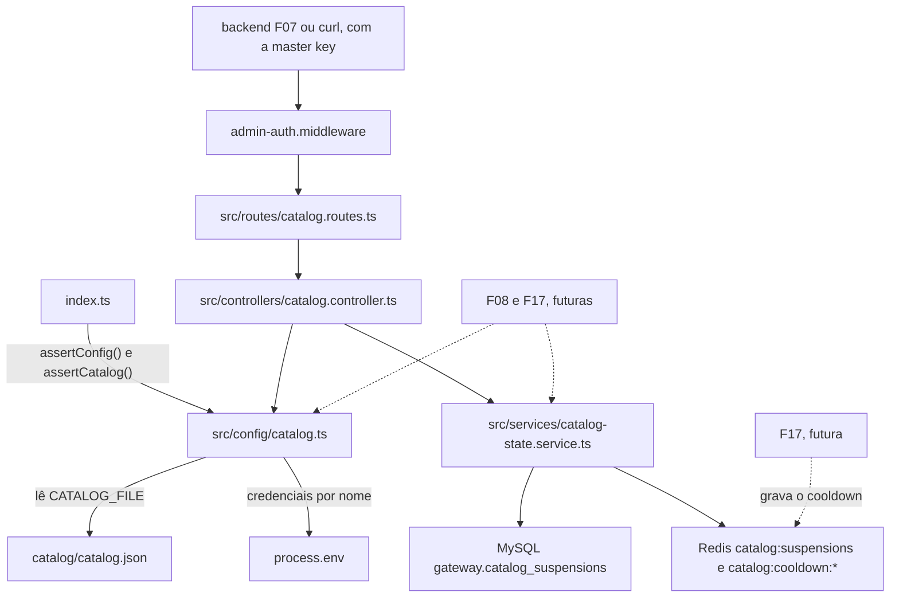

# Spec — F02. Catálogo de capacidades

**Complexidade:** medium (5 endpoints administrativos, 1 tabela, estado replicado no Redis, validação de arquivo na
partida)

## 1. Visão técnica

**O quê.** O proxy (`apps/ia`) passa a ter um catálogo versionado de capacidades e deployments e o estado de cada um
em tempo real:
- **Arquivo do catálogo:**
  - `apps/ia/catalog/catalog.json`, lido na partida;
  - validado por um esquema Joi mais as checagens cruzadas (referências, nomes únicos, credenciais no ambiente);
  - com qualquer problema, o proxy não sobe, e o log lista todos os problemas, um por linha.
- **Catálogo inicial:** as três capacidades do PRD (`developer-assistant`, `architecture-advisor` e
  `ticket-classifier`) sobre cinco deployments (OpenAI `gpt-4.1-mini` e `gpt-4.1`, Gemini `2.5-flash`, `2.5-pro` e
  `2.5-flash-lite`).
- **Estado em tempo real:**
  - a suspensão de uma capacidade ou de um deployment é gravada no MySQL (`catalog_suspensions`) e replicada num hash do
    Redis;
  - o cooldown de um deployment fica só no Redis. A F02 o lê, e a F17 o grava.
- **API administrativa:**
  - `GET /admin/catalog` devolve as definições e o estado;
  - `POST /admin/capabilities/{nome}/suspend` e `/resume`, e os equivalentes em `/admin/deployments/{nome}`.

**Por quê.** É a peça que desacopla o cliente do modelo físico:
- o `/v1` (F08) e o roteamento (F17) leem daqui a definição de cada capacidade e o estado de cada deployment;
- o custo (F10) usa os preços;
- a validação de resposta (F14) usa o contrato e o modo JSON;
- os domínios (F05) só habilitam capacidades que existem aqui;
- a tela do catálogo (F07) mostra o `GET /admin/catalog` e chama a suspensão.

**Escopo.**

*Incluído:*
- **Configuração e partida:**
  - a variável opcional `CATALOG_FILE` no `src/config/env` e nos três modelos `.env.*.example`;
  - o carregador e validador do catálogo em `src/config/catalog.ts`, com a recusa na partida pelo `index.ts`.
- **O arquivo:** `catalog/catalog.json` com o catálogo inicial da §5.
- **Dados:** a migration da tabela `catalog_suspensions`, e o acesso ao cliente Redis conectado (`redis-client.ts`).
- **Serviço de estado:**
  - réplica no Redis, com recarga a partir do MySQL;
  - leitura do cooldown;
  - suspensão e reativação com desfazimento em caso de falha, prazo de 2 s e falha rápida do Redis;
  - avisos de capacidade que fica indisponível.
- **API:** o controller e as rotas do catálogo, montados atrás da master key, e os tipos de erro 409 e 503 no formato
  do proxy.
- **Documentação:** `README.md`, com a seção sobre o catálogo (editar, reiniciar, `CATALOG_FILE`, suspender pela API).

*Contratos de entrada (Consome):* nenhum. A F02 só depende da F01 (configuração, `getDb`, Redis, master key, formato de
erro).

*Contratos de saída (Fornece, PRD §6):*
- **Definições de capacidade:** nome, tipo, descrição, primário, fallback, timeout, retry, `max_tokens` máximo, contrato
  e modo JSON nativo. Vêm de `getCatalog()` e do `GET /admin/catalog`.
- **Definições de deployment:** provedor, modelo físico, credencial (só o nome da variável, e só dentro do proxy),
  parâmetros aceitos, mapeamentos, parâmetros fixos e preços.
- **Estado em tempo real:** ativo, suspenso ou em cooldown, com o horário de fim do cooldown. Vem de
  `getCatalogState()`, a mesma leitura usada pelo `GET /admin/catalog`.

*Levado para a F08 e a F11, com rastreio (decisão do usuário em 2026-10-04):* a F02 não tem `/v1` nem chaves (F06). As
partes destes critérios do PRD §9 entram no contrato da feature indicada:

| Critério da F02 (PRD §9) | O que a F02 verifica | O que fica para depois |
|---|---|---|
| 1. `GET /v1/models` lista as três capacidades | `GET /admin/catalog` lista as três; a validação recusa nome de capacidade com nome de provedor | **F08:** a lista filtrada pela permissão da chave, sem nenhum nome físico na resposta do `/v1` |
| 4. Capacidade nova utilizável sem mudar o sistema web nem o script (D5) | um catálogo com uma quarta capacidade, carregado num reinício, aparece no `GET /admin/catalog` | **F08:** a chamada a ela pelo `/v1`. **F11:** a chamada pelo script de exemplo e pelo sistema web, sem mudança neles |
| 5. Suspender → 503 `capability_unavailable` em até 1 s; reativar → atendimento em até 1 s | o estado muda em até 1 s no `GET /admin/catalog` e na leitura de estado | **F08:** o 503 numa chamada ao `/v1` e o atendimento depois da reativação |

*Fora do escopo:*
- o `/v1` e o uso das definições numa chamada (F08);
- a gravação do cooldown e a contagem de falhas (F17);
- a aplicação do contrato e do modo JSON (F14);
- o catálogo de testes que aponta para o destino simulado, e a URL do simulador por provedor (F03 e F08). A F02 já aceita
  o provedor `simulated` no esquema;
- a tela do catálogo, o motivo na auditoria (F07, F12) e o contrato Pact dos endpoints, que a F07 acrescenta quando o
  backend passar a chamá-los;
- recarga do catálogo sem reiniciar (PRD §7).

## 2. Impacto na arquitetura



Pipeline HTTP do proxy, sem mudança de ordem:
1. request ID;
2. log;
3. JSON body;
4. `/health`;
5. `/admin` com a master key, onde entram as rotas do catálogo;
6. 404;
7. erro.

**Partida do proxy (`index.ts`):**
1. `assertConfig()`;
2. `assertCatalog()`. Se ele lançar, cada problema vai para o `stderr` numa linha `Invalid catalog: <problema>`, e o
   processo sai com código 1. É o mesmo canal e o mesmo formato da validação da configuração;
3. `listen`.

**Leitura e escrita do estado:**
- **Fonte da verdade:** a tabela `catalog_suspensions`.
- **Leitura de cada chamada:** o hash `catalog:suspensions` do Redis, que tem o campo sentinela `_loaded`.
  - Se o sentinela falta (Redis reiniciado, sem persistência), a leitura recarrega o hash a partir do MySQL numa
    consulta e grava o sentinela.
  - Assim, uma suspensão sobrevive tanto ao reinício do proxy (o Redis continua com o hash) quanto ao do Redis (a
    recarga vem do MySQL).
- **Cooldown:** chaves `catalog:cooldown:<deployment>` com TTL, lidas num `MGET`.
- **Sem cache em memória:** cada leitura vai ao Redis, então uma suspensão confirmada vale para a requisição seguinte,
  bem dentro do limite de 1 s do PRD.
- **Conexões do MySQL:** a recarga lê por `getDb({ operation: 'read' })`; a suspensão e a reativação escrevem numa
  transação de `getDb({ operation: 'write' })`.
- **Falha rápida:**
  - o cliente Redis passa a recusar comandos na hora quando não está pronto (`disableOfflineQueue`), em vez de
    enfileirá-los até a reconexão;
  - toda operação do serviço de estado tem um prazo de 2 s (`STATE_TIMEOUT_MS`, o mesmo do health da F01);
  - estourado o prazo, ou recusado um comando, antes do `COMMIT`, a escrita é desfeita e a resposta é 503; depois do
    `COMMIT`, valem os limites da §3 ("Falha rápida");
  - nenhum comando fica numa fila esperando a reconexão. Um comando que já saiu pelo socket de um Redis lento recebe
    atrás dele a reversão, na mesma conexão (§3).

## 3. Decisões técnicas

| Decisão | Abordagem escolhida | Alternativa considerada | Trade-off |
|---|---|---|---|
| Critérios que dependem do `/v1` | Verificados pelo `GET /admin/catalog`; as partes do `/v1` vão para o contrato da F08, com a tabela da §1 (decisão do usuário) | `/v1` mínimo na F02; ou critérios pendentes | O `/v1` só é provado na F08, mas a F02 fecha sem código provisório e sem `/v1` aberto sem chave |
| Formato e lugar do arquivo | JSON em `apps/ia/catalog/catalog.json`, lido com `fs` a partir do diretório de trabalho, como o `.env` (decisão do usuário) | YAML; módulo TypeScript | Sem comentários no arquivo, mas sem dependência nova e sem recompilar para o `dist/`. O `ts-node-dev` não observa o JSON: mudar o catálogo exige reiniciar, como o PRD pede |
| Validação | Joi 17, com `abortEarly: false` e `allowUnknown: false`, mais checagens cruzadas em código. Todos os problemas saem de uma vez, cada um com o caminho do campo | Validador próprio; zod | Uma dependência nova e madura, com mensagens por caminho, que a F08 reaproveita para validar as requisições |
| `CATALOG_FILE` | Variável opcional, padrão `catalog/catalog.json`, relativa ao diretório de trabalho. Fica nas regras do `src/config/env` e nos três modelos `.env.*.example`. O caminho é lido **na carga do catálogo**, pela função `catalogFile(env)` do `src/config/env`, e não no objeto `config` congelado no import | Caminho fixo; caminho no `config` congelado | Permite provar a recusa de um catálogo inválido sem editar o arquivo versionado, e serve ao catálogo de testes do simulador (F03/F08). Lido na carga, ele pode ser definido por um teste antes da primeira leitura, sem depender da ordem dos imports |
| Onde o catálogo é carregado | `src/config/catalog.ts`. Fica sob `src/config/`, então pode ler o `process.env` para conferir as credenciais (regra `env-only-in-config`) | `src/services/` | O catálogo é configuração. O serviço de estado não lê ambiente. Pela mesma regra, a leitura do valor de uma credencial pelo nome, que a F08 vai precisar, também fica em `src/config/` |
| Carga preguiçosa | `getCatalog()` carrega, valida e congela na primeira chamada, e guarda o resultado até o fim do processo. O `index.ts` chama `assertCatalog()` antes do `listen` | Carregar no import | Os testes importam o `app` sem precisar de um catálogo válido no import. Como o resultado fica guardado, cada fixture de catálogo tem o próprio arquivo de teste (um registro de módulos por arquivo no Jest) |
| Mensagens de catálogo inválido | Em inglês, como a validação da configuração da F01: `Invalid catalog: capability 'ticket-classifier' points to fallback 'gemini-lite', which does not exist` | O texto em português do exemplo do PRD | Consistência com os logs do projeto. O critério do PRD só exige que a mensagem cite a capacidade e o deployment |
| Nomes de capacidade | Kebab-case de 3 a 40. Recusa o nome quando todas as partes são termos genéricos ou números, e quando alguma parte é, ou começa com, um nome de provedor (§5, decisão do usuário) | Só a lista genérica; só kebab-case | Uma regra determinística para o "nome genérico" do PRD, que também impede o `/v1/models` de vazar o provedor |
| Parâmetros fixos | `fixed_params` opcional no deployment, com uma lista fechada: na v1, só `reasoning_effort` (decisão do usuário) | Só o padrão do provedor | O Gemini 2.5 raciocina por padrão, e os tokens de raciocínio consomem o `max_tokens`. Com `none` no Flash e no Flash-Lite e `low` no Pro, o fallback fica comparável ao `gpt-4.1-mini` e o custo previsível |
| Modelos | Linha Gemini 2.5 GA e o `gpt-4.1` como fallback do Pro, com os preços de 2026-10-04 (decisão do usuário) | Flash 3.x; aliases `-latest` | Modelos estáveis, sem data de desligamento e com preço fixo. Trocar depois é só editar o catálogo |
| Corpo de suspend/resume | `suspend`: `reason` (1 a 200) e `actor` (e-mail). `resume`: `actor`, e `reason` opcional, só registrado no log. Repetir a operação no mesmo estado → 409 `invalid_state` (decisão do usuário) | Idempotente; sem corpo | Mesmo padrão da remoção de domínio (F05). O `GET /admin/catalog` mostra por que e desde quando um recurso está suspenso |
| Persistência da suspensão | Uma linha por recurso suspenso, apagada na reativação. O histórico fica na auditoria do backend (F12) | Linha com `resumed_at` | A tabela guarda só o estado atual. A história completa é da F12 |
| Ordem da escrita | Réplica carregada → transação no MySQL → escrita no Redis → commit. Se o Redis falha ou o prazo estoura, rollback e 503 sem mudança. Se o commit falha, a escrita no Redis é revertida e a resposta é 503. Se a reversão também falha, o erro vai para o log, e a próxima operação sobre o recurso corrige a réplica (linha abaixo) | Redis depois do commit | O MySQL nunca fica com uma suspensão que o Redis não conhece, a não ser na falha dupla, que se corrige pela API |
| Falha rápida | `disableOfflineQueue` no cliente Redis; `getRedis()` guarda a promessa de conexão (chamadas concorrentes esperam a mesma) e desiste em 2 s se o cliente não ficar pronto; prazo de 2 s em cada operação do serviço de estado, com rollback | Esperar a reconexão | Sem isso, com o Redis parado, o `suspend` ficaria pendurado com a transação aberta, e o `HSET` da fila rodaria depois do rollback, deixando no Redis uma suspensão que o MySQL não tem. O `ping()` do health passa a falhar na hora também. Com o Redis lento (não parado), o comando já pode ter saído pelo socket quando o prazo estoura. Nesse caso, o serviço envia a reversão (`HDEL` no suspend, `HSET` no resume) pela mesma conexão, sem esperar a resposta: o Redis executa os comandos de uma conexão em ordem, então a reversão vale depois do comando atrasado. Se nem a reversão puder ser enviada, a correção da réplica (linha abaixo) resolve pela API. Dois limites do prazo: (a) uma transação cuja conexão do MySQL só chega depois do prazo recebe rollback assim que chega, sem executar nada; (b) depois de enviado o `COMMIT`, o serviço não reverte o Redis: se a confirmação não chega no prazo, responde o 503 com a mensagem de resultado não confirmado (§5), e o `HSET`/`HDEL` já feito fica. Se o commit confirmar depois, MySQL e Redis concordam; se falhar, a correção da réplica resolve na repetição |
| Correção da réplica | `resume` sem linha no MySQL mas com o campo na réplica: apaga o campo (`HDEL`) e responde 200. `suspend` com a linha no MySQL mas sem o campo na réplica: regrava o campo a partir da linha e responde 409 `invalid_state`. As duas situações vão para o log como `warn` | Sem correção | A falha dupla (commit e reversão) não deixa um recurso preso num estado que a API não consegue mudar |
| Recarga da réplica | Só quando o sentinela falta. A recarga só acrescenta campos (`HSET`), nunca apaga, então não desfaz uma suspensão concorrente | Recarga serializada com lock | Fica uma janela estreita: uma reativação concorrente com a recarga, logo depois de o Redis reiniciar, pode deixar o recurso como suspenso no Redis até a próxima recarga. Aceito na v1, com uma réplica e operações administrativas raras |
| Suspensões órfãs | Uma linha cujo recurso saiu do catálogo é ignorada na leitura e volta a valer se o nome voltar | Apagar na partida | A partida não escreve no banco, e o histórico continua consistente |
| Aviso de indisponibilidade | Suspender um deployment avisa cada capacidade ativa que fica sem nenhum deployment não suspenso (o primário sem fallback é o caso do PRD; primário e fallback suspensos também). O cooldown não entra, porque é transitório | Só o caso literal do PRD | Cobre o caso equivalente sem custo |
| Precedência do estado de um deployment | `suspended` > `cooldown` > `active`. O `cooldown_until` aparece mesmo quando o deployment está suspenso | Dois campos independentes | A tela da F07 mostra um estado por linha, como o PRD descreve |
| Credencial na API | O `GET /admin/catalog` não devolve o `credential_env` | Devolver o nome | A tela não precisa dele. Menos superfície |
| Gates | Nenhum gate novo. Uma mudança só no `catalog.json` não dispara o `tests-monorepo`, que olha `.ts`/`.js`, mas dispara o `tests-integration-ia`, que roda a suíte inteira quando muda algo em `apps/ia/`. Lá, o teste `GET /admin/catalog should mirror the versioned catalog file` carrega o catálogo real | Gate `catalog-ia` próprio | Sem rodada da `gate-builder`. Exige o `./dev.sh --infra` no ar, como os outros gates de integração |

## 4. Componentes

### Proxy (`apps/ia`)

| Arquivo | Novo/Modificado | Propósito | Responsabilidades |
|---|---|---|---|
| `catalog/catalog.json` | Novo | O catálogo versionado | As três capacidades e os cinco deployments da §5 |
| `src/config/env.ts` | Modificado | Configuração | Regra `CATALOG_FILE` opcional. Exporta `catalogFile(env = process.env)`, que devolve o valor ou o padrão `catalog/catalog.json`. O objeto `config` não muda |
| `src/config/catalog.ts` | Novo | Carregar e validar o catálogo | Na carga, resolve `catalogFile()` relativo ao `process.cwd()`. Valida com o esquema Joi e as checagens cruzadas da §5, com mensagens próprias onde a do Joi repetiria o valor de um campo que pode conter segredo (`credential_env`). Confere no `process.env` que cada `credential_env` existe e não é vazia. Exporta `getCatalog()` (carga preguiçosa, resultado congelado e guardado), `assertCatalog(env = process.env)` e `CatalogError` (`problems: string[]`, a mensagem junta as linhas). O `assertCatalog(env)` lê e valida `catalogFile(env)` a cada chamada, sem passar pelo resultado guardado, e confere as credenciais no `env` recebido. Só o `getCatalog()` guarda o resultado. Também exporta os tipos usados pelo serviço e pelo controller |
| `index.ts` | Modificado | Partida | Depois do `assertConfig()`, chama `assertCatalog()`. Se ele lançar um `CatalogError`, escreve uma linha `Invalid catalog: <problema>` por problema no `stderr` e sai com código 1, antes do `listen` |
| `redis-client.ts` | Modificado | Acesso ao cliente | Cliente criado com `disableOfflineQueue: true`. Exporta `getRedis()`, que devolve o singleton pronto: guarda a promessa de conexão, para que chamadas concorrentes esperem a mesma, e rejeita se o cliente não ficar pronto em 2 s. O `ping()` passa a usá-lo. O `quit()` fecha o cliente e descarta o singleton e a promessa guardada, para que o próximo `getRedis()` crie um cliente novo |
| `migrations/<timestamp>_create_catalog_suspensions.ts` | Novo | Tabela de suspensões | `up` cria `catalog_suspensions` (§6) com guarda `hasTable`; `down` a remove |
| `src/services/catalog-state.service.ts` | Novo | Estado em tempo real | `getCatalogState()`: garante a réplica (recarga pela conexão de leitura se faltar o sentinela), lê o hash e os cooldowns e devolve o estado de cada capacidade e deployment do catálogo. `suspendResource(type, name, { reason, actor })` e `resumeResource(type, name, { actor })`: ordem de escrita, falha rápida e correção da réplica da §3, transação na conexão de escrita, 409 por estado, 503 por falha ou prazo. O `suspended_at` é gerado pelo serviço, em UTC com milissegundos, e gravado igual no MySQL e no Redis. `unavailableCapabilities(deployment, state)` calcula os avisos. Erros tipados: `CatalogStateUnavailableError` e `CatalogInvalidStateError` |
| `src/controllers/catalog.controller.ts` | Novo | Handlers HTTP | `getCatalogView`: monta a resposta da §5 com `getCatalog()` + `getCatalogState()`. `suspend(type)` e `resume(type)`: 404 se o nome não existe no catálogo, validação Joi do corpo (400 `invalid_value` citando o campo, inclusive campo não aceito), chamada ao serviço, 409/503 a partir dos erros tipados. `try/catch` em todo handler assíncrono, com `next(error)` para o inesperado. Log `info` de cada suspensão e reativação, com tipo, nome, autor, motivo e `req.id` |
| `src/routes/catalog.routes.ts` | Novo | Rotas | `GET /catalog`, `POST /capabilities/:name/suspend`, `POST /capabilities/:name/resume`, `POST /deployments/:name/suspend` e `POST /deployments/:name/resume` |
| `src/routes/admin.routes.ts` | Modificado | Montagem | Monta `catalog.routes` depois do `adminAuth` |
| `config/.env.{development,testing,production}.example` | Modificados | Modelos | `CATALOG_FILE=catalog/catalog.json` (não é segredo) |
| `package.json` / `package-lock.json` | Modificados | Dependência | `joi` ^17.13 em `dependencies` |
| `__tests__/fixtures/catalog/*.json` | Novos | Fixtures de teste | Catálogos válidos e inválidos da §7, com as mesmas variáveis de credencial do `.env.testing` |

O `src/lib/api-error.ts` não muda: o `errorType` já devolve `invalid_request_error` para o 409 e `server_error` para o
503.

### Raiz

| Arquivo | Novo/Modificado | Propósito | Responsabilidades |
|---|---|---|---|
| `README.md` | Modificado | Documentação | Seção "Catálogo de capacidades": onde fica o arquivo, como reiniciar o proxy depois de editar (`docker compose -p ai-gateway-app restart ia`), o `CATALOG_FILE`, a recusa na partida e como suspender ou reativar pela API com `curl` e a master key, sem mostrar a chave |

### Banco de dados

| Migration | Tabelas | Operação | Notas |
|---|---|---|---|
| `<timestamp>_create_catalog_suspensions.ts` | `catalog_suspensions` | CREATE | Schema `gateway`; nenhuma chave estrangeira |

## 5. Contratos de API

### O arquivo do catálogo

**Estrutura** (todas as chaves desconhecidas são recusadas, em qualquer nível):

| Campo | Tipo | Obrigatório | Regra |
|---|---|---|---|
| `deployments` | array | sim | 1 ou mais |
| `deployments[].name` | string | sim | `^[a-z0-9]+(-[a-z0-9]+)*$`, de 3 a 60, único entre os deployments |
| `deployments[].provider` | string | sim | `openai`, `gemini` ou `simulated` |
| `deployments[].model` | string | sim | de 1 a 100, `^[A-Za-z0-9._:/-]+$` |
| `deployments[].credential_env` | string | sim para `openai` e `gemini`; opcional para `simulated` | `^[A-Z][A-Z0-9_]*$`; a variável precisa existir e não ser vazia no ambiente |
| `deployments[].params` | array de string | sim | sem repetição; subconjunto de `max_tokens`, `temperature`, `top_p`, `stop` e `response_format`; **precisa conter `max_tokens`**. Sem ele, a F08 removeria o limite da chamada, e a cota da F13 deixaria de ter teto por requisição |
| `deployments[].param_mappings` | objeto | não (padrão `{}`) | chave ∈ `params`; valor `^[a-z][a-z0-9_]*$`, de 1 a 60 |
| `deployments[].fixed_params` | objeto | não (padrão `{}`) | só a chave `reasoning_effort`, com `none`, `minimal`, `low`, `medium` ou `high` |
| `deployments[].price_per_million_tokens.input` / `.output` | number | sim | de 0 a 1.000 (US$ por milhão de tokens) |
| `capabilities` | array | sim | 1 ou mais |
| `capabilities[].name` | string | sim | kebab-case de 3 a 40, único, e não genérico (regra abaixo) |
| `capabilities[].type` | string | sim | `chat` (o valor `embedding` fica para a fase de RAG) |
| `capabilities[].description` | string | sim | de 1 a 200 |
| `capabilities[].primary` | string | sim | nome de um deployment do arquivo |
| `capabilities[].fallback` | string ou `null` | não (padrão `null`) | nome de um deployment do arquivo, diferente do primário |
| `capabilities[].timeout_seconds` | integer | sim | de 1 a 120 |
| `capabilities[].max_retries` | integer | sim | de 0 a 3. O backoff (0,5 s, 1 s, 2 s, com jitter) é da F17 |
| `capabilities[].max_tokens` | integer | sim | de 1 a 8.192 |
| `capabilities[].json_mode` | boolean | sim | — |
| `capabilities[].contract` | objeto ou `null` | não (padrão `null`) | `{ "format": "json", "fields": [...] }` |
| `contract.fields[]` | objeto | 1 a 20 | `name` (`^[A-Za-z_][A-Za-z0-9_]*$`, de 1 a 60, único), `type` (`string`, `number` ou `boolean`), `allowed` opcional (1 a 50 valores únicos do tipo declarado) |

**Semântica do contrato, para a F14:**
- todo campo declarado é obrigatório;
- um campo `string` vazio ou só com espaços conta como ausente. É assim que o "texto não vazio" do `reason` do PRD fica
  expresso.

**Suporte ao modo JSON:** um deployment suporta o modo JSON nativo quando `response_format` está nos `params` dele (F14).

**Nome de capacidade genérico.** O nome é dividido pelos hífens.
- **Recusado** quando todas as partes são números ou termos genéricos: `model`, `models`, `modelo`, `modelos`,
  `capability`, `capacidade`, `llm`, `ai`, `ia`, `chat`, `default`, `padrao`, `test`, `teste`, `assistant`,
  `assistente`.
- **Recusado** quando alguma parte é, ou começa com, um termo de provedor: `openai`, `gpt`, `gemini`, `google`,
  `claude`, `anthropic`, `simulated`.
- Exemplos:
  - recusados: `modelo-1`, `chat-2`, `ai-model`, `gpt4-helper`, `gemini-classifier`;
  - aceitos: `developer-assistant`, `architecture-advisor`, `ticket-classifier`.

**Problemas reportados.** Uma linha por problema, todos de uma vez, sem nenhum valor de credencial:

| Situação | Linha no `stderr` |
|---|---|
| Arquivo ausente ou ilegível | `Invalid catalog: cannot read catalog/catalog.json` |
| JSON inválido | `Invalid catalog: catalog/catalog.json is not valid JSON` |
| Violação do esquema | `Invalid catalog: capabilities[2].max_tokens must be less than or equal to 8192` (o caminho e a mensagem do Joi) |
| Nome fora do kebab-case | `Invalid catalog: capabilities[0].name 'Ticket_Classifier' must be kebab-case with 3 to 40 characters` |
| Nome genérico | `Invalid catalog: capability 'modelo-1' has a generic name; describe its expected use` |
| Nome com provedor | `Invalid catalog: capability 'gpt4-helper' must not name a provider or model family ('gpt')` |
| Nome duplicado | `Invalid catalog: capability 'ticket-classifier' is declared more than once` (idem para deployment) |
| Primário inexistente | `Invalid catalog: capability 'ticket-classifier' points to primary 'gpt-x', which does not exist` |
| Fallback inexistente | `Invalid catalog: capability 'ticket-classifier' points to fallback 'gemini-lite', which does not exist` |
| Fallback igual ao primário | `Invalid catalog: capability 'ticket-classifier' uses 'openai-gpt-4-1-mini' as both primary and fallback` |
| Credencial ausente | `Invalid catalog: deployment 'gemini-2-5-pro' references GEMINI_API_KEY, which is missing or empty in the environment` |
| Mapeamento sem parâmetro | `Invalid catalog: deployment 'openai-gpt-4-1' maps 'top_k', which is not in its params` |
| `max_tokens` fora dos `params` | `Invalid catalog: deployment 'openai-gpt-4-1' must accept max_tokens` |
| `credential_env` fora do formato | `Invalid catalog: deployments[1].credential_env must be an environment variable name (uppercase letters, digits and underscore)`. A mensagem própria nunca repete o valor, que pode ser uma chave colada por engano |

### Catálogo inicial (`catalog/catalog.json`)

Preços da página oficial de cada provedor em 2026-10-04, em US$ por milhão de tokens (entrada/saída, sem cache, prompts
de até 200 mil tokens).

**Deployments:**

| Nome | Provedor | Modelo | Credencial | `params` | Mapeamentos | `fixed_params` | Preço |
|---|---|---|---|---|---|---|---|
| `openai-gpt-4-1-mini` | `openai` | `gpt-4.1-mini` | `OPENAI_API_KEY` | `max_tokens`, `temperature`, `top_p`, `stop`, `response_format` | `max_tokens` → `max_completion_tokens` | — | 0,40 / 1,60 |
| `openai-gpt-4-1` | `openai` | `gpt-4.1` | `OPENAI_API_KEY` | idem | idem | — | 2,00 / 8,00 |
| `gemini-2-5-flash` | `gemini` | `gemini-2.5-flash` | `GEMINI_API_KEY` | `max_tokens`, `temperature`, `top_p`, `stop`, `response_format` | — | `reasoning_effort: none` | 0,30 / 2,50 |
| `gemini-2-5-pro` | `gemini` | `gemini-2.5-pro` | `GEMINI_API_KEY` | idem | — | `reasoning_effort: low` | 1,25 / 10,00 |
| `gemini-2-5-flash-lite` | `gemini` | `gemini-2.5-flash-lite` | `GEMINI_API_KEY` | idem | — | `reasoning_effort: none` | 0,10 / 0,40 |

**Capacidades:**

| Nome | Descrição | Primário | Fallback | Timeout | Retries | `max_tokens` | JSON nativo | Contrato |
|---|---|---|---|---|---|---|---|---|
| `developer-assistant` | Responde dúvidas técnicas de desenvolvimento de software. | `openai-gpt-4-1-mini` | `gemini-2-5-flash` | 30 | 2 | 1024 | não | — |
| `architecture-advisor` | Analisa e recomenda decisões de arquitetura de software. | `gemini-2-5-pro` | `openai-gpt-4-1` | 60 | 2 | 2048 | não | — |
| `ticket-classifier` | Classifica a mensagem de um ticket de suporte em categoria e motivo. | `openai-gpt-4-1-mini` | `gemini-2-5-flash-lite` | 10 | 1 | 256 | sim | `category` (`string`, `billing`/`technical`/`account`/`other`) e `reason` (`string`) |

Exemplo de um deployment e de uma capacidade no arquivo:

```json
{
  "deployments": [
    {
      "name": "openai-gpt-4-1-mini",
      "provider": "openai",
      "model": "gpt-4.1-mini",
      "credential_env": "OPENAI_API_KEY",
      "params": ["max_tokens", "temperature", "top_p", "stop", "response_format"],
      "param_mappings": { "max_tokens": "max_completion_tokens" },
      "price_per_million_tokens": { "input": 0.4, "output": 1.6 }
    }
  ],
  "capabilities": [
    {
      "name": "ticket-classifier",
      "type": "chat",
      "description": "Classifica a mensagem de um ticket de suporte em categoria e motivo.",
      "primary": "openai-gpt-4-1-mini",
      "fallback": "gemini-2-5-flash-lite",
      "timeout_seconds": 10,
      "max_retries": 1,
      "max_tokens": 256,
      "json_mode": true,
      "contract": {
        "format": "json",
        "fields": [
          { "name": "category", "type": "string", "allowed": ["billing", "technical", "account", "other"] },
          { "name": "reason", "type": "string" }
        ]
      }
    }
  ]
}
```

### Configuração

| Variável | Obrigatória | Regra | Padrão |
|---|---|---|---|
| `CATALOG_FILE` | não | caminho relativo ao diretório de trabalho do app, ou absoluto | `catalog/catalog.json` |

As variáveis de credencial citadas no catálogo continuam declaradas no `src/config/env` (`OPENAI_API_KEY`,
`GEMINI_API_KEY`). O catálogo só confere, pelo nome, que elas existem.

### `GET /admin/catalog`

- **Autenticação:** `Authorization: Bearer <GATEWAY_MASTER_KEY>`.
- **Resposta 200:** as definições na ordem do arquivo, com o estado. O `credential_env` não aparece.

| Campo | Tipo | Descrição |
|---|---|---|
| `capabilities[].name`, `type`, `description`, `primary`, `fallback`, `timeout_seconds`, `max_retries`, `max_tokens`, `json_mode`, `contract` | — | iguais ao arquivo, com os padrões aplicados |
| `capabilities[].state` | `active` \| `suspended` | — |
| `capabilities[].suspension` | objeto ou `null` | `reason`, `actor` e `suspended_at` (ISO 8601 UTC) |
| `deployments[].name`, `provider`, `model`, `params`, `param_mappings`, `fixed_params`, `price_per_million_tokens` | — | iguais ao arquivo, com os padrões aplicados |
| `deployments[].state` | `active` \| `suspended` \| `cooldown` | precedência da §3 |
| `deployments[].suspension` | objeto ou `null` | como na capacidade |
| `deployments[].cooldown_until` | string ou `null` | fim do cooldown, ISO 8601 UTC |

```json
{
  "capabilities": [
    {
      "name": "developer-assistant",
      "type": "chat",
      "description": "Responde dúvidas técnicas de desenvolvimento de software.",
      "primary": "openai-gpt-4-1-mini",
      "fallback": "gemini-2-5-flash",
      "timeout_seconds": 30,
      "max_retries": 2,
      "max_tokens": 1024,
      "json_mode": false,
      "contract": null,
      "state": "suspended",
      "suspension": {
        "reason": "Pico de custo em investigação",
        "actor": "admin_platform@aigateway.test",
        "suspended_at": "2026-10-04T14:05:12.345Z"
      }
    }
  ],
  "deployments": [
    {
      "name": "gemini-2-5-flash",
      "provider": "gemini",
      "model": "gemini-2.5-flash",
      "params": ["max_tokens", "temperature", "top_p", "stop", "response_format"],
      "param_mappings": {},
      "fixed_params": { "reasoning_effort": "none" },
      "price_per_million_tokens": { "input": 0.3, "output": 2.5 },
      "state": "cooldown",
      "suspension": null,
      "cooldown_until": "2026-10-04T14:06:00.000Z"
    }
  ]
}
```

### `POST /admin/capabilities/{nome}/suspend` e `POST /admin/deployments/{nome}/suspend`

- **Autenticação:** master key.

**Request:**

| Campo | Tipo | Obrigatório | Validação | Descrição |
|---|---|---|---|---|
| `reason` | string | sim | aparado; de 1 a 200 caracteres | motivo, que vai para a auditoria da F12 |
| `actor` | string | sim | e-mail, até 254 caracteres, sem checar o TLD (o ambiente local usa `.test`) | quem suspendeu, informado pelo backend |

```json
{ "reason": "Chave da OpenAI vazada", "actor": "admin_platform@aigateway.test" }
```

**Resposta 200:** o recurso no formato do `GET /admin/catalog`, mais `warnings` (array de string, vazio quando não há
aviso).

```json
{
  "deployment": {
    "name": "openai-gpt-4-1-mini",
    "provider": "openai",
    "model": "gpt-4.1-mini",
    "params": ["max_tokens", "temperature", "top_p", "stop", "response_format"],
    "param_mappings": { "max_tokens": "max_completion_tokens" },
    "fixed_params": {},
    "price_per_million_tokens": { "input": 0.4, "output": 1.6 },
    "state": "suspended",
    "suspension": {
      "reason": "Chave da OpenAI vazada",
      "actor": "admin_platform@aigateway.test",
      "suspended_at": "2026-10-04T14:05:12.345Z"
    },
    "cooldown_until": null
  },
  "warnings": []
}
```

Na suspensão de uma capacidade, o objeto vem em `capability`. Um aviso, quando uma capacidade ativa fica sem nenhum
deployment não suspenso, tem o texto do PRD:

```json
{ "warnings": ["A capacidade 'x' ficará indisponível enquanto o deployment estiver suspenso."] }
```

### `POST /admin/capabilities/{nome}/resume` e `POST /admin/deployments/{nome}/resume`

**Request:**

| Campo | Tipo | Obrigatório | Validação | Descrição |
|---|---|---|---|---|
| `actor` | string | sim | e-mail, até 254 caracteres | quem reativou |
| `reason` | string | não | aparado; até 200 caracteres | só registrado no log do proxy |

**Resposta 200:** o recurso com `state` recalculado (`active`, ou `cooldown` num deployment com cooldown em curso) e
`warnings: []`.

### Erros dos endpoints do catálogo

Formato do proxy: `{ "error": { "message", "type", "code" } }`. Ordem das checagens: master key → recurso existe →
corpo válido → estado.

| Código | Status | Mensagem | Quando |
|---|---|---|---|
| `invalid_admin_key` | 401 | *"Chave administrativa ausente ou inválida."* | master key ausente ou errada (F01) |
| `not_found` | 404 | *"A capacidade 'x' não existe no catálogo."* / *"O deployment 'x' não existe no catálogo."* | nome fora do catálogo |
| `invalid_value` | 400 | *"O campo 'reason' é obrigatório e aceita até 200 caracteres."* / *"O campo 'actor' precisa ser um e-mail."* / *"O campo 'x' não é aceito."* | corpo inválido ou com campo fora da tabela do endpoint; cita o primeiro campo com problema |
| `invalid_request` | 400 | *"JSON inválido."* | corpo que não é JSON (F01) |
| `invalid_state` | 409 | *"A capacidade 'x' já está suspensa."* / *"A capacidade 'x' não está suspensa."* (idem para deployment) | suspender o suspenso; reativar o ativo |
| `catalog_state_unavailable` | 503 | *"O estado do catálogo está temporariamente indisponível. Nada foi alterado."* (no `GET`, sem a segunda frase) | MySQL ou Redis falhou, ou a operação passou do prazo de 2 s, **antes** de o `COMMIT` ser enviado; ou o `COMMIT` foi rejeitado e a reversão no Redis deu certo. Nada mudou. A resposta sai em até 3 s, sem esperar o Redis ou o MySQL voltarem |
| `catalog_state_unavailable` | 503 | *"Não foi possível confirmar a operação. Confira o estado do catálogo antes de repetir."* | o `COMMIT` foi enviado e não confirmou no prazo (§3, "Falha rápida"), e a operação pode ter sido aplicada; ou o `COMMIT` foi rejeitado e a reversão no Redis também falhou, e a réplica ficou diferente do MySQL até a correção |

Toda resposta leva `x-request-id` (F01).

### Leitura de estado (interface interna, usada por F08 e F17)

`getCatalogState()` devolve, para cada capacidade e deployment do catálogo carregado:
- `state`;
- `suspension` (ou `null`);
- `cooldownUntil` (só no deployment).

A leitura vai ao Redis a cada chamada, sem cache em memória, e falha em até 2 s com `CatalogStateUnavailableError` se o
Redis ou o MySQL não responder. A F08 traduz essa falha no 503 dela.

**Nota para a F08:** pela regra `env-only-in-config`, a leitura do valor de uma credencial a partir do `credential_env`
fica em `src/config/` (por exemplo, uma função ao lado do carregador do catálogo). A F02 não a cria, porque nada a usaria
ainda (`deadcode`).

**Combinado com a F17:** o cooldown é gravado com `SET catalog:cooldown:<deployment> <fim em ISO 8601> PX <duração>`.
A F02 lê com `MGET`, e uma chave expirada significa que o deployment não está em cooldown.

## 6. Modelo de dados

**Tabela: `catalog_suspensions`** (schema `gateway`)

| Coluna | Tipo | Nulo | Padrão | Descrição |
|---|---|---|---|---|
| `resource_type` | `varchar(16)` | não | — | `capability` ou `deployment` |
| `resource_name` | `varchar(60)` | não | — | nome no catálogo |
| `reason` | `varchar(200)` | não | — | motivo da suspensão |
| `actor` | `varchar(254)` | não | — | e-mail de quem suspendeu |
| `suspended_at` | `datetime(3)` | não | `CURRENT_TIMESTAMP(3)` | em UTC (sessão do pool da F01). O serviço grava o valor explicitamente, o mesmo que vai para o Redis, então a recarga reproduz o instante exato. O padrão só vale para uma inserção manual |

**Restrições:**

| Restrição | Tipo | Definição | Propósito |
|---|---|---|---|
| `pk_catalog_suspensions` | PRIMARY KEY | `(resource_type, resource_name)` | um registro por recurso suspenso. A duplicidade numa suspensão concorrente vira 409 |
| `ck_catalog_suspensions_type` | CHECK | `resource_type IN ('capability','deployment')` | só os dois tipos |

Não há índice extra: a recarga lê a tabela inteira, que tem no máximo uma linha por recurso do catálogo.

**Migration (forma):**
```sql
CREATE TABLE catalog_suspensions (
  resource_type VARCHAR(16) NOT NULL,
  resource_name VARCHAR(60) NOT NULL,
  reason VARCHAR(200) NOT NULL,
  actor VARCHAR(254) NOT NULL,
  suspended_at DATETIME(3) NOT NULL DEFAULT CURRENT_TIMESTAMP(3),
  PRIMARY KEY (resource_type, resource_name),
  CONSTRAINT ck_catalog_suspensions_type CHECK (resource_type IN ('capability', 'deployment'))
);
```
A migration usa o builder do Knex (`createTable`, `primary`, `checkIn`), com guarda `hasTable` no `up` e `dropTableIfExists`
no `down`.

**Redis** (db 0 em desenvolvimento, db 2 nos testes):

| Chave | Tipo | Conteúdo | Quem grava |
|---|---|---|---|
| `catalog:suspensions` | hash | campos `capability:<nome>` e `deployment:<nome>` com o JSON `{ reason, actor, suspended_at }`, e o sentinela `_loaded = 1` | F02 |
| `catalog:cooldown:<deployment>` | string com TTL | fim do cooldown em ISO 8601 | F17 (a F02 só lê) |

## 7. Estratégia de testes

Os testes unitários espelham `src/`, mocam o `loader` e montam o ambiente à mão (como o `env.test.ts` da F01), e usam
mocks de `getDb` e do Redis. Nenhum unitário depende do `.env.testing` local. Os de integração rodam contra o
`gateway_test` e o Redis db 2, com o `.env.testing`, que tem as chaves fictícias dos provedores.

**Uma fixture de catálogo por arquivo de integração.** O `getCatalog()` guarda o catálogo até o fim do processo, e o
Jest dá a cada arquivo de teste um registro de módulos próprio. Por isso cada arquivo usa um único catálogo: o real, ou
uma fixture definida em `process.env.CATALOG_FILE` no `beforeAll`, antes da primeira requisição. Isso funciona porque o
caminho é lido na carga do catálogo, e não no import (§3). Nenhum teste de integração usa `jest.isolateModules` para
trocar de catálogo, porque as instâncias isoladas de `database` e `redis-client` ficariam abertas e o Jest não
terminaria. Os unitários validam várias fixtures no mesmo arquivo chamando o `assertCatalog(env)`, que não usa o
resultado guardado.

| Arquivo | Tipo | Alvo | Gate |
|---|---|---|---|
| `apps/ia/__tests__/unit/config/catalog.test.ts` | Unit | validação, carga preguiçosa e `assertCatalog` | `tests-monorepo` |
| `apps/ia/__tests__/unit/config/env.test.ts` | Unit (modificado) | `CATALOG_FILE` na validação e em `catalogFile()` | `tests-monorepo` |
| `apps/ia/__tests__/unit/services/catalog-state.service.test.ts` | Unit | réplica, recarga, precedência, avisos, ordem de escrita, prazo, falhas e correção da réplica | `tests-monorepo` |
| `apps/ia/__tests__/unit/controllers/catalog.controller.test.ts` | Unit | status, corpos e mensagens | `tests-monorepo` |
| `apps/ia/__tests__/unit/app.test.ts` | Unit (modificado) | rotas do catálogo atrás da master key | `tests-monorepo` |
| `apps/ia/__tests__/integration/catalog.test.ts` | Integração | API do catálogo com o catálogo versionado, contra MySQL e Redis reais | `tests-integration-ia` |
| `apps/ia/__tests__/integration/catalog-no-fallback.test.ts` | Integração | aviso do primário sem fallback (`no-fallback.json`) | `tests-integration-ia` |
| `apps/ia/__tests__/integration/catalog-extra-capability.test.ts` | Integração | capacidade nova só no arquivo (`extra-capability.json`) | `tests-integration-ia` |
| `apps/ia/__tests__/integration/catalog-startup.test.ts` | Integração | o ponto de entrada recusa catálogos inválidos (processo filho) | `tests-integration-ia` |
| `apps/ia/__tests__/integration/redis-client.test.ts` | Integração (modificado) | `getRedis()` pronto, reaproveitado e com falha rápida | `tests-integration-ia` |

Como a F02 muda o `package.json` e o lockfile do `ia` (o `joi`), o `tests-monorepo` roda a suíte unitária inteira do
app, com o limite de 80% sobre todo o `src/` (`GATES.md`, "Testes e cobertura").

**Fixtures (`apps/ia/__tests__/fixtures/catalog/`):**

| Arquivo | Conteúdo |
|---|---|
| `fallback-missing.json` | `ticket-classifier` com fallback `gemini-lite` |
| `invalid-name.json` | capacidade `Ticket_Classifier` |
| `generic-name.json` | capacidade `modelo-1` |
| `max-tokens-too-high.json` | `max_tokens: 8193` |
| `several-problems.json` | três problemas diferentes, para provar o relato completo |
| `no-fallback.json` | válido: uma capacidade sem fallback, para o aviso |
| `extra-capability.json` | válido: o catálogo inicial mais `release-notes-writer`, para a demo D5 |

**Funções principais:**

| Teste | Descrição | Asserções |
|---|---|---|
| unit: `the versioned catalog should be valid` | `assertCatalog(env)` sobre `catalog/catalog.json`, com `OPENAI_API_KEY` e `GEMINI_API_KEY` fictícias definidas no próprio teste | nenhum problema; as três capacidades do PRD estão presentes. Não fixa contagens, primários nem preços, para que trocar um modelo só no catálogo (métrica D3 do PRD) não quebre testes |
| `should report a fallback that does not exist, naming capability and deployment` | `fallback-missing.json` | `CatalogError` com a linha da §5 |
| `should reject names outside kebab-case or the 3 to 40 range` | `Ticket_Classifier`, `ab`, 41 caracteres | uma linha por nome |
| `should reject generic names and provider names` | `modelo-1`, `chat-2`, `ai-model`, `gpt4-helper`, `gemini-classifier`; aceitar os três do PRD | linhas da §5; os três passam |
| `should reject values outside the ranges` | `max_tokens` 0 e 8193, `timeout_seconds` 0 e 121, `max_retries` 4, preço negativo | uma linha por campo, com o caminho |
| `should report every problem at once` | `several-problems.json` | três linhas |
| `should reject unknown keys` | `max_token` no lugar de `max_tokens` | linha com o caminho |
| `should reject a missing or empty credential without printing values` | `GEMINI_API_KEY` ausente e vazia | linha com o nome da variável; nenhum valor do ambiente na mensagem |
| `should not echo the credential_env value when its format is invalid` | `credential_env: "sk-proj-abc123"` | linha da §5; o valor não aparece em nenhum problema |
| `should allow a simulated deployment without credential` | `simulated` sem `credential_env` | sem problema |
| `should reject duplicates, fallback equal to primary, mappings outside params and params without max_tokens` | casos da §5 | linhas da §5 |
| `should reject unknown fixed params and invalid reasoning effort` | `fixed_params: { seed: 1 }`, `reasoning_effort: "max"` | linhas |
| `should read the file from CATALOG_FILE at load time and cache the result` | `CATALOG_FILE` definido depois do import; `getCatalog()` duas vezes | o arquivo da variável é lido, uma vez só; objeto congelado |
| env: `catalogFile should default to catalog/catalog.json` | sem a variável e com ela | o padrão e o valor |
| `should report an unreadable file and invalid JSON` | caminho inexistente; JSON truncado | linhas da §5 |
| `should reload the replica from MySQL when the sentinel is missing` | hash vazio | uma consulta; `HSET` com as linhas e o sentinela |
| `should not query MySQL when the replica is loaded` | sentinela presente | nenhuma consulta |
| `should rank suspended over cooldown over active` | as três combinações | `state` e `cooldown_until` |
| `should warn about capabilities left without a non-suspended deployment` | primário sem fallback; primário e fallback suspensos; fallback suspenso com primário ativo; primário em cooldown | aviso só nos dois primeiros |
| `should roll back MySQL when Redis fails during suspend` | `HSET` rejeita | rollback; `CatalogStateUnavailableError` |
| `should answer unavailable when Redis refuses an offline command` | o cliente rejeita com `ClientOfflineError` antes da transação | `CatalogStateUnavailableError`; nenhuma transação aberta |
| `should give up and roll back after the 2 s deadline` | inserção que não resolve (fake timers) | rollback; `CatalogStateUnavailableError` em 2 s |
| `should send the revert behind a Redis command that timed out` | `HSET` enviado e sem resposta até o prazo | `HDEL` enviado na mesma conexão, sem `await`; rollback; `CatalogStateUnavailableError` |
| `should roll back a transaction whose connection arrives after the deadline` | a transação só abre depois do prazo (fake timers) | `CatalogStateUnavailableError` no prazo; quando a transação chega, rollback sem nenhuma escrita |
| `should not revert Redis once the commit was sent` | o commit não confirma no prazo | nenhuma reversão no Redis; `CatalogStateUnavailableError` com a mensagem de resultado não confirmado |
| `should revert Redis when the commit fails` | commit rejeita | `HDEL` (suspend) / `HSET` (resume) de reversão e a mensagem "Nada foi alterado"; se a reversão também rejeita, log `error` e a mensagem de resultado não confirmado |
| `should map a duplicate key to invalid state` | `ER_DUP_ENTRY` | `CatalogInvalidStateError` |
| `resume should heal a replica field without a MySQL row` | campo na réplica, nenhuma linha | `HDEL`; sucesso; log `warn` |
| `suspend should rewrite a missing replica field from the MySQL row` | linha no MySQL, campo ausente na réplica | `HSET` com os dados da linha; `CatalogInvalidStateError`; log `warn` |
| `should write the same suspended_at to MySQL and Redis` | relógio fixo | o mesmo instante nos dois |
| `should use the read connection to reload and the write connection to change` | espiões em `getDb` | `operation: 'read'` na recarga; `'write'` na transação |
| controller: `should answer 404, 400, 409 and 503 with the proxy error format` | cada caso da tabela de erros, inclusive campo não aceito | status, `code`, mensagem |
| controller: `should log suspensions with actor, reason and request id` | logger espionado | campos presentes |
| app: `should require the master key on the catalog routes` | `GET /admin/catalog` sem chave | 401 `invalid_admin_key` |
| integração: `GET /admin/catalog should mirror the versioned catalog file` | catálogo real; o teste lê e interpreta o próprio `catalog/catalog.json` | as definições do GET são iguais às do arquivo, na mesma ordem e com os padrões aplicados; as três capacidades do PRD estão presentes; tudo `active`; nenhum `credential_env`. É este teste que faz uma mudança só no JSON passar pelo `tests-integration-ia` |
| integração: `should suspend and resume a capability within 1 s` | suspend → GET → resume → GET | estados certos; cada mudança visível no GET seguinte, com o tempo entre a resposta do POST e a do GET abaixo de 1.000 ms |
| integração: `should suspend and resume a deployment` | idem para deployment | idem; linha no MySQL só enquanto suspenso |
| integração: `should keep a suspension after the replica is lost` | suspender; apagar `catalog:suspensions` no Redis | o GET seguinte mostra suspenso, com o mesmo motivo e o mesmo `suspended_at`; a linha continua no MySQL |
| integração: `should answer 404 for an unknown resource` | `POST /admin/capabilities/nao-existe/suspend` e o equivalente de deployment | 404 `not_found`; nenhuma linha gravada |
| integração: `should answer 409 when suspending twice and resuming an active resource` | dois suspends; resume do ativo | 409 `invalid_state`; o motivo original continua |
| integração: `should answer 400 for missing, invalid or unexpected fields` | sem `reason`, `reason` com 201 caracteres, sem `actor`, campo `foo` | 400 `invalid_value` citando o campo; nada gravado |
| integração: `should show a cooldown written in Redis` | `SET catalog:cooldown:<d> <fim> PX 30000` | `state: cooldown` e `cooldown_until` |
| integração (`catalog-no-fallback`): `should warn when suspending the primary of a capability without fallback` | `CATALOG_FILE` = `no-fallback.json` | `warnings` com o texto do PRD; a suspensão é aceita |
| integração (`catalog-extra-capability`): `should list a capability added only in the catalog file` | `CATALOG_FILE` = `extra-capability.json` | `release-notes-writer` no GET |
| integração (startup): `should refuse to start with an invalid catalog` | `process.execPath` com `-r ts-node/register/transpile-only index.ts`, `CATALOG_FILE` apontando para `fallback-missing.json`, `invalid-name.json`, `max-tokens-too-high.json` e `several-problems.json`, por `spawnSync` sem shell e com prazo de 20 s | o processo sai sozinho, antes do prazo, com código 1; `stderr` com as linhas `Invalid catalog:` |
| integração (`redis-client`): `getRedis should share one connection between concurrent calls` | duas chamadas em paralelo | o mesmo objeto de cliente e o mesmo `CLIENT ID` nas duas. O teste não conta o `CLIENT LIST`: ele mostra as conexões de todos os bancos, e com o `./dev.sh` completo o container do proxy tem uma conexão no db 0 com o mesmo nome |
| integração (`redis-client`): `getRedis should fail fast when Redis is unreachable` | `REDIS_PORT` de uma porta fechada, num registro isolado que o teste fecha com `quit()` no fim | rejeita em até 3 s |

Cada teste de integração limpa o que gravou: as linhas de `catalog_suspensions` e as chaves `catalog:*` do Redis de
teste, num `afterEach`.

**Mapa dos critérios de aceite (PRD §9) para os testes:**

| AC | Teste ou verificação |
|---|---|
| 1 (`/v1/models` lista as três, sem nome físico) | `GET /admin/catalog should mirror the versioned catalog file` + `should reject generic names and provider names`. O `/v1/models` fica na F08 (§1) |
| 2 (fallback inexistente impede a partida, log cita os dois) | `should report a fallback that does not exist…` + `should refuse to start with an invalid catalog` |
| 3 (kebab-case e `max_tokens` > 8.192 impedem a partida) | `should reject names outside kebab-case…`, `should reject values outside the ranges` e o teste de startup |
| 4 (capacidade nova só no catálogo, D5) | `should list a capability added only in the catalog file`. O uso pelo `/v1` fica na F08, e o pelo script e pelo sistema web na F11 |
| 5 (suspender e reativar em até 1 s) | `should suspend and resume a capability within 1 s`. O 503 no `/v1` fica na F08 |
| 6 (suspensão sobrevive ao reinício) | `should keep a suspension after the replica is lost` (o Redis perde a réplica) e o runtime do contrato (`OC-06`: reinício do container do proxy e `./dev.sh --down`/`./dev.sh`) |
| 7 (recurso inexistente → 404) | `should answer 404 for an unknown resource` |

**Integração entre features (PRD §9):** os critérios que citam a F02 são todos verificados do lado consumidor:

| Critério | Lado da F02 | Onde é verificado |
|---|---|---|
| F02 → F05 | `getCatalog().capabilities` com os nomes | F05 |
| F02 → F07 | `GET /admin/catalog` com capacidades, deployments, preços e estados. A F02 prova que a resposta é igual ao arquivo mais o estado | F07, com o contrato Pact |
| F02 → F08 | `max_tokens`, `params` e `param_mappings` | F08 |
| F02 → F10 | `price_per_million_tokens` | F10 |
| F02 → F14 | `contract` e `json_mode` | F14 |
| F02 → F17 | timeout, retries, fallback, suspensão e cooldown pela `getCatalogState()` | F17 |

**Crescimento de consultas (N+1):** a checagem do `GATES.md` mede os endpoints do backend pela
`integration-test-writer`, e os endpoints da F02 ficam no proxy. Mesmo assim:
- o `GET /admin/catalog` faz no máximo 1 consulta (a recarga) e nenhuma com a réplica carregada (`fixed-size result`);
- o suspend e o resume fazem 1 escrita.

## Premissas e decisões

- **Decisões do usuário (2026-10-04):**
  - critérios do `/v1` levados para a F08. A parte do script e do sistema web no critério 4 só existe na F11, então vai
    para ela;
  - linha Gemini 2.5 GA mais o `gpt-4.1`;
  - JSON + Joi com `CATALOG_FILE`;
  - `reason` e `actor` com 409 na repetição;
  - regra de nome genérico e de provedor;
  - `fixed_params` com `reasoning_effort`.
- **Modelos e preços:** listados nas contas em 2026-10-04, pelos endpoints de listagem, sem imprimir as chaves; preços
  das páginas oficiais na mesma data. O Google recomenda a linha 3.x para projetos novos e mantém a 2.5 para contas
  ativas. Trocar o modelo é só editar o catálogo.
- **Suposições a confirmar na primeira execução real (F08/F14), sem efeito nos testes, que usam o simulador e mocks:**
  - o Gemini aceita `response_format: {"type": "json_object"}` pela camada compatível com a OpenAI;
  - o `reasoning_effort: low` deixa espaço para a resposta nos 2.048 tokens do `architecture-advisor`.
- **`max_tokens` → `max_completion_tokens` nos dois deployments OpenAI:** a OpenAI aceita o parâmetro novo em todos os
  modelos de chat, e o mapeamento já reproduz a demo D2 com o provedor real.
- **Mensagens de catálogo inválido em inglês**, como a validação da configuração (§3). O PRD dá um exemplo em português,
  mas o critério só exige citar a capacidade e o deployment.
- **Arquivo `.env.testing` local:** o `CATALOG_FILE` é opcional e tem padrão, então os arquivos locais existentes não
  precisam mudar. Os modelos versionados ganham a variável.
- **Reinício em desenvolvimento:** o `ts-node-dev` não observa o JSON. Depois de editar o catálogo, reinicie o container
  do proxy, como o README vai explicar.
- **Contrato Pact:** o backend ainda não chama esses endpoints. A F07 acrescenta as interações quando passar a chamá-los.
- **Rastreabilidade:**
  - Fornece → Escopo e §5;
  - Regras e limites → §3, §5 e §6;
  - Experiência → §5 (suspensão, nova capacidade) e README;
  - Tratamento de erros → tabela de erros e linhas de catálogo inválido da §5;
  - critérios do §9 → §7 (mapa) e o `contract.md`;
  - critérios de integração → §7.
