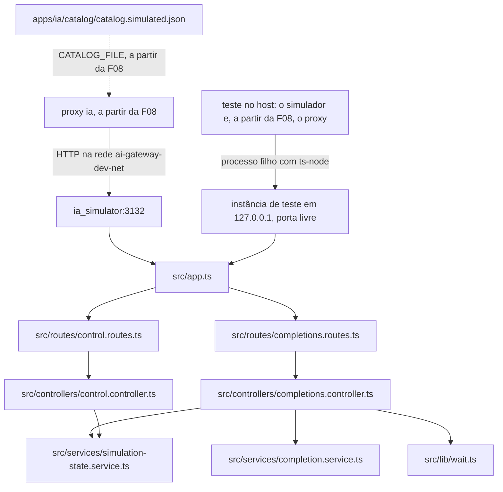

# Spec — F03. Destino de IA simulado

**Complexidade:** simple (5 endpoints novos num app sem banco, com estado em memória; um arquivo de catálogo no proxy;
um gate novo)

## 1. Visão técnica

**O quê.** O `apps/ia_simulator` deixa de ser o esqueleto da F01 e passa a imitar um provedor compatível com a OpenAI:
- **`POST /v1/chat/completions`** no formato da OpenAI, sem conferir a credencial;
- **modos por nome de modelo** (`ok`, `error`, `slow`, `timeout`, `fenced-json` e `invalid-json`), configurados pela
  API de controle;
- **uso de tokens determinístico** (caracteres ÷ 4, arredondado para cima) e corte da resposta no limite de tokens da
  requisição;
- **API de controle:**
  - `POST /control/modes` e `GET /control/modes`;
  - `GET /control/stats`, com a contagem e as últimas 20 chamadas de cada modelo;
  - `POST /control/reset`;
- **catálogo simulado** no proxy: `apps/ia/catalog/catalog.simulated.json`, espelho do catálogo real com cada
  deployment apontando para o provedor `simulated`.

**Por quê.** Nenhum teste chama um provedor real (PRD F01). As features que dependem do comportamento do provedor
provam os seus critérios contra o simulador:
- **F08:** o repasse dos parâmetros (D2), visto no corpo que o simulador registra;
- **F10 e F13:** custo e cotas sobre um uso de tokens previsível;
- **F14 e F15:** a resposta em JSON entre crases da demo D7 (`fenced-json`);
- **F17:** retry, backoff, `Retry-After`, timeout, cooldown e fallback (`error`, `slow`, `timeout`, `times` e a
  contagem), e as falhas definitivas que vão ao fallback sem retry (`error` com 400, 401, 403 e 404).

**Escopo.**

*Incluído:*
- **Simulador (`apps/ia_simulator`):**
  - o endpoint de completions, a API de controle, o estado em memória e o formato de erro da OpenAI;
  - o script `start:testing` e o helper de testes que sobe o simulador como processo filho no host;
  - a suíte `__tests__/integration`, contra o processo real;
  - o `npm test` restrito a `__tests__/unit` (regra do `CLAUDE.md`).
- **Proxy (`apps/ia`):** o `catalog/catalog.simulated.json` e o teste que confere que ele é válido e espelha o catálogo
  real.
- **Gate:** o `tests-integration-ia_simulator`, construído pela `gate-builder` antes da implementação (§3, "Gate").
- **Documentação:** a seção "Destino simulado" no `README.md`.

*Contratos de entrada (Consome):* nenhum. A F03 depende só de duas coisas que já existem:
- da F01: o esqueleto do simulador, o compose e a rede `ai-gateway-dev-net`;
- da F02: o esquema do catálogo, que já aceita o provedor `simulated` sem `credential_env`.

*Contratos de saída (Fornece):*
- **Endereço (F08):**
  - `http://ia_simulator:3132/v1` na rede do compose;
  - `http://127.0.0.1:<porta>/v1` numa instância de teste no host;
  - o endpoint é o da OpenAI: `/chat/completions` sob essa base.
- **Credencial (F08):** a chamada segue com qualquer `Authorization` ou sem nenhum. Por isso o deployment `simulated` não
  precisa de `credential_env`.
- **Comportamento por modelo (F08, F14, F17):** controlado por HTTP, com a contagem e o registro das chamadas.
- **Uso determinístico e corte no limite de tokens (F10, F13).**
- **Catálogo simulado (F08 em diante):** carregado pelo `CATALOG_FILE`.
- **O mecanismo do processo filho:** o helper e o `start:testing`. A F08 replica o helper do lado do proxy, sem importar
  código do simulador.

*Fora do escopo:*
- **Vai para a F08:**
  - a variável do proxy com a URL do provedor `simulated` e o valor dela no compose;
  - o cliente HTTP do proxy;
  - o helper dos testes do proxy.

  A F03 não cria configuração que nada leria.
- **O catálogo simulado no `./dev.sh`:** só faz sentido depois do `/v1` (F08). O README explica a troca pelo
  `CATALOG_FILE`.
- **Testes e2e (F15 em diante):**
  - o host não alcança o simulador (critério 5);
  - um teste que precise mudar o modo faz a chamada de controle de dentro da rede, por exemplo com
    `docker compose exec`;
  - a F15 decide como.
- **Outros endpoints e parâmetros da OpenAI** (streaming, `tools`, `n` > 1, embeddings): o proxy recusa esses parâmetros
  antes do repasse (F08).
- **Persistência do estado:** um reinício do simulador volta tudo ao padrão.

## 2. Impacto na arquitetura



**Pipeline HTTP do simulador:**
1. JSON body, com limite de 2 MB;
2. `/health`;
3. `/v1`, com o endpoint de completions;
4. `/control`;
5. 404 no formato da OpenAI;
6. erros: JSON inválido, corpo grande demais e erro inesperado.

**Uma chamada a `POST /v1/chat/completions`:**
1. Valida o corpo (§5). Um corpo inválido recebe 400 e não é contado.
2. Toma o modo do modelo (`takeMode`): o configurado ou, sem ele, o padrão `ok`. Um modo com `times` gasta uma chamada,
   e na última é removido, e o modelo volta ao padrão.
3. Registra a chamada, com contagem, horário, modo aplicado e corpo, **antes** de qualquer espera: uma chamada em
   `slow` ou `timeout` já conta.
4. Responde conforme o modo (§5): `slow` espera e depois responde como `ok`; `timeout` não responde.

**Cliente que fecha a conexão:**
- no `slow`, a espera é cancelada e nada é escrito;
- no `timeout`, a conexão fica aberta até o cliente fechá-la;
- o `index.ts` não define prazos de resposta no servidor, então nenhuma camada do Node responde no lugar do modo. O
  `requestTimeout` do Node só vale para receber a requisição.

**Estado em memória:**
- um módulo de serviço guarda os modos e as estatísticas de cada modelo, no próprio processo;
- não há banco nem Redis: um reinício zera tudo;
- cada instância (a do compose e as de teste) tem o próprio estado.

**Instância de teste no host:** os testes sobem o simulador como processo filho.
- **Comando:** `process.execPath` com `-r ts-node/register/transpile-only index.ts`, sem shell, com o `cwd` em
  `apps/ia_simulator`.
- **Ambiente:** `NODE_ENV=testing`, `API_HOST=127.0.0.1` e `PORT` de uma porta livre. O helper acha a porta abrindo um
  servidor na porta 0, lendo a porta e fechando o servidor.
- **Pronto:** quando o `GET /health/live` responde 200, em até 20 s.
- **Fim:** o helper encerra o processo filho no fim do arquivo de teste e espera a saída.

A instância existe só durante os testes, em `127.0.0.1`. O critério 5 trata da instância do `./dev.sh`, que continua sem
porta publicada.

## 3. Decisões técnicas

| Decisão | Abordagem escolhida | Alternativa considerada | Trade-off |
|---|---|---|---|
| Como os testes alcançam o simulador | Processo filho no host, numa porta livre, só por HTTP (decisão do usuário). A F03 prova o mecanismo nos testes de integração do próprio simulador; a F08 replica o helper no proxy | Só testes unitários com supertest; porta publicada para os testes | O mecanismo que a F08 e a F17 vão usar fica provado na origem, com o processo real. Custa um gate novo, e os testes do proxy passam a exigir `npm ci` no simulador (F08) |
| Gate | `tests-integration-ia_simulator`: `npm run test:integration` no simulador quando muda algo em `apps/ia_simulator/`, sem MySQL, Redis nem `.env.testing`. Criado pela `gate-builder` antes da implementação, depois do `tests-integration-ia` na cadeia | Reaproveitar o `tests-integration-*` atual como está | O gate atual exige `DB_HOST` e `REDIS_HOST` no `.env.testing`, que o simulador não tem |
| Script de partida | `start:testing`: `cross-env NODE_ENV=testing node -r ts-node/register/transpile-only index.ts`, com o `ts-node` como dependência de desenvolvimento explícita. O helper roda o mesmo comando direto pelo `process.execPath`, sem `npm` e sem shell | `ts-node-dev`; o `dist/` | O `ts-node-dev` abre um processo neto que o `kill` não encerra no Windows, e o `dist/` exigiria um build antes de cada teste. O script deixa o `ts-node` visível ao knip e documenta a partida manual |
| Estado | Em memória, num serviço com funções exportadas (`setMode`, `takeMode`, `recordCall`, `listModes`, `getStats` e `reset`) | Redis | O PRD diz "sem banco". Cada instância fica isolada, sem infraestrutura |
| Catálogo simulado | `apps/ia/catalog/catalog.simulated.json`: o catálogo real com `provider: simulated` e sem `credential_env` em cada deployment, e nenhuma outra diferença (decisão do usuário). Um teste de integração do proxy confere a validade, o espelho e um modelo por deployment | Deployments com nomes próprios; uma fixture só de teste | Os testes rodam sobre a mesma topologia do real: o primário de `developer-assistant` e o de `ticket-classifier` são o mesmo deployment. Mudar o catálogo real exige mudar o simulado no mesmo commit, e o gate pega o esquecimento |
| Lugar do teste do espelho | `apps/ia/__tests__/integration/`, que o `tests-integration-ia` roda inteiro a cada mudança em `apps/ia/` | `__tests__/unit` | O `tests-monorepo` só olha `.ts`/`.js`, então uma mudança só num dos JSON passaria sem o teste. É o mesmo motivo do teste do catálogo real na F02 |
| Modo padrão | Um modelo sem modo configurado responde em `ok`, com `"Resposta simulada."` (decisão do usuário) | 404 `model_not_found` | O catálogo simulado funciona sem preparo, mas um teste que esquece de configurar o modo não falha sozinho |
| Corte no limite | Limite = `max_completion_tokens` ou, sem ele, `max_tokens`. Se o conteúdo passa de limite × 4 caracteres, é cortado nesse ponto, com `finish_reason: length` e `completion_tokens` igual ao limite (decisão do usuário) | Ignorar o limite | Uso realista para a F10 e a F13: nenhum provedor devolve mais tokens que o pedido |
| Extras da API de controle | Registro das últimas 20 chamadas de cada modelo (horário, modo aplicado e corpo), `times` (1 a 1.000) e `retry_after_seconds` (0 a 120, só no 429 e no 503) (decisão do usuário) | Só o que o PRD pede | Servem à F08 (D2), à F14 (`response_format`) e à F17 (backoff, retry que se recupera, `Retry-After`). O registro guarda só o corpo, nunca headers |
| Contagem de caracteres | Pontos de código Unicode (`Array.from`), não unidades UTF-16 | `string.length` | Um acento ou um emoji conta como 1 caractere |
| Texto da entrada | O `content` de todas as mensagens, concatenado sem separador. Um `content` em lista soma o `text` das partes `type: text`; `null` conta 0 | O corpo JSON inteiro | O uso depende só do que foi escrito, não dos parâmetros nem da ordem dos campos |
| Credencial | O header `Authorization` não é lido: a chamada segue com qualquer valor ou sem ele | Exigir um Bearer | O PRD diz "aceita qualquer Bearer", e o deployment `simulated` não tem `credential_env`. A recusa da credencial é simulada pelo modo `error` com 401 |
| Validação | Joi 17, a mesma versão do proxy (`^17.13.8`). Completions: só o mínimo para responder (`model`, `messages` e os limites de tokens), aceitando os outros campos. Controle: campos por modo, sem campo desconhecido | Validador próprio | A mesma biblioteca do proxy |
| Idioma das mensagens | Inglês nas mensagens de erro, nas da API de controle e nos logs. O conteúdo simulado das respostas segue a §5, em português, como a resposta a um prompt em português | Português, como o proxy | O `/v1` imita o provedor, cujas mensagens de erro são em inglês. O simulador não é produto: só os testes e quem desenvolve leem as mensagens |
| Formato de erro | `{ "error": { "message", "type", "code" } }`, o da OpenAI e o do proxy, com um `sendApiError` próprio do simulador | Importar o do proxy | Nenhum app importa código de outro (regra `no-cross-app`) |
| Espera do `slow` | Uma função de espera em `src/lib/`, cancelável pelo fechamento do cliente, que os testes unitários substituem. O tempo real é provado no teste de integração, com os 15 s do critério 3 | Timers falsos do Jest com o supertest | Timers falsos travam o I/O do supertest. Com a espera isolada, os unitários ficam rápidos |
| Limite do corpo | 2 MB no `express.json` | 100 kB, o padrão | O proxy aceita 1 MB do cliente (F08) e repassa com parâmetros a mais |
| Logs | Uma linha `info` por chamada (modelo, modo, status e atraso) e por mudança de controle, sem o conteúdo das mensagens | pino-http | Suficiente para o `docker compose logs`. O logger continua desligado no `NODE_ENV=testing` |

## 4. Componentes

### Simulador (`apps/ia_simulator`)

| Arquivo | Novo/Modificado | Propósito | Responsabilidades |
|---|---|---|---|
| `src/app.ts` | Modificado | Montagem | `express.json({ limit: '2mb' })`; monta `/health`, `/v1` e `/control`; o 404 e o tratamento de erro no fim |
| `src/lib/api-error.ts` | Novo | Formato de erro | `sendApiError(res, status, code, message, type?)`. Sem `type`, ele vem do status: 4xx → `invalid_request_error`, 5xx → `server_error` |
| `src/lib/wait.ts` | Novo | Espera cancelável | `wait(ms, signal)`: resolve depois de `ms`, ou antes, sem erro, quando o sinal aborta, e limpa o timer |
| `src/middleware/error-handler.middleware.ts` | Novo | 404 e erros | `notFound`: 404 `not_found`. `errorHandler`: JSON inválido → 400 `invalid_json`; corpo acima de 2 MB → 413 `request_too_large`; outro erro → 500 `internal_error`, com log `error` |
| `src/services/simulation-state.service.ts` | Novo | Estado em memória | `setMode(config)`, `takeMode(model)`, `recordCall(model, mode, body)`, `listModes()`, `getStats()` e `reset()`. Guarda os modos e as estatísticas de cada modelo, aplica o `times`, mantém as 20 chamadas mais recentes de cada modelo e devolve cópias, nunca as estruturas internas |
| `src/services/completion.service.ts` | Novo | Resposta no formato OpenAI | `countTokens(text)`, `promptText(messages)`, `responseContent(mode)` (os padrões e as crases do `fenced-json`) e `buildCompletion({ model, messages, content, limit })`, que monta o corpo `chat.completion` com o corte, o `finish_reason` e o `usage` da §5 |
| `src/controllers/completions.controller.ts` | Novo | Handler do `/v1` | Valida o corpo, toma e registra o modo, responde conforme ele (§5), cancela a espera do `slow` quando o cliente fecha e registra a chamada no log |
| `src/controllers/control.controller.ts` | Novo | Handlers do `/control` | `setModeHandler` (validação por modo, 400 `invalid_value` citando o campo), `getModes`, `getStatsHandler` e `resetHandler`, com o log das mudanças |
| `src/routes/completions.routes.ts` | Novo | Rotas | `POST /chat/completions` |
| `src/routes/control.routes.ts` | Novo | Rotas | `GET /modes`, `POST /modes`, `GET /stats` e `POST /reset` |
| `package.json` / `package-lock.json` | Modificados | Dependências e scripts | `joi` `^17.13.8` em `dependencies`; `ts-node` `^10.9.2` em `devDependencies`. Scripts: `test` e `test:coverage` passam a `jest __tests__/unit/`; novos `test:unit`, `test:integration` (`cross-env NODE_ENV=testing jest __tests__/integration/ --runInBand`) e `start:testing` (§3) |
| `jest.config.js` | Modificado | Prazo dos testes | `testTimeout: 30000`, como no proxy, para o teste de 15 s |
| `__tests__/utils/simulator-process.ts` | Novo | Helper dos testes de integração | `startSimulator()`: acha uma porta livre, sobe o processo filho sem shell e espera o `/health/live` por até 20 s. Se o filho sair antes, o erro traz o `stderr` dele. `stop()` encerra o filho e espera a saída |

Não mudam: o `index.ts`, o `loader.ts`, o `src/config/env.ts`, o `Dockerfile` e os modelos `.env.*.example`. A F03 não
cria variável de ambiente.

### Proxy (`apps/ia`)

| Arquivo | Novo/Modificado | Propósito | Responsabilidades |
|---|---|---|---|
| `catalog/catalog.simulated.json` | Novo | Catálogo de testes | Cópia do `catalog/catalog.json` com `provider: "simulated"` e sem `credential_env` em cada deployment |
| `__tests__/integration/catalog-simulated.test.ts` | Novo | Guarda do espelho | Validade, espelho e um modelo por deployment (§7) |

### Raiz

| Arquivo | Novo/Modificado | Propósito | Responsabilidades |
|---|---|---|---|
| `README.md` | Modificado | Documentação | A seção "Destino simulado" (§5, "README") e a linha do `apps/ia_simulator` em "Testes de integração" |

O gate `tests-integration-ia_simulator` é da `gate-builder`, numa rodada antes do `implement-feature`. Ele muda o
`scripts/runGate.mjs`, o `scripts/gates/integration.mjs`, o `package.json` da raiz e o `GATES.md`.

## 5. Contratos de API

Nenhum endpoint do simulador tem autenticação: ele só existe na rede interna e nos testes, e nunca recebe dados reais.
As mensagens de erro são em inglês (§3).

### `POST /v1/chat/completions`

**Requisição.** Os outros campos (`temperature`, `top_p`, `stop`, `response_format`, `reasoning_effort` etc.) são
aceitos e só registrados.

| Campo | Tipo | Obrigatório | Validação |
|---|---|---|---|
| `model` | string | sim | 1 a 200 caracteres |
| `messages` | array | sim | 1 a 1.000 objetos, cada um com `role` (string) e `content` (string, lista de partes ou `null`); outros campos aceitos |
| `max_completion_tokens` | integer | não | ≥ 1, ou `null` |
| `max_tokens` | integer | não | ≥ 1, ou `null` |

```json
{
  "model": "gpt-4.1-mini",
  "messages": [
    { "role": "system", "content": "Responda em JSON." },
    { "role": "user", "content": "Fui cobrado duas vezes." }
  ],
  "max_completion_tokens": 256,
  "response_format": { "type": "json_object" }
}
```

**Resposta por modo:**

| Modo | Resposta |
|---|---|
| `ok` | 200 `chat.completion`, com o `content` configurado ou `Resposta simulada.` |
| `error` | o status configurado (400, 401, 403, 404, 429, 500, 502 ou 503), com o corpo da tabela abaixo e, se configurado, o header `Retry-After` |
| `slow` | espera `delay_ms` e responde como `ok` |
| `timeout` | nenhuma resposta; a conexão fica aberta até o cliente fechá-la |
| `fenced-json` | 200, com o conteúdo `` ```json `` + quebra de linha + JSON + quebra de linha + `` ``` ``. O JSON é o `content` configurado ou `{"category": "billing", "reason": "Cobrança duplicada na assinatura."}`, a resposta da demo D7 |
| `invalid-json` | 200, com o `content` configurado ou `Categoria: billing. Motivo: cobrança duplicada na assinatura.` |

**Resposta 200** (modo `ok`, para a requisição acima):

```json
{
  "id": "chatcmpl-sim-6f1c2b9e4d0a4f7e8c3b2a1d0e9f8c7b",
  "object": "chat.completion",
  "created": 1791126000,
  "model": "gpt-4.1-mini",
  "choices": [
    {
      "index": 0,
      "message": { "role": "assistant", "content": "Resposta simulada." },
      "finish_reason": "stop"
    }
  ],
  "usage": { "prompt_tokens": 10, "completion_tokens": 5, "total_tokens": 15 }
}
```

A entrada tem 40 caracteres (17 + 23) → 10 tokens. `Resposta simulada.` tem 18 caracteres → 5 tokens.

| Campo | Regra |
|---|---|
| `id` | `chatcmpl-sim-` + 32 caracteres hexadecimais aleatórios |
| `created` | segundos Unix da resposta |
| `model` | o `model` da requisição |
| `choices[0].message.content` | o conteúdo do modo, cortado no limite |
| `choices[0].finish_reason` | `length` se houve corte; senão, `stop` |
| `usage.prompt_tokens` | ⌈caracteres do texto da entrada ÷ 4⌉ (§3, "Texto da entrada" e "Contagem de caracteres") |
| `usage.completion_tokens` | ⌈caracteres do conteúdo devolvido ÷ 4⌉, depois do corte e com as crases do `fenced-json` |
| `usage.total_tokens` | a soma dos dois |

**Corte no limite.** Seja L o `max_completion_tokens` (ou, sem ele, o `max_tokens`) e M o número de caracteres do
conteúdo. Se ⌈M ÷ 4⌉ > L:
- o conteúdo fica com os primeiros L × 4 caracteres;
- o `finish_reason` é `length`;
- o `completion_tokens` é L.

Exemplos com `Resposta simulada.` (18 caracteres, 5 tokens):
- limite 2 (`max_completion_tokens: 2`, ou `max_tokens: 2` sem `max_completion_tokens`) → `Resposta` (8 caracteres),
  com `completion_tokens: 2`;
- `max_completion_tokens: 256` e `max_tokens: 2` juntos → vale o 256, e não há corte.

**Corpo do modo `error`**, que imita a OpenAI:

| Status | `type` | `code` | `message` |
|---|---|---|---|
| 400 | `invalid_request_error` | `unsupported_parameter` | `Unsupported parameter: this parameter is not supported with this model.` |
| 401 | `invalid_request_error` | `invalid_api_key` | `Incorrect API key provided.` |
| 403 | `request_forbidden` | `unsupported_country_region_territory` | `Country, region, or territory not supported.` |
| 404 | `invalid_request_error` | `model_not_found` | `The model does not exist or you do not have access to it.` |
| 429 | `requests` | `rate_limit_exceeded` | `Rate limit reached for requests.` |
| 500 | `server_error` | `server_error` | `The server had an error while processing your request.` |
| 502 | `server_error` | `bad_gateway` | `Bad gateway.` |
| 503 | `server_error` | `service_unavailable` | `The engine is currently overloaded, please try again later.` |

400, 401, 403 e 404 são as falhas definitivas da F17 (vão ao fallback sem retry); 429, 500, 502 e 503, as transitórias.
O 400 simulado usa o `code` `unsupported_parameter`, diferente dos 400 do próprio simulador (`invalid_json` e
`invalid_request`, abaixo), para que um teste distinga um do outro. Além disso, o 400 simulado é contado no
`GET /control/stats`, e os do próprio simulador não.

**Erros da requisição:**

| Status | `code` | Quando |
|---|---|---|
| 400 | `invalid_json` | o corpo não é JSON, ou é um primitivo JSON (`123`, `"abc"`): o parser do Express só aceita objeto e lista |
| 400 | `invalid_request` | o corpo é uma lista JSON, e não um objeto; `model` ou `messages` ausentes ou inválidos; limite de tokens que não é inteiro ≥ 1. A mensagem cita o campo, por exemplo `The field 'messages' must have at least 1 item.` |
| 413 | `request_too_large` | corpo acima de 2 MB |

Uma requisição recusada não é contada nem registrada.

### `POST /control/modes`

Configura o modo de um modelo e substitui o anterior. As estatísticas não mudam.

| Campo | Tipo | Obrigatório | Modos | Validação |
|---|---|---|---|---|
| `model` | string | sim | todos | 1 a 200 caracteres |
| `mode` | string | sim | — | `ok`, `error`, `slow`, `timeout`, `fenced-json` ou `invalid-json` |
| `times` | integer | não | todos | 1 a 1.000: o modo vale para as próximas N chamadas, e depois o modelo volta ao padrão |
| `content` | string | não | `ok`, `slow`, `fenced-json` e `invalid-json` | 1 a 20.000 caracteres. No `fenced-json`, JSON válido; no `invalid-json`, texto que não é JSON |
| `status` | integer | sim, no `error` | `error` | 400, 401, 403, 404, 429, 500, 502 ou 503 |
| `retry_after_seconds` | integer | não | `error` | 0 a 120, só com `status` 429 ou 503 |
| `delay_ms` | integer | sim, no `slow` | `slow` | 0 a 120.000 |

Um campo fora da coluna "Modos" do modo escolhido é recusado.

```json
{ "model": "gpt-4.1-mini", "mode": "error", "status": 503, "retry_after_seconds": 2, "times": 3 }
```

**Resposta 200:** o modo guardado, com `remaining_calls` (`null` quando não há `times`):

```json
{ "model": "gpt-4.1-mini", "mode": "error", "status": 503, "retry_after_seconds": 2, "remaining_calls": 3 }
```

**Erros:** 400 `invalid_value`, com a mensagem citando o campo. Nada muda numa recusa. Exemplos:
- `The field 'status' must be one of 400, 401, 403, 404, 429, 500, 502, 503.`;
- `The field 'retry_after_seconds' is only accepted with status 429 or 503.`;
- `The field 'content' must be valid JSON in fenced-json mode.`;
- `The field 'foo' is not accepted in timeout mode.`;
- corpo que é uma lista JSON, e não um objeto: `The request body must be a JSON object.`

Um corpo que não é JSON, ou que é um primitivo JSON, é recusado antes, pelo parser, com 400 `invalid_json`.

### `GET /control/modes`

200, com o modo guardado de cada modelo, inclusive um `ok` configurado explicitamente. Não aparecem os modelos que
nunca foram configurados, os que voltaram ao padrão no fim do `times` e nenhum depois do reset.

```json
{ "modes": { "gpt-4.1-mini": { "mode": "error", "status": 503, "retry_after_seconds": 2, "remaining_calls": 1 } } }
```

### `GET /control/stats`

200, com cada modelo que recebeu ao menos uma chamada desde a partida ou o último reset:

```json
{
  "models": {
    "gpt-4.1-mini": {
      "calls": 1,
      "requests": [
        {
          "received_at": "2026-10-04T15:00:00.000Z",
          "mode": "error",
          "body": {
            "model": "gpt-4.1-mini",
            "messages": [{ "role": "user", "content": "Oi" }],
            "max_completion_tokens": 256
          }
        }
      ]
    }
  }
}
```

- **`calls`:** todas as chamadas aceitas desde a partida ou o último reset, inclusive as que esperam no `slow` ou no
  `timeout`.
- **`requests`:** as 20 chamadas mais recentes, da mais antiga para a mais nova, com o horário de chegada (UTC, com
  milissegundos), o modo aplicado e o corpo como chegou. Nenhum header é guardado.

### `POST /control/reset`

204. Apaga todos os modos e as estatísticas. Não interrompe as chamadas em andamento.

### README

Seção "Destino simulado", depois de "Catálogo de capacidades":
- o que é e onde roda: só na rede interna, em `http://ia_simulator:3132`, e nunca recebe dados reais;
- a tabela dos modos e dos campos do `POST /control/modes`, o `GET /control/stats` e o `POST /control/reset`;
- como chamar a API de controle no `./dev.sh`, de dentro da rede: um script `node` enviado ao container do proxy por
  `docker compose -p ai-gateway-app exec -T ia node -`;
- o catálogo simulado, a troca pelo `CATALOG_FILE` (útil a partir da F08) e a regra de mantê-lo espelhado;
- a instância de teste no host (`npm run start:testing` com `PORT`) e o `npm run test:integration` do simulador, que
  não precisa do `./dev.sh --infra`.

## 6. Modelo de dados

Sem banco. O estado fica na memória do processo:

| Estrutura | Chave | Valor |
|---|---|---|
| modos | nome do modelo | `{ mode, content?, status?, retry_after_seconds?, delay_ms?, remaining_calls }` |
| estatísticas | nome do modelo | `{ calls, requests: [{ received_at, mode, body }] }`, com no máximo 20 itens em `requests` |

- O nome do modelo é comparado exatamente, inclusive maiúsculas e minúsculas.
- `takeMode` com `remaining_calls` igual a 1 devolve o modo e o remove; acima de 1, decrementa.
- `reset()` troca as duas estruturas por estruturas vazias.

## 7. Estratégia de testes

**Unitários:**
- usam o supertest sobre o `app` e chamam os serviços direto, com o `reset()` num `beforeEach`;
- a espera do `slow` é substituída por um mock de `src/lib/wait`, que confere o tempo pedido.

**Integração do simulador:** sobem o processo real pelo helper, uma vez por arquivo, sem `.env.testing` e sem
infraestrutura.

**Catálogo simulado:** o teste fica na suíte de integração do proxy (§3).

Como a F03 muda o `package.json` e o `jest.config.js` do simulador, o `tests-monorepo` roda a suíte unitária inteira
dele, com o limite de 80% sobre todo o `src/`.

| Arquivo | Tipo | Alvo | Gate |
|---|---|---|---|
| `apps/ia_simulator/__tests__/unit/services/simulation-state.service.test.ts` | Unit | modos, `times`, registro, reset, cópias | `tests-monorepo` |
| `apps/ia_simulator/__tests__/unit/services/completion.service.test.ts` | Unit | contagem, texto da entrada, conteúdo por modo, corte, corpo | `tests-monorepo` |
| `apps/ia_simulator/__tests__/unit/controllers/completions.controller.test.ts` | Unit | cada modo pelo supertest, validação, cancelamento da espera | `tests-monorepo` |
| `apps/ia_simulator/__tests__/unit/controllers/control.controller.test.ts` | Unit | validação por modo, respostas, reset | `tests-monorepo` |
| `apps/ia_simulator/__tests__/unit/middleware/error-handler.middleware.test.ts` | Unit | 400, 413, 404 e 500 | `tests-monorepo` |
| `apps/ia_simulator/__tests__/unit/lib/api-error.test.ts` | Unit | `type` por status | `tests-monorepo` |
| `apps/ia_simulator/__tests__/unit/lib/wait.test.ts` | Unit | espera e cancelamento, com timers falsos e sem I/O | `tests-monorepo` |
| `apps/ia_simulator/__tests__/unit/app.test.ts` | Unit (modificado) | rotas montadas; 404 no formato da OpenAI | `tests-monorepo` |
| `apps/ia_simulator/__tests__/integration/simulator.test.ts` | Integração | o processo real, pela rede | `tests-integration-ia_simulator` |
| `apps/ia/__tests__/integration/catalog-simulated.test.ts` | Integração | catálogo simulado | `tests-integration-ia` |

**Funções principais:**

| Teste | Descrição | Asserções |
|---|---|---|
| state: `should answer ok for a model without a configured mode` | modelo nunca configurado | `takeMode` devolve `ok`, sem conteúdo |
| state: `should replace the mode of a model` | dois `setMode` seguidos | vale o último |
| state: `should return to ok after the configured number of calls` | `times: 2` | duas chamadas no modo e a terceira em `ok`; `remaining_calls` 2 → 1 → removido |
| state: `should count every call and keep only the 20 most recent requests` | 25 chamadas | `calls` 25; 20 itens, do 6º ao 25º, em ordem |
| state: `should clear modes and stats on reset` | modos e chamadas, depois `reset()` | estruturas vazias |
| state: `should not expose its internal structures` | alterar o retorno de `getStats()` e de `listModes()` | o estado não muda |
| completion: `should count characters as code points rounded up` | `""`, `abc`, `abcd`, `abcde`, `ação`, um emoji de um ponto de código | 0, 1, 1, 2, 1, 1 |
| completion: `should join the content of every message` | string, lista de partes com `text` e `image_url`, `null` | só o texto conta |
| completion: `should build an OpenAI chat completion` | conteúdo padrão | campos e formato do `id` da §5 |
| completion: `should cut the content at the token limit` | `max_completion_tokens` 2; `max_tokens` 2; os dois juntos (vale o `max_completion_tokens`); limite maior que o conteúdo | conteúdo, `finish_reason` e `completion_tokens` |
| completion: `should wrap JSON in a json code fence` | padrão e configurado | a cerca `json` da §5, com o JSON interno válido |
| controller: `should answer ok with deterministic usage` | a requisição da §5 | 200; `usage` 10/5/15 |
| controller: `should answer the configured error with the OpenAI body and Retry-After` | cada um dos oito status; 429 e 503 com `retry_after_seconds` | status, corpo da tabela e o header só quando configurado |
| controller: `should wait delay_ms in slow mode` | `delay_ms: 15000`, com a espera simulada | a espera recebe 15000; depois, 200 |
| controller: `should not answer in timeout mode` | `timeout`; o cliente desiste | nenhuma resposta; a chamada conta |
| controller: `should cancel the slow wait when the client closes` | o cliente aborta durante a espera | o sinal da espera aborta; nada é escrito |
| controller: `should answer text that is not JSON in invalid-json mode` | padrão e configurado | o `JSON.parse` do conteúdo falha |
| controller: `should accept any or no Authorization header` | sem header, `Bearer x` e `Basic y` | 200 nos três |
| controller: `should reject an invalid request without counting it` | sem `model`, `messages` vazio, `max_tokens: 0` | 400 `invalid_request` citando o campo; `calls` não muda |
| controller: `should record the body and the applied mode` | `response_format` e `max_completion_tokens` no corpo | o item de `requests` tem o mesmo corpo e o modo |
| control: `should validate each mode` | cada linha da tabela de campos, inclusive `status` 418, `delay_ms` 120001, `retry_after_seconds` com 500, `content` que não é JSON no `fenced-json`, JSON no `invalid-json` e campo desconhecido | 400 `invalid_value` citando o campo; nada muda |
| control: `should store and list a mode` | `POST` e `GET /control/modes` | as respostas da §5, com `remaining_calls` |
| control: `should reset with 204` | `POST /control/reset` | 204; modos e estatísticas vazios |
| errors: `should answer invalid JSON, a large body and an unknown route in the OpenAI format` | corpo truncado, 2 MB + 1 byte, `GET /nope` | 400 `invalid_json`, 413 `request_too_large` e 404 `not_found` |
| integração: `should start on a free port and answer the health check` | helper | 200 em `/health/live` |
| integração: `should answer ok with deterministic usage over HTTP` | `fetch` real | o mesmo da §5 |
| integração: `should answer 503 to every call and count each one` | `error` 503, três chamadas | três 503; `calls` 3 |
| integração: `should hold the answer for 15 s in slow mode` | `delay_ms: 15000` | a resposta chega entre 15.000 e 20.000 ms depois do envio |
| integração: `should never answer in timeout mode and keep serving` | `timeout`; o cliente aborta depois de 1 s; depois, uma chamada a outro modelo | nenhuma resposta em 1 s; a outra chamada recebe 200; `calls` conta a primeira |
| integração: `should send valid JSON fenced as json` | `fenced-json` | o conteúdo começa com a cerca `json` e termina com a cerca de fechamento, e o miolo é JSON válido |
| integração: `should send Retry-After and recover after times` | `error` 429 com `retry_after_seconds: 2` e `times: 1` | 429 com `Retry-After: 2`; a chamada seguinte recebe 200 |
| integração: `should answer the definitive errors 400, 403 and 404 and count each call` | `error` com cada um dos três status, uma chamada cada, num modelo por status | o status e o `code` da tabela (o 400 com `unsupported_parameter`); sem `Retry-After`; `calls: 1` em cada modelo |
| proxy (`catalog-simulated`): `the simulated catalog should be valid without provider credentials` | `assertCatalog` com `CATALOG_FILE=catalog/catalog.simulated.json` e um ambiente sem `OPENAI_API_KEY` e sem `GEMINI_API_KEY` | nenhum problema |
| proxy (`catalog-simulated`): `the simulated catalog should mirror the versioned catalog` | lê os dois JSON | todo deployment simulado tem `provider: simulated` e não tem `credential_env`; sem esses dois campos, os deployments são iguais e estão na mesma ordem; as capacidades são iguais |
| proxy (`catalog-simulated`): `each simulated deployment should have its own model` | modelos do catálogo simulado | nenhum repetido, porque os modos são por modelo |

**Mapa dos critérios de aceite (PRD §9) para os testes:**

| AC | Teste ou verificação |
|---|---|
| 1 (`ok` no formato OpenAI, com `usage` determinístico) | `should answer ok with deterministic usage` (unitário e integração) e `should count characters as code points rounded up` |
| 2 (`error` 503 em toda chamada; o `stats` conta cada uma) | `should answer 503 to every call and count each one` |
| 3 (`slow` com 15.000 ms → resposta só depois de 15 s) | `should hold the answer for 15 s in slow mode`, com o processo real |
| 4 (`fenced-json`: JSON válido entre crases, com a marcação `json`) | `should send valid JSON fenced as json` e `should wrap JSON in a json code fence` |
| 5 (não acessível do host, só pela rede interna) | runtime-only, no `./dev.sh` (contrato, `OC-05`): nenhuma porta publicada, conexão recusada no host e 200 de dentro do container do proxy |

**Integração entre features:** nenhum critério de integração da §9 do PRD cita a F03. Os critérios de outras features
que usam o simulador são verificados do lado consumidor, com este simulador e o catálogo simulado:
- F14, 3º critério (`fenced-json` registrado como `invalid_json`);
- F15, 5º critério (o classificador mostra a resposta fora do formato);
- F17, 1º e 3º critérios (retries com backoff; cooldown sem chamadas ao primário);
- F17, 8º critério (um 400 do provedor não gera retry: `error` 400 e `calls: 1`).

**Crescimento de consultas (N+1):** não se aplica. O simulador não tem banco.

## Premissas e decisões

- **Decisões do usuário (2026-10-04):**
  - processo filho no host, suíte de integração do simulador e gate novo; o helper do proxy fica com a F08;
  - catálogo simulado espelhando o real, versionado em `apps/ia/catalog/`;
  - registro das chamadas, `times` e `retry_after_seconds`;
  - modelo sem modo configurado responde `ok`;
  - corte no limite de tokens;
  - depois da avaliação da F03: o modo `error` passa a aceitar também 400, 403 e 404, as falhas definitivas da F17 que
    faltavam, com o PRD (§6 da F03) alterado junto.
- **Assumidas nesta spec, sem pergunta, porque o PRD não decide:**
  - o `Authorization` não é lido;
  - mensagens em inglês;
  - contagem por pontos de código, e texto da entrada só com o `content`;
  - os conteúdos padrão: `ok`, `fenced-json` com a resposta da D7 e `invalid-json`;
  - os limites: `content` até 20.000 caracteres, `times` até 1.000, `retry_after_seconds` até 120, corpo até 2 MB e 20
    chamadas registradas por modelo;
  - a API de controle sem autenticação.
- **Critério 5:** já cumprido pela F01, porque o serviço `ia_simulator` não tem `ports` no compose. A F03 não muda o
  compose, e a verificação é de runtime.
- **Instância de teste no host:** existe só durante os testes, em `127.0.0.1` e numa porta livre. Não é o "destino" do
  critério 5, que trata do ambiente do `./dev.sh`.
- **`npm test` do simulador:** passa a rodar só `__tests__/unit`, como manda o `CLAUDE.md`. O `npm test` da raiz não sobe
  processos.
- **Dependências no container:** o `dev-entrypoint.sh` roda `npm ci` quando o lockfile muda, então basta reiniciar o
  container do simulador depois da mudança (`docker compose -p ai-gateway-app restart ia_simulator`).
- **Para a F08:**
  - a variável da URL do provedor `simulated`, com o valor `http://ia_simulator:3132/v1` no compose do proxy;
  - o cliente HTTP do proxy;
  - o helper do lado do proxy, que roda o simulador como processo filho com o `cwd` em `apps/ia_simulator` e exige
    `npm ci` nele. O mecanismo e o helper do simulador servem de modelo.
- **Para a F15 e outros testes e2e:** o host não alcança o simulador, então a mudança de modo vem de dentro da rede.
- **Para a F17:** as falhas por status e por tempo das duas classes do PRD (§6 da F17) são reproduzíveis de ponta a
  ponta no simulador:
  - definitivas, que vão ao fallback sem retry: `error` com 400, 401, 403 ou 404. O critério "Um 400 do provedor não
    gera retry" (PRD §9) é provado com o `error` 400 e o `calls: 1` do `GET /control/stats`;
  - transitórias, que recebem retry: `error` com 429, 500, 502 ou 503, `timeout` e `slow` acima do timeout da
    capacidade;
  - o "erro de rede" da classe transitória não tem modo no simulador: a F17 o provoca com um endereço sem servidor.
- **Rastreabilidade:**
  - Regras e limites → §5 (endpoint, modos, faixas e `usage`) e §3;
  - Experiência → §2 (instância de teste), §5 (`stats` e catálogo) e README;
  - critérios do §9 → §7 (mapa) e o `contract.md`.
