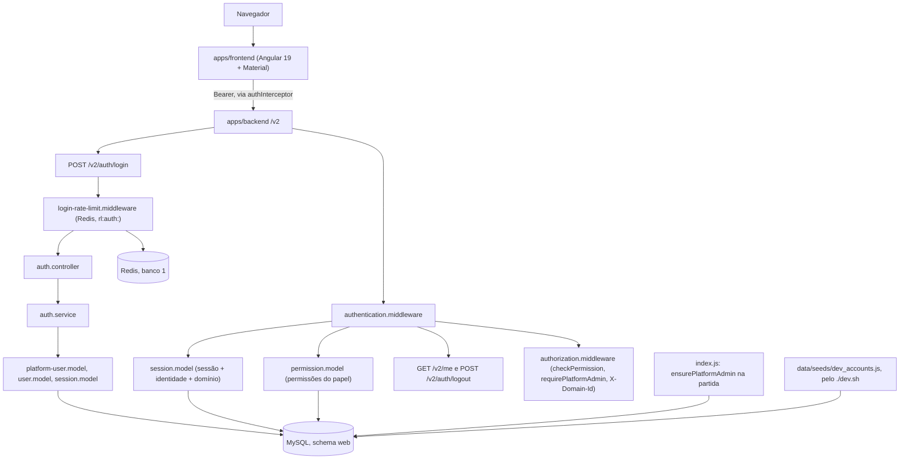

# Spec — F04. Autenticação do sistema

**Complexidade:** complex (3 endpoints e 4 middlewares no backend, 5 migrations com o catálogo de permissões, a base
inteira do frontend: Angular Material, tema, shell, guards e interceptores; a cópia do design system e um gate novo)

## 1. Visão técnica

**O quê.** A F04 cria a identidade, a sessão e a autorização do sistema web, e a base visual de todas as telas.

- **Backend (`apps/backend`):**
  - duas identidades: o `platform_admin`, numa tabela própria e sem domínio, e os usuários de domínio, com o papel
    `domain_admin` ou `user`. Os ids são UUID em `BINARY(16)`, e o e-mail é único entre as duas;
  - a cópia dos domínios (`dr_domain`: id, nome e status), que a F07 vai preencher;
  - o login (`POST /v2/auth/login`), com:
    - bcrypt de custo 10;
    - bloqueio da conta por 15 minutos depois de 5 erros seguidos;
    - limite de tentativas por IP no Redis;
    - JWT de 8 horas e uma sessão ativa no MySQL;
  - o `POST /v2/auth/logout` e o `GET /v2/me`;
  - quatro middlewares:
    - a autenticação, que confere o token e a sessão a cada requisição;
    - a autorização por permissão (área + ação);
    - a rota exclusiva da plataforma;
    - o limite de login por IP.

    O domínio que o `platform_admin` escolhe chega no header `X-Domain-Id`;
  - o catálogo de permissões de acesso, criado por migration na faixa 400–499, e o mapa papel → permissão;
  - o primeiro administrador da plataforma, criado na partida a partir do `PLATFORM_ADMIN_EMAIL` e do
    `PLATFORM_ADMIN_PASSWORD`;
  - o seed de desenvolvimento: o domínio das contas e2e, um domínio inativo e três contas.
- **Frontend (`apps/frontend`):**
  - Angular Material 19 com o tema claro e escuro do design system (M3, azure e blue, Open Sans, `density: -2`), os
    tokens `--app-*` e as classes globais do page shell;
  - a tela de login;
  - o shell:
    - o cabeçalho, com o nome, o papel, o domínio, a troca de tema e o botão Sair;
    - o menu lateral, conforme as permissões;
    - os breadcrumbs;
  - os guards (sessão, permissão, plataforma e destino por papel) e dois interceptores funcionais: o Bearer, e o
    tratamento do 401, do 403, do 404 e do 503;
  - as telas provisórias Domínios, Usuários e Playground, e as páginas de acesso negado, de página não encontrada e de
    serviço indisponível.
- **Documentação:**
  - a cópia adaptada do design system em `docs/design-system/angular-material.md`;
  - as seções novas do `README.md` e do `GATES.md`.
- **Gates:** o `visual-frontend` (novo) e a prova do `e2e-frontend` com os três perfis. Os dois são trabalho da
  `gate-builder` (§3, "Gates").

**Por quê.** Toda tela do sistema web (F07, F09, F12, F15, F16 e F18) depende de uma identidade, de uma sessão que
possa ser revogada, de permissões conferidas no backend e do mesmo shell. A F04 é a última feature de fundação (PRD
§8). Sem ela, o harness e2e não consegue logar e as telas não têm onde morar.

**Escopo.**

*Incluído:*
- **Backend:**
  - as cinco migrations do §6 e o seed de desenvolvimento;
  - os três endpoints do §5 e os quatro middlewares;
  - a criação do primeiro administrador na partida;
  - as regras de senha e de e-mail, compartilhadas com a F07 e a F09;
  - o `redact` do header `Authorization` nos logs;
  - os utilitários dos testes de integração: `setupTestDatabase`, `generateToken` e `permission-helper`.
- **Frontend:** as dependências do Material, o tema, as fontes empacotadas, o login, o shell, os guards, os
  interceptores, as três telas provisórias e as páginas de 403, de 404 e de indisponibilidade.
- **Raiz:**
  - o `./dev.sh` passa a aplicar o seed depois das migrations;
  - o `README.md` e o `GATES.md`;
  - a cópia do design system.
- **Gates:** o `visual-frontend` e a prova do `e2e-frontend` (pela `gate-builder`).

*Contratos de entrada (Consome):* a F04 depende só da F01:
- o `database.js` com `dbRead`/`dbWrite`, o `redis-client.js`, o `src/config/env`, o request ID, o CORS e o formato de
  erro `{ message }`;
- o `uuidToBin`/`binToUuid` de `src/utils/uuid.utils.js`;
- os schemas `web` e `web_test`, o banco 1 do Redis (desenvolvimento) e o banco 3 (testes);
- as variáveis `JWT_SECRET`, `PLATFORM_ADMIN_EMAIL` e `PLATFORM_ADMIN_PASSWORD`, que a F01 já exige. As regras de conteúdo
  delas são da F04.

*Contratos de saída (Fornece):*
- **Cópia dos domínios (`dr_domain` no schema `web`):** a F07 preenche e atualiza, no mesmo fluxo em que chama o proxy.
  O login e o cabeçalho a leem.
- **Usuários de domínio (`users`):** a F07 cria o primeiro `domain_admin` junto com o domínio, e a F09 cria, edita e
  remove os demais.
- **Sessões (`active_sessions`):** a F07 revoga as sessões de um domínio desativado ou removido, e a F09 as de um usuário
  removido. Os métodos de revogação estão no §5, "Interfaces internas".
- **Regras de senha e de e-mail:** `validatePassword` e `normalizeEmail`/`isValidEmail`, para os formulários da F07 e da
  F09.
- **E-mail único entre as identidades:** `isEmailTaken(email)`, para a F07 e a F09.
- **Autorização:**
  - `authenticate`, `checkPermission(area, action)` e `requirePlatformAdmin`, usados por toda rota nova;
  - o header `X-Domain-Id` do `platform_admin`.
- **Catálogo de permissões:** a tabela `permissions` e o mapa `role_permissions`. Cada feature acrescenta as permissões
  das áreas dela na própria faixa de ids.
- **`GET /v2/me`:** nome, papel, domínio e permissões, para o menu e para os guards.
- **Frontend:**
  - o shell, o menu (uma lista de itens com a permissão de cada um), os guards, os interceptores, o
    `CurrentUserService`, o `ThemeService`, o `NotificationService`, os breadcrumbs, o layout das telas de autenticação
    e o page shell global;
  - as telas provisórias, que a F07 (Domínios), a F09 (Usuários) e a F15 (Playground) trocam pelas reais.
- **Testes:** os utilitários de integração do backend e as contas do harness e2e, criadas pelo seed.

*Fora do escopo:*
- **Telas reais:**
  - Domínios (F07), Usuários e o seletor de domínio do `platform_admin` (F09), Playground (F15);
  - o frontend só passa a mandar o `X-Domain-Id` quando a F09 criar o seletor. A F04 entrega o lado do backend.
- **Remoção de usuário** (a marcação, o efeito no login e a revogação das sessões): é da F09. A F04 entrega o método de
  revogação.
- **Revogação das sessões ao desativar ou remover um domínio:** é da F07. A F04 já recusa, a cada requisição, a sessão de
  um usuário cujo domínio não está ativo (§3).
- **A mensagem de indisponibilidade do proxy nas telas,** parte do 15º critério: é da F11, porque nenhuma tela da F04 fala
  com o proxy.
- **Limpeza das sessões expiradas:** as linhas ficam no banco. Uma rotina de limpeza fica para quando o volume pedir.
- **Recuperação de senha, 2FA, renovação do token, reCAPTCHA, impersonação, permissões por usuário e grupos** (PRD §7).
- **Auditoria de login:** a F12 audita ações administrativas, e um login não é uma delas.

## 2. Impacto na arquitetura



**Pipeline HTTP do backend** (o que muda está em negrito):
1. request ID;
2. pino-http, **com o `Authorization` redigido**;
3. CORS, **com o `X-Domain-Id` entre os headers aceitos**;
4. JSON body;
5. `/health`;
6. `/v2`:
   - **`POST /auth/login`**, com o limite por IP, sem autenticação;
   - **`authenticate`** para todo o resto do `/v2`;
   - **`POST /auth/logout`** e **`GET /me`**;
7. 404;
8. erros: JSON inválido, **`AppError` (status e corpo próprios)**, **banco indisponível → 503** e erro inesperado.

**Um login:**
1. O limite por IP conta a tentativa no Redis, com prazo de 2 s. Acima do teto, devolve 429. Sem o Redis, devolve 503.
2. Valida o corpo. Um corpo sem e-mail ou sem senha recebe 400.
3. Normaliza o e-mail (remove os espaços das pontas e passa para minúsculas) e procura primeiro em `platform_users`,
   depois em `users`, lendo junto o status do domínio.
4. Se o e-mail não existe, compara a senha com um hash fixo, para que o tempo de resposta não revele o e-mail, e
   devolve 401.
5. Numa transação, com a linha da identidade travada (`FOR UPDATE`):
   - se a conta está bloqueada, devolve 423, sem comparar a senha;
   - uma senha fora das regras é comparada com o hash fixo, com o mesmo custo, e conta como erro. Ela nunca é comparada
     com o hash da conta: o bcrypt só considera 72 bytes, e uma senha mais longa com os mesmos 72 primeiros bytes
     casaria;
   - se a senha está fora das regras ou não confere:
     - soma 1 ao contador;
     - no 5º erro, bloqueia por 15 minutos, zera o contador e devolve 423;
     - antes do 5º, devolve 401;
   - se a senha confere, zera o contador. Se o domínio do usuário não está ativo, devolve 403;
   - se tudo confere, grava o `last_login_at` e cria a sessão.
6. Assina o JWT com o id da sessão e devolve o token e a expiração.

**Uma requisição autenticada:**
1. Lê o `Authorization: Bearer`. Sem ele, devolve 401.
2. Confere a assinatura e a expiração do JWT (HS256). Se falhar, devolve 401.
3. Lê a sessão junto com a identidade e o domínio, numa consulta. O prazo é de 2 s, e um erro do banco devolve 503.
4. Devolve 401 se:
   - a sessão não existe, foi revogada ou expirou;
   - a sessão é de outra identidade;
   - o domínio de um usuário de domínio não está `active`.
5. Lê as permissões do papel, numa consulta, e preenche o contexto da requisição (§5, "Contexto da requisição").

**No frontend:**
- o `authInterceptor` põe o Bearer em toda chamada ao `environment.apiUrl`;
- o `errorInterceptor` trata, para toda chamada que não seja o login nem o logout:
  - o 401: volta ao login com *"Sua sessão expirou. Entre novamente."*;
  - o 403: recarrega o `/v2/me` e mostra o acesso negado;
  - o 404: mostra a página não encontrada;
  - o 503 ou a falha de rede: mostra a mensagem de indisponibilidade, sem deslogar;
- os guards decidem, antes de abrir a rota, se o usuário entra, e para onde vai;
- Sair sempre termina no login com *"Você saiu do sistema."*: o `SignInService` chama o logout e, com sucesso ou com
  qualquer erro (401, 503, falha de rede), apaga a sessão local.

## 3. Decisões técnicas

| Decisão | Escolha | Alternativa considerada | O que se aceita |
|---|---|---|---|
| Sessão | JWT de 8 h com `{ data: { session_id, user } }`, conferido a cada requisição contra `active_sessions` (PRD) | só o JWT, sem estado | 2 consultas por requisição autenticada, e 3 numa rota compartilhada do `platform_admin` (a do `X-Domain-Id`) |
| Domínio inativo depois do login | a autenticação confere o status do domínio a cada requisição e devolve 401 | depender só da revogação das sessões pela F07 | um join a mais na consulta da sessão; vale como defesa em profundidade |
| Ids das identidades e da sessão | UUID em `BINARY(16)`, com os helpers da F01 (decisão do usuário) | `INT` com auto-incremento | conversão em todo model; id não sequencial nas URLs e no proxy |
| Telas de destino do login | provisórias em `/domains`, `/users` e `/playground`. A F04 cria só a leitura das áreas que abre: 400 `users.read` e 401 `playground.read` (decisão do usuário) | uma tela Início genérica | a F07, a F09 e a F15 trocam as telas, e a F09 e a F15 criam as outras ações nas faixas delas |
| 403 de uma rota de administração | provado no teste de integração com uma rota montada só no teste. Na tela, o guard já mostra a mensagem (decisão do usuário) | criar um endpoint que o PRD não pede | o 403 numa rota real do produto chega com a F09 |
| Domínio do `platform_admin` | header `X-Domain-Id`, validado pelo `checkPermission` contra a cópia (decisão do usuário) | `?domain_id=` na URL | o header entra no CORS. Os usuários de domínio o têm ignorado |
| Permissões | catálogo fixo (`permissions`) + mapa `role_permissions`, com o `platform_admin` como papel no mapa | grupos ou permissões por usuário | PRD §7 deixa grupos fora. Cada spec decide quais papéis recebem cada permissão, e as rotas que o `platform_admin` divide com os domínios lhe dão a permissão |
| Limite por IP | `express-rate-limit` ^8.3.1 + `rate-limit-redis` ^4.3.1 (a 4 aceita o `express-rate-limit` 8; a 6 pediria o 8.6), prefixo `rl:auth:`, janela de 15 min. O teto vem do `LOGIN_RATE_LIMIT_MAX` (padrão 20). Só o modelo de desenvolvimento o sobe para 200 (decisão do usuário) | contador próprio com `INCR` | o `./dev.sh` não reproduz o 429 com 20: o critério é provado no teste de integração e, em runtime, com o backend sem a variável |
| Bloqueio por conta | contador e `locked_until` na linha da identidade, numa transação com `FOR UPDATE` | contador no Redis | o bloqueio vale mesmo sem o Redis. Sem o MySQL o login já devolve 503 |
| Status do bloqueio | 423, com `locked_until` e a hora `HH:MM` em `America/Sao_Paulo` na mensagem | 401 ou 429 | a resposta revela que a conta existe, como o PRD aceita |
| Senha fora das regras no login | tratada como senha errada: 401 e conta para o bloqueio | 400 | o bcrypt só considera 72 bytes: sem a recusa, uma senha mais longa com os mesmos 72 primeiros bytes entraria |
| Hash | `bcrypt` 6, custo 10 | `bcrypt` 5.1 | a 6 traz os binários de Linux musl (Alpine do container) e de Windows dentro do pacote, sem download nem compilação no `npm ci`. A API e o formato `$2b$10$` são os da 5 |
| HTTP no frontend | interceptores funcionais (`provideHttpClient(withInterceptors(...))`) (decisão do usuário) | header e `catchError` montados em cada serviço | os serviços recebem as dependências pelo construtor, e os testes os instanciam à mão com um `httpClientMock` (regras FS1–FS5 da `unit-test-writer`). Os interceptores e os guards funcionais são testados com `TestBed.runInInjectionContext` e mocks |
| Estado no frontend | `BehaviorSubject` nos serviços | signals ou NgRx | o mesmo padrão em todo o app |
| Fontes | `@fontsource/open-sans` e `material-icons`, empacotadas no build | Google Fonts por link | o gate visual e as telas não dependem de rede externa |
| Tema padrão | segue o `prefers-color-scheme` até o usuário escolher. A escolha fica no `localStorage['theme']` | claro fixo | — |
| Cópia do design system | adaptada ao AI Gateway: mantém as regras visuais e técnicas e tira o contexto e os padrões de outro domínio (decisão do usuário). O corpo fica em inglês, como na origem (decisão desta spec, §5, "Design system") | literal, só sem os nomes | a sincronização com a referência é manual |
| Testes dos fluxos de login | o login pela tela, as mensagens de credencial inválida e de domínio inativo, Sair e a sessão adulterada ficam com a integração, com os testes unitários e com a verificação `runtime-only`. O e2e cobre os fluxos com a sessão guardada | testes e2e que logam | as regras A1 e A2 da `e2e-test-writer` proíbem logar dentro de um teste e forjar um token, e o `GATES.md` proíbe logar por teste |
| Primeiro administrador | criado no `index.js`, depois do `assertConfig` e antes do `listen`. Qualquer falha encerra o processo com código 1 e uma linha de log | criar pelo seed | a partida passa a precisar do MySQL, que o `./dev.sh` já sobe antes |
| Banco indisponível | a conferência da sessão tem prazo de 2 s (`acquireConnectionTimeout` do knex). Um erro de conexão vira 503, com o request ID no log | o padrão de 60 s do knex | uma requisição nunca fica presa esperando o MySQL |
| Seed de desenvolvimento | `data/seeds/dev_accounts.js`, idempotente, só com `NODE_ENV=development`. O `./dev.sh` o aplica depois das migrations | aplicar à mão | as contas e2e existem em todo ambiente local novo |
| Erros do backend | `AppError(status, message, extra)`, lançado pelos services e traduzido pelo `errorHandler` | `try/catch` com `res.status` em cada controller | um formato só, `{ message, ...extra }` |

**Gates.** A `gate-builder` faz duas rodadas:
- **Rodada prévia (antes do `implement-feature`):**
  - completa o harness e2e:
    - o perfil `platform_admin`, com o projeto, a semente e a fixture `platformAdminApi`;
    - o login de cada perfil no global setup, por `POST /v2/auth/login`, gravando no storage state o `currentUser`
      inteiro (`{ token, expires_at }`), porque o `authGuard` confere o `expires_at`;
    - a sessão guardada só é reaproveitada se o `GET /v2/me` dela responder 200. Uma sessão revogada (por exemplo,
      depois de recriar o banco) faz o global setup logar de novo, em vez de quebrar todos os testes;
    - as variáveis `E2E_*`;
    - a semente do `user` conferindo, pelo `/v2/me` das duas sessões, que o `admin` e o `user` estão no mesmo domínio;
  - monta o `visual-frontend`, para as medições do contrato;
  - documenta no `GATES.md` a configuração anti-bot de não produção (`LOGIN_RATE_LIMIT_MAX`) e a política de dados
    (§5, "GATES.md"), e atualiza as seções "Ainda não construído" e "O que estes gates NÃO checam".
- **Rodada posterior (depois do `implement-feature`):**
  - prova os dois gates do vermelho ao verde contra o `./dev.sh`;
  - registra a data no Histórico;
  - põe o `e2e-frontend` e o `visual-frontend` na cadeia padrão.

**Ordem depois da spec:**
1. a rodada prévia da `gate-builder`;
2. o `implement-feature`. Ele ainda não aciona a `e2e-test-writer`, porque o `e2e-frontend` só fica provado na rodada
   posterior;
3. a rodada posterior da `gate-builder`;
4. a `e2e-test-writer` (confirmada pela `e2e-test-validator`) para as linhas `e2e` do contrato, num commit de teste da
   F04;
5. o `evaluator`.

## 4. Componentes

**Backend (`apps/backend`):**

| Arquivo | Novo/Modificado | Propósito | Responsabilidades |
|---|---|---|---|
| `package.json`, `package-lock.json` | M | dependências | `jsonwebtoken` ^9, `bcrypt` ^6, `joi` ^17.13, `express-rate-limit` ^8.3.1, `rate-limit-redis` ^4.3.1 |
| `config/.env.{development,testing,production}.example` | M | modelos | `LOGIN_RATE_LIMIT_MAX` (vazio no testing e na produção, `200` no development) |
| `index.js` | M | partida | `assertConfig` → `ensurePlatformAdmin` → `listen`. Uma falha encerra com código 1 e uma linha de log sem a senha |
| `knexfile.js` | M | pool | `acquireConnectionTimeout: 2000` e `connectTimeout: 2000` no mysql2 |
| `redis-client.js` | M | cliente Redis | exporta `getClient()`, que conecta sob demanda com prazo de 2 s, com `disableOfflineQueue: true`. Guarda a promessa da conexão em andamento: chamadas simultâneas esperam a mesma conexão, em vez de receberem erro da fila desligada |
| `src/config/env.js` | M | configuração | regras de conteúdo de `PLATFORM_ADMIN_EMAIL` e `PLATFORM_ADMIN_PASSWORD`, com o motivo na mensagem; `LOGIN_RATE_LIMIT_MAX` (1 a 10.000, padrão 20) |
| `src/logger/index.js` | M | logger | `redact` de `req.headers.authorization` e `req.headers.cookie` |
| `src/middleware/cors.middleware.js` | M | CORS | aceita o header `X-Domain-Id` |
| `src/middleware/error-handler.middleware.js` | M | erros | traduz o `AppError` e os erros de conexão do banco (503 com o request ID no log) |
| `src/middleware/authentication.middleware.js` | N | `authenticate` | token, sessão, identidade, domínio ativo, permissões e contexto da requisição |
| `src/middleware/authorization.middleware.js` | N | autorização | `checkPermission(area, action)`, com o `X-Domain-Id` do `platform_admin`, e `requirePlatformAdmin` |
| `src/middleware/login-rate-limit.middleware.js` | N | limite por IP | o `rateLimit()` é criado na importação do módulo, com um store próprio que cria o `RedisStore` só na primeira requisição e repassa a ele o `init` e as operações. Teto do config, 429 com `Retry-After`, 503 em falha do store |
| `src/utils/app-error.utils.js` | N | erro de aplicação | `AppError` e os erros prontos (`unauthorized`, `forbidden`, `serviceUnavailable`, ...) com as mensagens do §5 |
| `src/utils/password.utils.js` | N | regras de senha | `validatePassword(password)` devolve `{ valid, rule }`: 10 a 64 caracteres (pontos de código) e até 72 bytes em UTF-8. Em CommonJS, como o `src/config/env.js`, porque o config e o seed (rodado pelo CLI do knex, sem Babel) o importam |
| `src/utils/email.utils.js` | N | regras de e-mail | `normalizeEmail` (sem espaços nas pontas e em minúsculas) e `isValidEmail` (até 254 caracteres, `local@domínio.tld`). Em CommonJS, pelo mesmo motivo |
| `src/utils/datetime.utils.js` | N | hora local | `formatClockTime(date)` → `HH:MM` em `America/Sao_Paulo` |
| `src/utils/database-errors.utils.js` | N | classificação | `isDatabaseUnavailable(error)`: erros de conexão do mysql2 e o timeout do pool do knex |
| `src/models/session.model.js` | N | sessões | `create`, `findWithIdentity`, `revoke`, `revokeAllForUser`, `revokeAllForDomain` |
| `src/models/platform-user.model.js` | N | identidade de plataforma | `findByEmail`, `findByEmailForUpdate`, `existsAny`, `create`, `registerFailure`, `registerSuccess` |
| `src/api/v2/models/user.model.js` | N | usuários de domínio | `findByEmail` (com o status e o nome do domínio), `findByEmailForUpdate`, `registerFailure`, `registerSuccess` |
| `src/api/v2/models/domain.model.js` | N | cópia dos domínios | `findById` (id, nome e status) |
| `src/api/v2/models/permission.model.js` | N | catálogo | `findByRole(role)` → `['area.action', ...]` |
| `src/services/auth.service.js` | N | login e logout | o fluxo do §2, o hash fixo do e-mail inexistente, o JWT e a revogação no logout |
| `src/services/platform-admin-bootstrap.service.js` | N | primeiro administrador | `ensurePlatformAdmin({ email, password })` (§5) |
| `src/services/email-availability.service.js` | N | e-mail único | `isEmailTaken(email)`, nas duas identidades |
| `src/api/v2/controllers/auth.controller.js` | N | handlers | `login` (validação Joi do corpo) e `logout` |
| `src/api/v2/controllers/me.controller.js` | N | handler | `show`, a partir do contexto da requisição |
| `src/api/v2/routes/auth.routes.js` | N | rotas | `POST /login` (limite → controller) e `POST /logout` (`authenticate` → controller) |
| `src/api/v2/routes/me.routes.js` | N | rota | `GET /` → controller |
| `src/api/v2/index.js` | M | montagem | `/auth`, depois `authenticate`, depois `/me` |
| `data/seeds/dev_accounts.js` | N | seed | os dois domínios e as três contas (§6). Em CommonJS e sem importar models nem services (o CLI do knex não passa pelo Babel) |
| `__tests__/utils/test-setup.js` | M | integração | `setupTestDatabase()` cria (se faltar) o domínio e o `domain_admin` de integração e devolve `{ db, user, domain }`, com `user` = `{ id, email, name, role, dr_domain_id }` e `domain` = `{ domain_id, name, status }` (ids em UUID texto). `cleanupTestDatabase()` apaga as sessões criadas e fecha as conexões |
| `__tests__/utils/auth.js` | N | integração | `generateToken({ user: { id, dr_domain_id } })` ou `generateToken({ platformUser: { id } })`, com `expiresAt` opcional (assíncrono: grava a sessão e assina o token), e `resetLoginRateLimit()` |
| `__tests__/utils/permission-helper.js` | N | integração | `createTestDomain`, `createTestUser`, `createTestPlatformUser` e os `delete*` correspondentes |

**Frontend (`apps/frontend`):**

| Arquivo | Novo/Modificado | Propósito | Responsabilidades |
|---|---|---|---|
| `package.json`, `package-lock.json` | M | dependências | `@angular/material` e `@angular/cdk` ~19.2.19, `@angular/animations` e `@angular/forms` ~19.2.20, `@fontsource/open-sans`, `material-icons` |
| `angular.json` | M | build | as folhas das fontes em `styles`, se o `styles.scss` não as importar |
| `src/main.ts` | M | bootstrap | `provideHttpClient(withInterceptors([authInterceptor, errorInterceptor]))` e `provideAnimationsAsync()` |
| `src/themes/_base-theme.scss` | N | tema | `mat.theme` (azure/blue, Open Sans, `density: -2`) e `mat.theme-overrides` claro e escuro, pelas tabelas do design system |
| `src/themes/default-theme.scss` | N | classes de tema | `.theme-default` e `.theme-default-dark`, com as variáveis do menu lateral |
| `src/styles.scss` | M | global | tema, fontes, tokens `--app-*` (espaçamento e status), page shell (`.content-wrapper`, `.header-container`, `.content-header`, `.content`) e `.empty-state` |
| `src/app/app-routing.ts` | M | rotas | a tabela do §5, "Rotas" |
| `src/app/auth/auth.component.{ts,html,css}` | N | layout das telas de autenticação | o `mat-card` centralizado |
| `src/app/auth/auth.base.css` | N | estilos compartilhados | `h1.title`, `p.login-box-msg`, `.separator`, `.link` (design system) |
| `src/app/auth/sign-in/sign-in.component.{ts,html,css}` | N | login | o formulário, as mensagens recebidas pela navegação e as do backend, e o destino por papel |
| `src/app/auth/sign-in/sign-in.service.ts` | N | sessão | `login`, `logout` (apaga a sessão local com sucesso ou erro), `getToken`, `isSessionExpired` e `clearSession` sobre o `localStorage['currentUser']` |
| `src/app/services/current-user.service.ts` | N | usuário logado | `me$` (`BehaviorSubject`), `load()` (`GET /v2/me`), `hasPermission`, `isPlatformAdmin`, `landingRoute()`, `clear()` |
| `src/app/services/notification.service.ts` | N | avisos | `MatSnackBar` para a indisponibilidade |
| `src/app/shared/services/theme.service.ts` | N | tema | `isDarkMode$`, `toggle()`, a classe no `<body>` e o `localStorage['theme']` |
| `src/app/interceptors/auth.interceptor.ts` | N | Bearer | só para o `environment.apiUrl` |
| `src/app/interceptors/error.interceptor.ts` | N | erros HTTP | 401, 403, 404, 503 e falha de rede, menos no login e no logout |
| `src/app/guards/auth.guard.ts` | N | guards funcionais | `authGuard`, `loginGuard`, `permissionGuard`, `platformAdminGuard` e `landingGuard` |
| `src/app/layout/layout.component.{ts,html,css}` | N | shell | cabeçalho, menu lateral e `router-outlet` |
| `src/app/main-header/main-header.component.{ts,html,css}` | N | cabeçalho | nome, papel, domínio, tema e Sair |
| `src/app/main-sidebar/main-sidebar.component.{ts,html,css}` | N | menu lateral | os itens visíveis para o usuário, com o ativo destacado |
| `src/app/main-sidebar/menu-items.ts` | N | configuração do menu | a tabela do §5, "Menu" |
| `src/app/breadcrumbs/breadcrumbs.component.{ts,html,css}` e `breadcrumbs.model.ts` | N | breadcrumbs | `Breadcrumb { iconClass, alias, url }` vindo dos dados da rota |
| `src/app/placeholder/placeholder.component.{ts,html,css}` | N | telas provisórias | page shell, título e breadcrumbs da rota, e o aviso do §5 |
| `src/app/forbidden/forbidden.component.{ts,html,css}` | N | 403 | *"Você não tem permissão para acessar esta página."* |
| `src/app/not-found/not-found.component.{ts,html,css}` | N | 404 | *"Página não encontrada."* |
| `src/app/auth/unavailable/unavailable.component.{ts,html,css}` | N | indisponibilidade ao abrir o app | a mensagem de indisponibilidade e o botão "Tentar novamente", dentro do layout das telas de autenticação, sem apagar a sessão |

Todo componente novo é standalone, com prefixo `tails`, `.component.css` (nunca `.scss`), `Mat*Module` importado
explicitamente e o spec ao lado. Os serviços recebem as dependências pelo construtor (FS1 da `unit-test-writer`).

**Raiz e documentação:**

| Arquivo | Novo/Modificado | Propósito |
|---|---|---|
| `dev.sh` | M | depois das migrations, `npm run -s seed:dev` no backend, pelo mesmo `app_compose run --rm --no-deps` |
| `docs/design-system/angular-material.md` | N | a cópia adaptada (§5, "Design system") |
| `README.md` | M | seção "Autenticação": as contas do seed, a variável `LOGIN_RATE_LIMIT_MAX`, o primeiro administrador e o desbloqueio de uma conta no ambiente local |
| `GATES.md` | M | `styles-frontend` passa a citar `docs/design-system/angular-material.md`. A configuração anti-bot e a política de dados vêm da `gate-builder` (§5, "GATES.md") |

**Banco de dados (`apps/backend/migrations`):**

| Migration | Tabelas | Operação | Notas |
|---|---|---|---|
| `<ts>_create_table_dr_domain.js` | `dr_domain` | CREATE | cópia dos domínios |
| `<ts>_create_table_platform_users.js` | `platform_users` | CREATE | identidade de plataforma |
| `<ts>_create_table_users.js` | `users` | CREATE | FK para `dr_domain` |
| `<ts>_create_table_active_sessions.js` | `active_sessions` | CREATE | FKs para as duas identidades e `CHECK` de dono único |
| `<ts>_create_tables_permissions.js` | `permissions`, `role_permissions` | CREATE + INSERT | ids 400 e 401 e o mapa da F04 |

`<ts>` é o `YYYYMMDDHHMMSS` gerado pelo `npm run migration:add`, nesta ordem. Toda migration tem `up` e `down`, com guarda
`hasTable`.

## 5. Contratos de API

Todos os corpos são JSON. Os erros têm o formato `{ "message": "..." }`, às vezes com campos a mais, e toda resposta
traz o `x-request-id` (F01).

### `POST /v2/auth/login`

- **Autenticação:** nenhuma. Passa pelo limite por IP.
- **Resposta:** `Cache-Control: no-store`.

**Requisição:**

| Campo | Tipo | Obrigatório | Validação | Descrição |
|---|---|---|---|---|
| `email` | string | sim | 1 a 254 caracteres depois do `trim` | e-mail, comparado sem diferenciar maiúsculas |
| `password` | string | sim | não vazio | senha. Fora das regras de senha, conta como senha errada |

```json
{ "email": "admin@temporario.com", "password": "********" }
```

**Resposta 200:**

| Campo | Tipo | Descrição |
|---|---|---|
| `token` | string | JWT HS256 |
| `expires_at` | string ISO 8601 (UTC) | o fim da sessão: 8 horas depois do login, truncado ao segundo |

```json
{
  "token": "eyJhbGciOiJIUzI1NiIsInR5cCI6IkpXVCJ9.eyJkYXRhIjp7...",
  "expires_at": "2026-10-05T03:12:45.000Z"
}
```

**Payload do JWT:**
- de um usuário de domínio:
  `{ "data": { "session_id": "<uuid>", "user": { "id": "<uuid>", "type": "domain", "dr_domain_id": "<uuid>" } }, "iat": …, "exp": … }`;
- do `platform_admin`: `user` = `{ "id": "<uuid>", "type": "platform" }`, sem `dr_domain_id`.

O `expires_at` da sessão é truncado ao segundo, e o `exp` do JWT é esse instante em segundos. O token é assinado com
`exp` explícito (não com `expiresIn`), para os dois coincidirem.

**Erros:**

| Status | Quando | Corpo |
|---|---|---|
| 400 | corpo sem `email` ou `password`, com tipos errados, ou e-mail acima de 254 caracteres | `{ "message": "Informe o e-mail e a senha." }` |
| 401 | e-mail inexistente, ou senha errada ou fora das regras | `{ "message": "E-mail ou senha inválidos." }` (o mesmo corpo nos dois casos) |
| 403 | senha correta, mas o domínio do usuário está inativo, removido ou fora da cópia | `{ "message": "O domínio da sua conta está desativado. Fale com o administrador da plataforma." }` |
| 423 | a 5ª senha errada seguida, ou qualquer tentativa durante o bloqueio, inclusive com a senha correta | `{ "message": "Conta bloqueada por 15 minutos após várias tentativas. Tente novamente às HH:MM.", "locked_until": "<ISO>" }` |
| 429 | acima do teto de tentativas do IP na janela de 15 min | `{ "message": "Muitas tentativas de login. Tente novamente em alguns minutos." }`, com o header `Retry-After` em segundos |
| 503 | Redis indisponível (o limite não pode ser garantido) ou MySQL indisponível | `{ "message": "Serviço temporariamente indisponível. Tente novamente em instantes." }` |

**Regras:**
- **Limite por IP:**
  - conta toda requisição a esta rota, válida ou não;
  - chave `rl:auth:<ip>` no Redis;
  - teto do `LOGIN_RATE_LIMIT_MAX`, janela de 15 minutos;
  - o IP é o da conexão (`trust proxy` desligado).
- **Bloqueio:**
  - vale para as duas identidades;
  - o contador conta erros **seguidos**: um login correto o zera, e o bloqueio também (o contador volta a 0 quando a
    conta é bloqueada);
  - uma tentativa durante o bloqueio não muda nada;
  - o `HH:MM` é a hora de `locked_until` em `America/Sao_Paulo`.
- **Identidade:** procura primeiro o `platform_admin`, depois os usuários de domínio (PRD).
- **Senha certa num domínio inativo:** zera o contador e não cria sessão.
- **Logs:** nenhum log tem a senha nem o corpo da requisição. O `Authorization` é redigido pelo pino.

### `POST /v2/auth/logout`

- **Autenticação:** `authenticate`.
- **Efeito:** revoga a sessão do token (`revoked_at` = agora, `revoked_reason` = `logout`).
- **Resposta 204,** sem corpo. O mesmo token recebe 401 na requisição seguinte.
- **Erros:** os da autenticação (401, 503).

### `GET /v2/me`

- **Autenticação:** `authenticate`. Nenhuma permissão é exigida. O header `X-Domain-Id` é ignorado.

**Resposta 200:**

| Campo | Tipo | Descrição |
|---|---|---|
| `id` | string (UUID) | id da identidade |
| `name` | string | nome |
| `email` | string | e-mail normalizado |
| `role` | `platform_admin` \| `domain_admin` \| `user` | papel |
| `domain` | `{ id, name }` \| `null` | o domínio do usuário; `null` para o `platform_admin` |
| `permissions` | string[] | as permissões do papel, no formato `area.action`, em ordem alfabética |

```json
{
  "id": "3f6c1a8e-2b4d-4c9e-8f1a-6b2d9e0c7a51",
  "name": "Administrador de teste",
  "email": "admin@temporario.com",
  "role": "domain_admin",
  "domain": { "id": "5a1f3c2e-8d4b-4f6a-9b2c-7e1d0f3a6b45", "name": "Domínio de teste" },
  "permissions": ["playground.read", "users.read"]
}
```

O `platform_admin` recebe `"domain": null` e `"permissions": ["users.read"]`.

**Erros:** os da autenticação (401, 503).

### Erros comuns da autenticação e da autorização

| Status | Origem | Corpo |
|---|---|---|
| 401 | sem token; token malformado, adulterado ou expirado; sessão inexistente, revogada ou expirada; sessão de outra identidade; domínio do usuário não ativo | `{ "message": "Sua sessão expirou. Entre novamente." }` |
| 403 | `checkPermission` sem a permissão; `requirePlatformAdmin` com um usuário de domínio | `{ "message": "Você não tem permissão para acessar esta página." }` |
| 400 | `platform_admin` numa rota compartilhada sem `X-Domain-Id` | `{ "message": "Escolha um domínio." }` |
| 404 | `X-Domain-Id` que não é UUID, não está na cópia ou está removido | `{ "message": "Domínio não encontrado." }` |
| 503 | MySQL indisponível na conferência da sessão, das permissões ou do domínio | `{ "message": "Serviço temporariamente indisponível. Tente novamente em instantes." }` |

### Contexto da requisição (interface interna)

Depois do `authenticate`, os controllers e o `checkPermission` usam:

| Campo | Tipo | Conteúdo |
|---|---|---|
| `req.sessionId` | string (UUID) | id da sessão |
| `req.identityType` | `'platform'` \| `'domain'` | tipo da identidade |
| `req.platformUserId` | string (UUID) \| `null` | id do `platform_admin` |
| `req.userId` | string (UUID) \| `null` | id do usuário de domínio |
| `req.role` | string | papel |
| `req.domainId` / `req.domainInBinary` | string / `Buffer` \| `null` | domínio do usuário. Para o `platform_admin`, só depois do `checkPermission` de uma rota compartilhada (o do `X-Domain-Id`) |
| `req.permissions` | `Set<string>` | permissões do papel, `area.action` |
| `req.currentUser` | objeto | `{ id, name, email, role, domain }`, o corpo do `/v2/me` sem as permissões |

**`checkPermission(area, action)`:**
- sem `area.action` em `req.permissions`: devolve 403;
- usuário de domínio: segue, com o domínio do token e da sessão. O `X-Domain-Id` é ignorado;
- `platform_admin`: exige o `X-Domain-Id`:
  - sem o header, devolve 400;
  - com um UUID inválido, ou com um domínio fora da cópia ou removido, devolve 404;
  - com um domínio ativo ou inativo, preenche `req.domainId`/`req.domainInBinary` e segue.

**`requirePlatformAdmin`:** segue só com `req.identityType === 'platform'`. Senão, devolve 403. É para as rotas da
plataforma (domínios e catálogo, na F07).

Toda rota nova declara, na própria linha da rota, o `checkPermission` ou o `requirePlatformAdmin` (regra
`backend-routes-only-wire`).

### Interfaces internas fornecidas

- `SessionModel.revokeAllForUser(userId, reason)` e `SessionModel.revokeAllForDomain(domainId, reason)`: revogam as
  sessões ainda válidas e devolvem quantas foram revogadas. A `revokeAllForDomain` faz um `UPDATE` só, com subconsulta
  dos usuários do domínio, sem loop. Os motivos aceitos são `logout`, `user_removed`, `domain_inactive` e
  `domain_removed`. A F07 e a F09 os usam numa transação delas: os métodos aceitam um `trx` opcional.
- `validatePassword(password)` → `{ valid: true }` ou `{ valid: false, rule }`, com `rule` ∈ `min_length`,
  `max_length` e `max_bytes`.
- `isEmailTaken(email, { trx })` → `true` se o e-mail normalizado existe em `platform_users` ou em `users`.

### Primeiro administrador (`ensurePlatformAdmin`)

- **Na partida, depois do `assertConfig`:**
  - se já existe qualquer linha em `platform_users`, não cria nem altera nada, e o log diz
    `Platform admin already present`;
  - se o `PLATFORM_ADMIN_EMAIL` normalizado já é de um usuário de domínio, encerra com
    `PLATFORM_ADMIN_EMAIL is already used by a domain user`;
  - senão, cria o `platform_admin` com o nome "Administrador da plataforma", o e-mail normalizado e o hash bcrypt, e o
    log diz `Platform admin created`.
- **Senha fora das regras:** o `assertConfig` falha antes, e o backend não sobe. A mensagem cita a variável e a regra,
  por exemplo `Missing or invalid environment variable: PLATFORM_ADMIN_PASSWORD (must have at most 72 bytes in UTF-8)`.
  As outras regras são `must have at least 10 characters` e `must have at most 64 characters`.
- **E-mail inválido:** a mensagem é `... PLATFORM_ADMIN_EMAIL (must be a valid e-mail up to 254 characters)`.
- **Nunca** o valor da senha aparece em log ou erro.

### Configuração

| Variável | App | Obrigatória | Regra | Padrão |
|---|---|---|---|---|
| `PLATFORM_ADMIN_EMAIL` | backend | sim (F01) | e-mail válido, até 254 caracteres | — |
| `PLATFORM_ADMIN_PASSWORD` | backend | sim (F01) | regras de senha: 10 a 64 caracteres e até 72 bytes em UTF-8 | — |
| `LOGIN_RATE_LIMIT_MAX` | backend | não | inteiro de 1 a 10.000 | 20 |

A variável nova entra nos três modelos `.env.*.example` do backend no mesmo commit (`CLAUDE.md`):
- vazia no `testing` e no `production`;
- `200` no `development`, com o motivo no `README.md`.

O `.env.development` local recebe o mesmo valor.

### Frontend

**`localStorage`:**

| Chave | Valor | Quem escreve |
|---|---|---|
| `currentUser` | `{ "token": "<jwt>", "expires_at": "<ISO>" }` | o `SignInService`, no login. É apagada no logout, num 401 ou com a sessão vencida. O harness e2e lê o `token` |
| `theme` | `"light"` \| `"dark"` | o `ThemeService` |

O nome, o papel, o domínio e as permissões vêm sempre do `GET /v2/me` (ao carregar o app e depois de um 403), nunca do
token (PRD).

**Rotas:**

| Caminho | Componente | Guards | Dados da rota |
|---|---|---|---|
| `/login` | `AuthComponent` > `SignInComponent` | `loginGuard`: com uma sessão válida, vai para o destino do papel | — |
| `/` (pai) | `LayoutComponent` | `authGuard`: sem token, ou com o `expires_at` vencido (aí com a mensagem de sessão expirada), vai para o login. Carrega o `/v2/me` se faltar | — |
| `/` (vazio) | — | `landingGuard`: redireciona para o destino do papel | — |
| `/domains` | `PlaceholderComponent` | `platformAdminGuard` | título "Domínios", breadcrumb `{ iconClass: 'domain', alias: 'Domínios', url: '/domains' }` |
| `/users` | `PlaceholderComponent` | `permissionGuard` com `users.read` | título "Usuários", breadcrumb `group` |
| `/playground` | `PlaceholderComponent` | `permissionGuard` com `playground.read` | título "Playground", breadcrumb `chat` |
| `/forbidden` (filho do layout) | `ForbiddenComponent` | — | aberto só com `skipLocationChange` |
| `/not-found` (filho do layout) | `NotFoundComponent` | — | aberto só com `skipLocationChange` |
| `/**` (filho do layout) | `NotFoundComponent` | — | — |
| `/unavailable` | `AuthComponent` > `UnavailableComponent` | — | — |

- **Destino por papel:** `platform_admin` → `/domains`, `domain_admin` → `/users`, `user` → `/playground`.
- **Guard sem permissão:** devolve `new RedirectCommand(router.parseUrl('/forbidden'), { skipLocationChange: true })`,
  então a URL pedida continua na barra e o shell continua visível. Um guard que só devolvesse `false` faria o router
  restaurar a URL anterior (ou `/`, na navegação inicial). O 403 de uma chamada à API navega para `/forbidden` com
  `skipLocationChange` depois de recarregar o `/v2/me`.
- **404 de uma chamada à API:** navega para `/not-found` do mesmo jeito.
- **`/v2/me` com 503 ou falha de rede ao abrir o app:** o `authGuard` não apaga a sessão e navega para `/unavailable`.
  O botão "Tentar novamente" volta para `/`, e o guard tenta o `/v2/me` de novo. Com o app já aberto, um 503 só mostra o
  snackbar.

**Menu (`menu-items.ts`):**

| Rótulo | Ícone | Rota | Visível quando |
|---|---|---|---|
| Domínios | `domain` | `/domains` | papel `platform_admin` |
| Usuários | `group` | `/users` | `users.read` |
| Playground | `chat` | `/playground` | `playground.read` |

Resultado: o `platform_admin` vê Domínios e Usuários, o `domain_admin` vê Usuários e Playground, e o `user` vê só
Playground. Cada feature que trocar uma tela provisória ou criar uma área acrescenta o item dela aqui.

**Cabeçalho:**
- o nome "AI Gateway";
- o nome do usuário, o rótulo do papel e o domínio, ou "Plataforma" para o `platform_admin`. Os rótulos são
  "Administrador da plataforma", "Administrador do domínio" e "Usuário";
- o botão de ícone de tema (`aria-label="Alternar tema"`);
- o botão "Sair".

**Textos:**

| Onde | Texto |
|---|---|
| login: título e subtítulo | "AI Gateway" e "Entre com seu e-mail e senha." |
| login: campos e botão | "E-mail", "Senha" (com o botão de ícone `aria-label="Mostrar senha"`/`"Ocultar senha"`) e "Entrar" |
| login, depois de Sair | *"Você saiu do sistema."* |
| login, depois de um 401 ou da sessão vencida | *"Sua sessão expirou. Entre novamente."* |
| login, erro do backend | a `message` do corpo (401, 403, 423, 429, 503), dentro do card |
| login, falha de rede (status 0, sem corpo) | *"Serviço temporariamente indisponível. Tente novamente em instantes."*, dentro do card |
| telas provisórias | "Esta tela chega numa próxima versão." no `.empty-state` |
| acesso negado | *"Você não tem permissão para acessar esta página."* |
| página não encontrada | *"Página não encontrada."* |
| 503 ou falha de rede fora do login | *"Serviço temporariamente indisponível. Tente novamente em instantes."*, num snackbar, sem sair da tela |
| página de indisponibilidade | a mesma mensagem e o botão "Tentar novamente" |

O botão Entrar fica desabilitado enquanto um campo estiver vazio ou durante o envio. As mensagens que chegam pela
navegação (Sair, sessão expirada) vão no `state` do `router.navigate`.

### Design system (`docs/design-system/angular-material.md`)

A cópia parte de `references/angular-material.md` da skill de design system instalada em `.claude/skills/`, e:
- **mantém** todas as regras visuais e técnicas:
  - tipografia, espaçamento, alturas compactas, cores e superfícies;
  - page shell, botões, cards de dashboard, `table-section`, filtro lateral, paginação, estados de carga e vazio,
    diálogos e formulários, listas de permissões, senha com tooltip, menu lateral e movimento;
  - Material por módulos, sintaxe de botões, CSS por componente, tema, modo escuro, tokens, a política de
    `!important`, o estilo de código e a compatibilidade dos testes;
  - menus compactos, telas de autenticação, base CSS compartilhada, reset do `mat-card`, cards de filtro de relatório,
    ações de cabeçalho de tabela, anti-padrões e verificação visual;
- **troca o contexto:**
  - o título passa a "AI Gateway — Design System & Angular Material Rules";
  - a filosofia fala do sistema web do AI Gateway (administradores da plataforma e dos domínios, e usuários que
    consomem IA);
  - os exemplos de status falam de requisições e capacidades;
  - a arquitetura diz "componentes standalone com `loadComponent`, sem NgModules", que é o caso deste app;
- **regra geral do que sai:** nenhuma referência a módulo, tela, componente, arquivo, classe de exemplo ou entidade que
  não exista neste app nem esteja prevista no PRD. Isso inclui:
  - os padrões de tela que só existem no sistema de origem, com as linhas de tabela e os anti-padrões que os citam;
  - os arquivos, as pastas e as classes de exemplo do sistema de origem, trocados por exemplos neutros deste app;
  - os tipos de tela de autenticação que o PRD §7 deixa fora (seleção de tenant, recuperação de conta, segundo fator) e
    o aviso de reCAPTCHA;
  - as menções a uma biblioteca CSS global que este app não usa;
  - o bloco que aponta a origem como fonte canônica de outro projeto;
- **a conferência item a item** fica em `docs/private/f04-design-system-checklist.md`, fora do Git, porque descreve o
  sistema de origem;
- **datas:** a regra "Moment.js, locale `pt-BR`, formato `DD/MM/YYYY`" continua. O Moment entra como dependência na
  primeira feature que manipular datas na tela, não na F04;
- **corrige** a frase da regra de comentários para "which this project forbids in production code";
- **ganha** um cabeçalho em português dizendo de onde a cópia veio, que ela vale para o `apps/frontend` e que a
  sincronização com a referência é manual.

O corpo continua em inglês, como na origem, porque é uma referência técnica cujos tokens, classes e exemplos são em
inglês. A tradução criaria divergência a cada sincronização. O cabeçalho registra essa exceção à regra de documentação em
português.

**Confidencialidade:** nenhum commit, nem intermediário, leva o nome do sistema de origem nem o caminho da pasta da skill
(que o contém). O arquivo nasce limpo, e o `git grep` da regra de confidencialidade roda antes do commit.

### `GATES.md`

- **No `implement-feature`:** o `styles-frontend` passa a citar `docs/design-system/angular-material.md` como a fonte
  das regras (a frase "A F04 copia o documento…" vira o registro do que foi feito).
- **Na rodada prévia da `gate-builder`:**
  - **configuração anti-bot de não produção:** o `LOGIN_RATE_LIMIT_MAX=200` do modelo de desenvolvimento, por que
    existe, e que o 429 com o teto 20 é provado no teste de integração;
  - **política de dados:**
    - são registros protegidos os dois domínios do seed, a conta do domínio inativo e as três contas do harness;
    - **nenhum teste envia o formulário de login nem chama o logout com a sessão guardada**: o login conta para o limite
      do IP e para o bloqueio da conta, e o logout revoga a sessão que os outros testes usam. Esses fluxos ficam com a
      integração e com a verificação `runtime-only` (regras A1 e A2 da `e2e-test-writer`);
  - o perfil `platform_admin` e o login no global setup (§3, "Gates").

## 6. Modelo de dados

Todas as tabelas ficam no schema `web` (e no `web_test`), sem chave estrangeira para o schema `gateway`. Os horários são
UTC (`DATETIME(3)`, sessão MySQL em `+00:00` desde a F01). Os ids UUID usam o `uuidToBin`/`binToUuid`.

**Convenções das migrations:**
- as colunas `BINARY(16)` são declaradas com `table.specificType(col, 'BINARY(16)')`. O `table.binary(col, 16)` do knex
  gera `VARBINARY(16)`;
- no MySQL, a chave primária sempre se chama `PRIMARY`. Os nomes `pk_*` abaixo são só referência; os nomes conferidos
  são os de FK, UNIQUE, CHECK e índice.

**Tabela `dr_domain`** (cópia; a F07 escreve, a F04 só lê, fora o seed)

| Coluna | Tipo | Nulo | Padrão | Descrição |
|---|---|---|---|---|
| `id` | `BINARY(16)` | não | — | o mesmo id do domínio no proxy |
| `name` | `VARCHAR(60)` | não | — | nome |
| `status` | `ENUM('active','inactive','removed')` | não | — | status |
| `created_at` | `DATETIME(3)` | não | `CURRENT_TIMESTAMP(3)` | — |
| `updated_at` | `DATETIME(3)` | não | `CURRENT_TIMESTAMP(3)` | atualizado pelo model a cada escrita |

Constraints: `pk_dr_domain` (`id`). Sem índice único no nome: a unicidade entre os não removidos é do proxy (F05).

**Tabela `platform_users`**

| Coluna | Tipo | Nulo | Padrão | Descrição |
|---|---|---|---|---|
| `id` | `BINARY(16)` | não | — | UUID v4 gerado no Node |
| `name` | `VARCHAR(100)` | não | — | nome |
| `email` | `VARCHAR(254)` | não | — | normalizado |
| `password_hash` | `CHAR(60)` | não | — | bcrypt `$2b$10$…` |
| `role` | `ENUM('platform_admin')` | não | `'platform_admin'` | papel de plataforma |
| `failed_attempts` | `TINYINT UNSIGNED` | não | `0` | erros seguidos |
| `locked_until` | `DATETIME(3)` | sim | `NULL` | fim do bloqueio |
| `last_login_at` | `DATETIME(3)` | sim | `NULL` | último login |
| `created_at`, `updated_at` | `DATETIME(3)` | não | `CURRENT_TIMESTAMP(3)` | — |

Constraints: `pk_platform_users` (`id`), `uq_platform_users_email` (`email`).

**Tabela `users`**

| Coluna | Tipo | Nulo | Padrão | Descrição |
|---|---|---|---|---|
| `id` | `BINARY(16)` | não | — | UUID v4 gerado no Node |
| `dr_domain_id` | `BINARY(16)` | não | — | domínio |
| `name` | `VARCHAR(100)` | não | — | nome (2 a 100 na F09) |
| `email` | `VARCHAR(254)` | não | — | normalizado |
| `password_hash` | `CHAR(60)` | não | — | bcrypt |
| `role` | `ENUM('domain_admin','user')` | não | — | papel |
| `failed_attempts` | `TINYINT UNSIGNED` | não | `0` | erros seguidos |
| `locked_until` | `DATETIME(3)` | sim | `NULL` | fim do bloqueio |
| `last_login_at` | `DATETIME(3)` | sim | `NULL` | último login |
| `created_at`, `updated_at` | `DATETIME(3)` | não | `CURRENT_TIMESTAMP(3)` | — |

Constraints e índices:
- `pk_users` (`id`);
- `uq_users_email` (`email`): o e-mail é único na plataforma (PRD F09);
- `fk_users_dr_domain` (`dr_domain_id` → `dr_domain.id`, `ON DELETE RESTRICT`), com o índice `ix_users_dr_domain_id`.

A unicidade **entre** `platform_users` e `users` é da aplicação (`isEmailTaken`), conferida antes de cada criação.

**Tabela `active_sessions`**

| Coluna | Tipo | Nulo | Padrão | Descrição |
|---|---|---|---|---|
| `id` | `BINARY(16)` | não | — | o `session_id` do JWT |
| `platform_user_id` | `BINARY(16)` | sim | `NULL` | dono, se for de plataforma |
| `user_id` | `BINARY(16)` | sim | `NULL` | dono, se for de domínio |
| `created_at` | `DATETIME(3)` | não | `CURRENT_TIMESTAMP(3)` | início |
| `expires_at` | `DATETIME(3)` | não | — | início + 8 h |
| `revoked_at` | `DATETIME(3)` | sim | `NULL` | revogação |
| `revoked_reason` | `VARCHAR(40)` | sim | `NULL` | `logout`, `user_removed`, `domain_inactive`, `domain_removed` |
| `ip_address` | `VARCHAR(45)` | sim | `NULL` | IP do login |
| `user_agent` | `VARCHAR(255)` | sim | `NULL` | truncado em 255 |

Constraints e índices:
- `pk_active_sessions` (`id`);
- `fk_active_sessions_platform_user` e `fk_active_sessions_user`, com `ON DELETE CASCADE`. O produto só apaga uma
  identidade na compensação da criação de um domínio (F07), e a cascata também evita sessões órfãs nos testes;
- `ck_active_sessions_owner`: exatamente um entre `platform_user_id` e `user_id` não é nulo;
- `ix_active_sessions_user_id` (`user_id`, `revoked_at`) e `ix_active_sessions_platform_user_id` (`platform_user_id`,
  `revoked_at`).

**Tabela `permissions`**

| Coluna | Tipo | Nulo | Padrão | Descrição |
|---|---|---|---|---|
| `id` | `INT UNSIGNED` | não | — | id fixo da faixa da feature (sem auto-incremento) |
| `area` | `VARCHAR(40)` | não | — | área |
| `action` | `ENUM('read','add','edit','remove')` | não | — | ação |

Constraints: `pk_permissions` (`id`), `uq_permissions_area_action` (`area`, `action`).

**Tabela `role_permissions`**

| Coluna | Tipo | Nulo | Descrição |
|---|---|---|---|
| `role` | `ENUM('platform_admin','domain_admin','user')` | não | papel |
| `permission_id` | `INT UNSIGNED` | não | permissão |

Constraints: a chave primária composta (`role`, `permission_id`) e `fk_role_permissions_permission` (`permission_id` →
`permissions.id`).

**Linhas da F04:**

| `id` | `area` | `action` | Papéis |
|---|---|---|---|
| 400 | `users` | `read` | `domain_admin`, `platform_admin` |
| 401 | `playground` | `read` | `domain_admin`, `user` |

O `down` apaga primeiro o mapa e depois as permissões da F04, e só então as tabelas.

**Exemplo de DDL (`active_sessions`, equivalente ao que o knex gera):**

```sql
CREATE TABLE active_sessions (
  id BINARY(16) NOT NULL,
  platform_user_id BINARY(16) NULL,
  user_id BINARY(16) NULL,
  created_at DATETIME(3) NOT NULL DEFAULT CURRENT_TIMESTAMP(3),
  expires_at DATETIME(3) NOT NULL,
  revoked_at DATETIME(3) NULL,
  revoked_reason VARCHAR(40) NULL,
  ip_address VARCHAR(45) NULL,
  user_agent VARCHAR(255) NULL,
  CONSTRAINT pk_active_sessions PRIMARY KEY (id),
  CONSTRAINT fk_active_sessions_platform_user FOREIGN KEY (platform_user_id)
    REFERENCES platform_users (id) ON DELETE CASCADE,
  CONSTRAINT fk_active_sessions_user FOREIGN KEY (user_id)
    REFERENCES users (id) ON DELETE CASCADE,
  CONSTRAINT ck_active_sessions_owner CHECK (
    (platform_user_id IS NULL) <> (user_id IS NULL)
  )
);
CREATE INDEX ix_active_sessions_user_id ON active_sessions (user_id, revoked_at);
CREATE INDEX ix_active_sessions_platform_user_id ON active_sessions (platform_user_id, revoked_at);
```

As migrations ficam fora do `src/`, então os gates de SQL raw não as alcançam. Mesmo assim, só o `CHECK` e os padrões
`CURRENT_TIMESTAMP(3)` usam `knex.raw`, com SQL literal.

**Seed de desenvolvimento (`data/seeds/dev_accounts.js`):**
- **Ambiente:** roda só com `NODE_ENV=development`. Em outro ambiente, só escreve uma linha de log e sai.
- **Módulos:** o CLI do knex carrega o seed sem o Babel. O seed é CommonJS e só importa módulos CommonJS: o
  `src/config/env`, o `src/utils/password.utils` e o `src/utils/email.utils`, além do `bcrypt`. Ele converte os UUIDs
  com `Buffer.from(<hex>, 'hex')` e confere o e-mail em conflito direto nas duas tabelas, sem models nem services.
- **Idempotência:** insere o que falta (`INSERT IGNORE`, pelo `onConflict().ignore()` do knex) e nunca altera uma linha
  existente.
- **Domínios:**

  | id | nome | status |
  |---|---|---|
  | `5a1f3c2e-8d4b-4f6a-9b2c-7e1d0f3a6b45` | Domínio de teste | `active` |
  | `5a1f3c2e-8d4b-4f6a-9b2c-7e1d0f3a6b46` | Domínio inativo de teste | `inactive` |

- **Contas** (o perfil e2e ao lado):

  | e-mail | nome | papel | domínio | perfil e2e |
  |---|---|---|---|---|
  | `admin@temporario.com` | Administrador de teste | `domain_admin` | Domínio de teste | `admin` |
  | `user@temporario.com` | Usuário de teste | `user` | Domínio de teste | `user` |
  | `inativo@temporario.com` | Usuário do domínio inativo | `user` | Domínio inativo de teste | — (critério 4) |

  O `platform_admin@temporario.com` vem do `ensurePlatformAdmin`, não do seed.
- **Senha:** todas usam a senha do `PLATFORM_ADMIN_PASSWORD`, lida pelo `src/config/env` e validada pelas regras de
  senha (decisão do usuário). Uma senha fora das regras faz o seed falhar com o motivo, sem imprimir o valor.
- **E-mail já usado pela outra identidade:** o seed falha com o e-mail e a tabela em conflito.
- **Prazo:** o seed vale até a F07 (domínio e primeiro `admin`) e a F09 (`user`). Depois, o harness pode criar essas
  contas pela `platformAdminApi`.

**Redis:** a chave `rl:auth:<ip>` (banco 1 no desenvolvimento, banco 3 nos testes), com expiração de 15 minutos, do
store do `rate-limit-redis`. Nada mais da F04 fica no Redis.

## 7. Estratégia de testes

Os testes seguem as skills do fluxo SDD (`GATES.md`, "Testes e cobertura"):
- unitários do backend em `apps/backend/__tests__/unit`, espelhando o `src/`;
- integração do backend em `apps/backend/__tests__/integration`, contra o `web_test` e o Redis de teste;
- specs do frontend ao lado do código;
- e2e em `tests/e2e/<perfil>/`.

Nomes e comentários de teste em inglês. Cobertura ≥ 80% nos fontes alterados. Como a F04 muda o `package.json` dos
dois apps, o lint e os testes rodam no app inteiro.

**Arquivos de teste:**

| Arquivo | Tipo | Alvo | Meta |
|---|---|---|---|
| `apps/backend/__tests__/unit/config/env.test.js` (M) | Unit | regras novas de config | todas as regras e mensagens |
| `apps/backend/__tests__/unit/utils/{password,email,datetime,app-error,database-errors}.utils.test.js` | Unit | utilitários | 100% |
| `apps/backend/__tests__/unit/models/{session,platform-user}.model.test.js` | Unit | models de identidade | consultas e conversões |
| `apps/backend/__tests__/unit/api/v2/models/{user,domain,permission}.model.test.js` | Unit | models | consultas e conversões |
| `apps/backend/__tests__/unit/services/{auth,platform-admin-bootstrap,email-availability}.service.test.js` | Unit | regras de negócio | cada ramo do §2 e do §5 |
| `apps/backend/__tests__/unit/middleware/{authentication,authorization,login-rate-limit}.middleware.test.js` | Unit | middlewares | cada status |
| `apps/backend/__tests__/unit/middleware/{cors,error-handler}.middleware.test.js` (M) | Unit | mudanças | `X-Domain-Id`, `AppError`, 503 |
| `apps/backend/__tests__/unit/api/v2/controllers/{auth,me}.controller.test.js` | Unit | handlers | validação e respostas |
| `apps/backend/__tests__/unit/logger/index.test.js` (M) | Unit | logger | o `redact` |
| `apps/backend/__tests__/integration/auth-login.test.js` | Integração | `POST /v2/auth/login` | critérios 3, 4, 6–8, 12, 16 e 17 |
| `apps/backend/__tests__/integration/auth-session.test.js` | Integração | autenticação e logout | critérios 5, 9–11 |
| `apps/backend/__tests__/integration/me.test.js` | Integração | `GET /v2/me` | critério 5 e o contrato |
| `apps/backend/__tests__/integration/authorization.test.js` | Integração | middlewares em rotas montadas no teste | critério 13 (backend) e o `X-Domain-Id` |
| `apps/backend/__tests__/integration/platform-admin-bootstrap.test.js` | Integração | `ensurePlatformAdmin` | critérios 1 e 16 |
| `apps/backend/__tests__/integration/permissions-catalog.test.js` | Integração | migration de permissões | ids 400 e 401 e o mapa |
| `apps/backend/__tests__/integration/redis-client.test.js` (M) | Integração | `getClient` | conexão sob demanda |
| `apps/frontend/src/app/**/*.spec.ts` | Unit | cada componente, serviço, guard e interceptor | 80% |
| `tests/e2e/{platform_admin,admin,user}/f04-*.spec.js` | E2E | os fluxos com a sessão guardada (`UI-01` a `UI-03`) | cada linha do contrato marcada `e2e` |

**Funções principais (backend, unitário):**

| Teste | Descrição | Asserções |
|---|---|---|
| `should reject a platform admin password shorter than 10 characters` | regra de config | mensagem com a variável e `must have at least 10 characters`, sem o valor |
| `should reject a password of 64 characters or less over 72 bytes` | 40 × `ç` (80 bytes) | `rule: 'max_bytes'` |
| `should count characters as code points` | 10 emojis | 10 caracteres, aceito em comprimento |
| `should answer 401 with the same body for unknown e-mail and wrong password` | service | corpos iguais e `bcrypt.compare` chamado nos dois |
| `should lock the account on the fifth consecutive failure` | service | 423, `locked_until` = agora + 15 min, contador zerado |
| `should refuse the right password while the account is locked` | service | 423 e senha não comparada |
| `should reset the counter on a successful login` | service | `failed_attempts` 0 |
| `should refuse a user of an inactive or removed domain` | service | 403 com a mensagem do PRD e nenhuma sessão |
| `should format the unlock time in America/Sao_Paulo` | utilitário | `HH:MM` local |
| `should answer 503 when the rate limit store fails` | middleware | 503 com a mensagem |
| `should answer 503 when the database is unavailable` | autenticação | 503, sem 401 |
| `should ignore X-Domain-Id for domain users` | autorização | o domínio do token |
| `should require X-Domain-Id for the platform admin on a shared route` | autorização | 400, 404 (inválido, ausente ou removido) e 200 |
| `should redact the Authorization header` | logger | o valor não aparece na saída |

**Funções principais (backend, integração):**

| Teste | Asserções |
|---|---|
| `should log in each identity and create a session` | 200, `token`, `expires_at` = +8 h, linha em `active_sessions` |
| `should store the password as a bcrypt hash of cost 10` | `password_hash` começa com `$2b$10$` |
| `should answer the same 401 for a wrong password and an unknown e-mail` | mesmo status e corpo |
| `should refuse a password over 72 bytes at login as a wrong password` | 401 e contador +1 |
| `should lock on the fifth consecutive failure even for the right password` | 423 na 5ª e na 6ª (correta) |
| `should let the user in after the lock expires` | `locked_until` no passado → 200 |
| `should refuse the login of a user whose domain is inactive or removed` | 403 com a mensagem do PRD |
| `should answer 429 on the 21st attempt from the same IP` | 20 respostas que não são 429, depois 429 com `Retry-After`. `resetLoginRateLimit()` antes e depois |
| `should answer 401 without a token, with a tampered token and with a revoked session` | 401 nos três |
| `should refuse a session older than 8 hours` | sessão com `expires_at` no passado → 401; JWT com `exp` no passado → 401 |
| `should revoke the session on logout` | 204, depois 401 com o mesmo token |
| `should refuse the next request after the domain becomes inactive` | status `inactive` na cópia → 401 |
| `should return name, role, domain and permissions` | o corpo do §5 para os três papéis |
| `should reflect a role change on the next request` | papel trocado no banco → `/v2/me` com as permissões novas |
| `should not grow the number of queries with the number of permissions of the role` | crescimento de consultas (regras Q1–Q8 da `integration-test-writer`): 1 e depois 5 permissões de teste mapeadas ao papel, com ids fora das faixas das features; mesma contagem (`toHaveLength`), e a segunda resposta com 4 permissões a mais |
| `should answer 403 to a user on a route that requires users.read` | rota montada no teste com `checkPermission('users', 'read')` |
| `should validate X-Domain-Id for the platform admin` | 400, 404 e 200 |
| `should answer 403 to a domain admin on a platform route` | `requirePlatformAdmin` |
| `should create the platform admin once and leave it unchanged on the next start` | 1 linha. Na segunda chamada, `updated_at` e `password_hash` iguais |
| `should refuse a platform admin e-mail already used by a domain user` | erro com a mensagem do §5 |
| `should report an e-mail taken in either identity` | `isEmailTaken` nos dois sentidos (critério 16) |

Os testes de integração seguem as regras da `integration-test-writer`:
- `setupTestDatabase()` no `beforeAll` e `cleanupTestDatabase()` no `afterAll`;
- `try/finally` com a limpeza em ordem de chave estrangeira (`active_sessions` → `role_permissions` de teste →
  `permissions` de teste → `users` → `platform_users` → `dr_domain`);
- só os dados criados pelo teste são apagados;
- o `generateToken` é assíncrono (`authToken = await generateToken({ user: { id: user.id, dr_domain_id: domain.domain_id } })`),
  porque grava a sessão que a autenticação confere;
- cada arquivo que faz login chama o `resetLoginRateLimit()` antes de cada teste, porque todos os testes compartilham o
  mesmo IP;
- os testes que bloqueiam uma conta, trocam um papel ou mudam o status de um domínio usam identidades e domínios
  criados por eles (`permission-helper`), nunca o usuário e o domínio compartilhados do `setupTestDatabase`;
- o teste do primeiro administrador exige `platform_users` vazia no `web_test`. Ele confere essa precondição e falha
  com uma mensagem clara se não valer, sem apagar dados que não criou. Todo teste que cria um `platform_admin` o remove;
- o teste do 429 lê o teto do `config` (o `.env.testing` deixa o `LOGIN_RATE_LIMIT_MAX` vazio, então vale 20) e faz
  teto + 1 tentativas.

**Frontend (unitário):**
- **Padrão:** os serviços são instanciados à mão, com um `httpClientMock` de um `jest.fn()` por método, e o
  `localStorage` é mockado antes dos imports (FS1–FS5 da `unit-test-writer`). Os interceptores e os guards funcionais
  rodam em `TestBed.runInInjectionContext`, com os serviços mockados.
- **`SignInComponent`:**
  - envio e botão desabilitado;
  - a mensagem do backend para o 401, o 403, o 423, o 429 e o 503;
  - a mensagem de indisponibilidade numa falha de rede (status 0, sem corpo);
  - a mensagem recebida pela navegação (Sair e sessão expirada);
  - o destino por papel depois do login.
- **`SignInService`:** gravação e limpeza do `currentUser`, a sessão vencida, e o logout que apaga a sessão local com
  sucesso, 401, 503 ou falha de rede.
- **`CurrentUserService`:** `load`, `hasPermission`, `landingRoute` e `clear`.
- **Interceptores:**
  - o Bearer só para a API;
  - o 401 apaga a sessão e leva ao login uma vez, mesmo com respostas simultâneas, e o login e o logout são ignorados;
  - o 403 recarrega o `/v2/me` e abre o acesso negado;
  - o 404 abre a página não encontrada;
  - o 503 e o status 0 mostram o snackbar sem deslogar.
- **Guards:** cada caminho da tabela de rotas, inclusive o `expires_at` vencido (login com a mensagem de sessão
  expirada) e o `/v2/me` com 503 (`/unavailable`, sessão mantida).
- **`ThemeService`:** o padrão do sistema operacional, a troca, a classe do `<body>` e a persistência.
- **Componentes:**
  - o cabeçalho de cada papel: o nome, o rótulo do papel e o domínio, ou "Plataforma", e o clique no ícone de tema
    chamando o `toggle`;
  - o menu de cada papel: os itens visíveis;
  - os breadcrumbs, as três páginas de status e o `UnavailableComponent` ("Tentar novamente" volta para `/`).

**E2E (pela `e2e-test-writer`, com os perfis do `GATES.md`, depois da rodada posterior da `gate-builder`):**

Todos os testes usam a sessão guardada do perfil. Nenhum envia o formulário de login, chama o logout ou altera o token
(regras A1 e A2).
- **Destino por papel, nos três perfis:** abrir `/` (e `/login`) com a sessão guardada leva ao destino do papel
  (`platform_admin` → `/domains`, `admin` → `/users`, `user` → `/playground`).
- **Navegação pelo menu, nos três perfis:** clicar num item leva à rota dele, que fica destacada, com o título, o
  breadcrumb e o aviso da tela provisória. O `admin` vai de Usuários para Playground, o `platform_admin` de Domínios
  para Usuários, e o `user` clica em Playground a partir de outra rota.
- **Acesso negado, no perfil `user`:** abrir `/users` e `/domains` pela URL mostra a mensagem de acesso negado, com a URL
  pedida na barra e o shell visível, e o menu do `user` não tem Usuários nem Domínios.
- **Página não encontrada, no perfil `admin`:** abrir uma URL inexistente mostra *"Página não encontrada."* dentro do
  shell.

**Verificação `runtime-only` dos fluxos de login (pelo `evaluator`, com o navegador visível):**
- o login de cada conta leva ao destino do papel;
- um e-mail inexistente mostra *"E-mail ou senha inválidos."*;
- a conta `inativo@temporario.com`, com a senha certa, mostra a mensagem do domínio desativado;
- Sair leva ao login com *"Você saiu do sistema."*, e o token antigo recebe 401;
- um token adulterado no `currentUser` leva ao login com *"Sua sessão expirou. Entre novamente."*.

Cada um desses logins gasta uma tentativa do IP, dentro do teto de desenvolvimento. Nenhuma verificação envia uma senha
errada para uma conta existente.

**Integração entre features (PRD §9):** nenhum critério de integração do PRD cita a F04. O que a F04 fornece é usado
pela F07 e pela F09, que provam o uso nos próprios critérios.

**Crescimento de consultas (N+1):**
- `GET /v2/me`: `should not grow the number of queries with the number of permissions of the role`. As permissões
  seguem as linhas de `role_permissions`, que o teste semeia e remove;
- `POST /v2/auth/login`: `not measurable — write endpoint`;
- `POST /v2/auth/logout`: `not measurable — write endpoint`.

## Premissas e decisões

**Decisões do usuário (2026-10-04):**
- telas provisórias de destino e o 403 provado no teste de integração;
- o domínio do `platform_admin` no header `X-Domain-Id`, validado no middleware já na F04;
- `LOGIN_RATE_LIMIT_MAX` (padrão 20), com 200 só no modelo de desenvolvimento;
- interceptores funcionais no frontend;
- a cópia adaptada do design system;
- ids UUID em `BINARY(16)` para as identidades e as sessões;
- antes da sessão: perfis e2e `platform_admin`, `admin` e `user`; as contas `@temporario.com` com a senha do
  `PLATFORM_ADMIN_PASSWORD`; o seed de desenvolvimento até a F07/F09; o isolamento entre domínios provado na API e à mão,
  sem quarto perfil.

**Decisões técnicas desta spec (o usuário pode rever):**
- o status do domínio é conferido a cada requisição, além da revogação que a F07 fará;
- o bloqueio responde 423 com `locked_until`, e a hora vai na mensagem em `America/Sao_Paulo`;
- uma senha fora das regras no login conta como senha errada;
- `bcrypt` 6 no lugar do 5.1, pelos binários de Alpine e Windows dentro do pacote;
- as fontes são empacotadas, e o tema padrão segue o sistema operacional;
- o seed cria também um domínio inativo e a conta `inativo@temporario.com`, para o critério 4 ter uma verificação no
  navegador;
- o `./dev.sh` aplica o seed depois das migrations;
- o corpo da cópia do design system fica em inglês, uma exceção à regra de documentação em português do `CLAUDE.md`
  **que o usuário precisa confirmar**;
- os fluxos que passam pelo formulário de login, pelo logout ou por um token alterado são provados por integração, por
  testes unitários e pela verificação `runtime-only`, e não por e2e (regras A1 e A2 da `e2e-test-writer`);
- o `platform_admin` recebe `users.read` (a área Usuários é compartilhada, com o seletor da F09), mas não
  `playground.read` (ele não tem chave de IA);
- a página `/unavailable` cobre a abertura do app com o MySQL fora, sem levar ao login;
- a mensagem de indisponibilidade da F04 não mostra o request ID. A F11 padroniza as mensagens com o request ID.

**Premissas:**
- o `./dev.sh` já aplica as migrations antes de subir os apps. A partida do backend encontra as tabelas e o MySQL
  `healthy`;
- o store do `rate-limit-redis` carrega um script Lua ao ser criado. Criá-lo na importação, com o Redis fora, geraria uma
  promise rejeitada sem tratamento e derrubaria o processo. Criar o `rateLimit()` dentro de uma requisição faz o
  `express-rate-limit` acusar `ERR_ERL_CREATED_IN_REQUEST_HANDLER`. Por isso, o `rateLimit()` nasce na importação, com
  um store próprio que cria o `RedisStore` no primeiro login, dentro do prazo de 2 s, e trata a falha;
- o host acessa o backend pelo IP do gateway da rede Docker, então todo acesso local divide a mesma chave de limite;
- o `knip` pode não enxergar as dependências de fonte importadas só por SCSS ou pelo `angular.json`. Se acusar, a
  exceção vai para o `knip.json` do frontend e para "Exceções conscientes" do `GATES.md`, com o motivo.

**Pendências passadas adiante:**
- **F07:**
  - preencher e atualizar a `dr_domain` no fluxo com o proxy;
  - revogar as sessões com `revokeAllForDomain` (`domain_inactive`, `domain_removed`);
  - criar o primeiro `domain_admin` com as regras de senha e o `isEmailTaken`;
  - trocar a tela provisória de Domínios, usando o `requirePlatformAdmin`;
  - provar no navegador o snackbar de indisponibilidade numa chamada feita com o app aberto (na F04, nenhuma tela chama
    a API depois de carregar).
- **F09:**
  - o seletor de domínio do `platform_admin`, mandando o `X-Domain-Id` pelo `authInterceptor`;
  - as permissões `users.add/edit/remove` na faixa 900;
  - a remoção de usuário, com a marcação, o efeito no login e o `revokeAllForUser` (`user_removed`);
  - trocar a tela provisória de Usuários.
- **F11:** a mensagem de indisponibilidade do proxy nas telas (a parte do 15º critério que depende do proxy) e as
  mensagens com o request ID.
- **F12 e F16:** o `checkPermission` exige o `X-Domain-Id` do `platform_admin` em toda rota compartilhada (400 sem ele).
  As visões de todos os domínios (auditoria e consumo) precisam de rotas próprias com o `requirePlatformAdmin`.
- **F15:** trocar a tela provisória de Playground e criar as permissões da área na faixa 1500.
