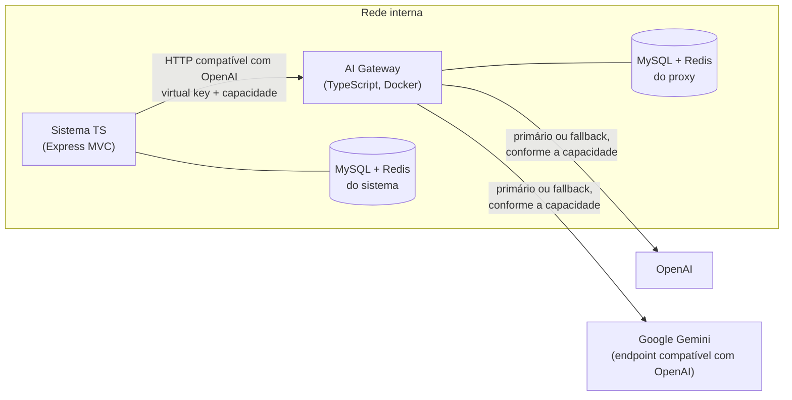
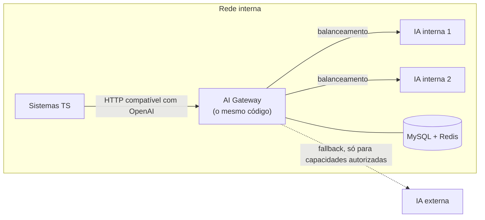
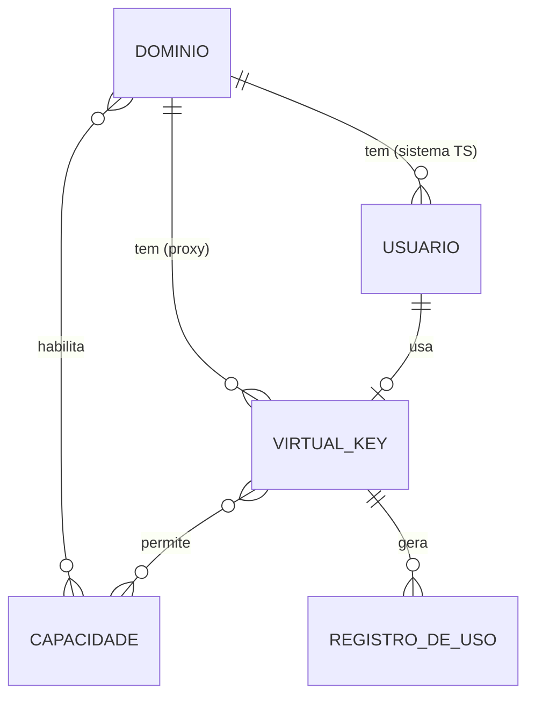

# AI Gateway — briefing para o PRD

> **Superado em 2026-10-03.** A stack descrita aqui (Express com EJS, sessão em cookie com CSRF, argon2id, npm
> workspaces, portas 3000 e 4000) foi trocada na revisão do [PRD](ai-gateway-prd.md): frontend Angular, backend
> Express em JavaScript, proxy em TypeScript, JWT e bcrypt, em apps independentes. Quando os dois divergirem, vale o PRD.

Material de entrada para a skill `prd-writer`. Ele junta duas fontes:

- a aula de AI Gateway do MBA em Arquitetura de IA (transcrição em [docs/transcription/ia_gateway](../transcription/ia_gateway)), já que o professor não disponibilizou o repositório;
- as decisões de arquitetura tomadas em 2026-09-23 para este projeto, que depois será levado para a empresa.

O objetivo é que a entrevista do `prd-writer` gaste tempo só com o que ainda está em aberto.

**Dois ambientes, um mesmo proxy.** O PRD é **deste projeto**, que usa só provedores externos (OpenAI e Google).
A topologia da empresa, com servidores de IA próprios, orienta o desenho, para que o mesmo código sirva lá mudando
apenas a configuração.

**Legenda usada em todo o documento**

- **[aula]** — dito ou demonstrado na transcrição.
- **[decidido]** — decisão já tomada pelo dono do projeto.
- **[sugestão]** — proposta para preencher uma lacuna. Pode ser trocada na entrevista.
- **[em aberto]** — decisão que o PRD precisa tomar. Está listada na seção 10 com uma recomendação.

---

## 1. Contexto

### Origem

- A aula tem 18 vídeos. Ela parte da chamada direta ao SDK de um provedor e chega a um LiteLLM Proxy com fallback. Todas as demonstrações foram feitas em Python, com OpenAI e Anthropic [aula].
- A transcrição termina no fallback técnico. O professor anuncia para as próximas aulas dois temas que **não estão nesta transcrição** [aula]:
  - o **gateway manual**, com políticas de degradação, resposta parcial, revisão humana e processamento assíncrono;
  - os **gateways de mercado**, como o Vercel AI Gateway e o Cloudflare AI Gateway.

### Decisões de arquitetura [decidido]

1. **O proxy é nosso e é escrito em TypeScript/Node, como o resto do sistema.** Não há Python no projeto.
2. **O proxy é um serviço separado do sistema MVC**, mesmo sendo da mesma linguagem. Roda no seu próprio container Docker, com rede e segredos próprios, e é acessível **só pela rede interna**, sem exposição à internet.
3. **Destinos deste projeto: OpenAI e Google Gemini.** O Gemini é acessado com uma **chave criada no Google AI Studio**.
   - Não há servidores de IA próprios.
   - Os dois provedores são externos e pagos, e cada capacidade usa um deles como primário e o outro como fallback, como a aula fez com OpenAI e Anthropic.
4. **Topologia na empresa (alvo futuro), que o desenho precisa suportar:**
   - dois servidores de IA internos em **ativo-ativo** como primários, com o tráfego balanceado entre eles e um assumindo se o outro cair;
   - a IA externa só como fallback, e só para as capacidades autorizadas.
5. **O mesmo código atende os dois ambientes.** Entre este projeto e a empresa, só muda o catálogo de capacidades.
6. **O sistema é multi-tenant.** Cada **domínio** é um tenant, uma unidade isolada com seus próprios usuários, permissões, chaves, limites, budgets e registros de uso. Um domínio nunca vê dados de outro.
7. **A v1 inclui login simples, tela de permissões e gestão de domínios.** Com essas telas é possível criar domínios e usuários, dar permissões e exercitar todas as opções do proxy: permissão por capacidade, limites, budgets, revogação e fallback.
8. **Os dados ficam em MySQL + Redis.**
   - **MySQL** é a fonte de verdade.
   - **Redis** guarda o estado compartilhado entre réplicas (contadores de rate limit, totais de budget, cache de validação de chave, saúde dos destinos) e as sessões de login.
   - Cada serviço tem o seu próprio schema. O proxy e o sistema não compartilham tabelas (seção 3.3).
9. **Qdrant fica fora da v1.** É um banco vetorial: serve para cache semântico ou RAG, não para chaves, budgets e registros de uso.
10. **O LiteLLM foi descartado.** O LiteLLM Proxy exige PostgreSQL e não suporta MySQL, e o SDK do LiteLLM é Python. Ele continua sendo a referência conceitual da aula.

**Motivos:**
- **Uma só linguagem.** A arquitetura da empresa é similar a este projeto (TS/Node), e o proxy será levado para lá. O time que vai mantê-lo já domina a stack, e os gates, a toolchain e os tipos são os mesmos para os dois serviços.
- **O proxy quase só repassa requisições.** Neste projeto, OpenAI e Gemini falam o formato da OpenAI (o Gemini por um endpoint de compatibilidade). Na empresa, os servidores internos também. A tradução pesada, que era a vantagem do LiteLLM, não é necessária na v1.
- **Superfície menor.** Um proxy enxuto e auditável tem superfície de ataque bem menor que a do LiteLLM Proxy, que teve CVEs críticas exploradas em 2026 (seção 9).

### Estado atual do repositório

- **Stack do sistema:** Express 5 em camadas MVC (models, controllers, routes, views em EJS), Jest + Supertest, Node ≥ 20.
- **Gates existentes** (ver [GATES.md](../../GATES.md)): typecheck, lint com zero warnings, build, arch, tests (cobertura ≥ 80%) e deadcode.
  - Hoje eles cobrem só o sistema, em `src/`. O proxy, como segundo serviço TS, precisa ser incluído neles (D-14).
- O CRUD de usuários em memória é apenas exemplo do esqueleto e será substituído pelos usuários reais do sistema.

---

## 2. Problema [aula]

Chamar o SDK de um provedor direto funciona bem para um MVP, uma feature isolada ou uma automação interna. O
problema aparece quando o uso de IA cresce:

- **A IA se espalha como decisão técnica, não só como funcionalidade.** Cada ponto do sistema passa a conhecer o
  SDK, o provedor, o modelo, o formato de request e de response, os parâmetros, o tratamento de erro, o timeout, o
  retry, o custo e os limites de cada modelo.
- **Trocar de provedor vira uma mudança grande.** Trocar de modelo exige mexer em vários lugares, e aplicar uma regra
  padrão (fallback, por exemplo) fica complicado.
- **Os SDKs não têm interface comum.**
  - A OpenAI usa `client.chat.completions.create`; a Anthropic usa `client.messages.create`.
  - **Até dentro do mesmo provedor os parâmetros mudam:** o GPT-5.4-mini exige `max_completion_tokens` no lugar de `max_tokens`.
- **Não há visibilidade.** Saber quanto cada fluxo gasta, qual é a latência e por que uma chamada falhou é difícil,
  porque os logs estão espalhados.
- **Não há governança.** Algumas perguntas ficam sem dono:
  - Qualquer aplicação pode usar o modelo mais caro?
  - Um batch pode disparar milhares de chamadas sem limite?
  - Uma feature experimental consome o mesmo orçamento que uma feature crítica?
  - Um usuário comum pode executar a mesma operação pesada que um usuário interno?
  - Uma feature sem limite pode esgotar a cota do provedor e derrubar outras partes do sistema?

---

## 3. Arquitetura alvo

### 3.1 Este projeto



- **O sistema TS** tem o login, as telas de domínios e permissões, e as telas que usam as capacidades.
  - Ele fala com o proxy de duas formas: pela API compatível com a OpenAI, usando a virtual key do usuário logado [aula], e pela API administrativa do proxy.
  - **Nunca chama uma IA direto.**
- **O proxy**:
  - valida a chave e identifica o domínio e o usuário a partir dela;
  - aplica permissões, rate limits e budgets;
  - escolhe o destino primário da capacidade;
  - aplica timeout, retry e cooldown;
  - recorre ao destino de fallback quando o primário falha;
  - valida o contrato da resposta;
  - registra o uso.
- **Os dois destinos** recebem requisições no formato da OpenAI:
  - a OpenAI nativamente;
  - o Gemini pelo endpoint de compatibilidade da API do Google (`https://generativelanguage.googleapis.com/v1beta/openai/`). Esse endpoint ainda está em **beta** e **ignora em silêncio os parâmetros que não suporta** (seção 9).
- **Nos testes**, destinos simulados substituem os provedores reais e reproduzem falhas sob comando, inclusive a topologia da empresa (seção 7).

### 3.2 Na empresa (alvo futuro)



- **Os servidores internos** expõem uma API compatível com a da OpenAI. vLLM, Ollama e TGI fazem isso nativamente. O motor escolhido é decisão da empresa (D-05).
- **A IA externa** entra só no fallback. A permissão é definida **por capacidade**: uma capacidade com dados sensíveis nunca sai da rede interna (LGPD).

### 3.3 Modelo multi-tenant (domínios)

**Domínio = tenant** [decidido]. Tudo pertence a um domínio, e nenhum dado atravessa de um domínio para outro.

**Papéis** [sugestão]

| Papel | O que faz |
|---|---|
| **Administrador da plataforma** | Cria, edita e desativa domínios. Define quais capacidades cada domínio pode usar, o budget e os limites do domínio. Vê o consumo de todos os domínios. |
| **Administrador do domínio** | Cria, edita e remove os usuários do **seu** domínio. Dá permissões dentro do que o domínio tem e vê o consumo do domínio. |
| **Usuário** | Usa as capacidades permitidas nas telas do sistema e vê o próprio consumo. |

**Permissões em camadas** [sugestão]
- Uma permissão é formada pelas capacidades permitidas, pelos limites (RPM/TPM) e pelo budget mensal.
- Ela existe em dois níveis: **domínio** e **usuário**.
- A permissão efetiva é a **interseção**: o usuário só usa uma capacidade se ela estiver liberada para ele **e** para o domínio.
- Limites e budgets valem nos dois níveis, e o mais restritivo vence.

**Como a identidade chega ao proxy** [decidido, D-17]
- Cada usuário recebe uma **virtual key emitida pelo proxy**, vinculada ao seu domínio. As permissões do usuário ficam registradas nessa chave.
- O sistema TS guarda a chave **cifrada** e a usa nas chamadas feitas em nome daquele usuário.
- **O proxy deriva o domínio e o usuário da chave, nunca de um header informado pelo app.** O isolamento é garantido pela própria credencial: uma chave só consegue agir dentro do seu domínio.
- Um domínio também pode ter chaves de aplicação (um batch, um agente) sem usuário humano, como a aula sugere [aula].

**Quem guarda o quê** [sugestão]

| Serviço | Dados |
|---|---|
| **Proxy** (MySQL do proxy) | Domínios, virtual keys e suas permissões, limites, budgets e registros de uso. O Redis guarda contadores, cache de validação e saúde dos destinos. |
| **Sistema TS** (MySQL do sistema) | Usuários, credenciais de login, papéis e o vínculo usuário → chave (cifrada). O Redis guarda as sessões. |

- Os serviços não compartilham tabelas. O sistema TS lê e altera domínios, chaves e permissões **pela API administrativa do proxy** (D-12).
- Na v1, **só o sistema TS tem a master key**, e é ele que aplica as regras de papel e de domínio, cobertas por testes de isolamento (G8) [decidido, D-19]. Chaves administrativas por domínio no proxy ficam como evolução.



**Login simples** [sugestão]
- **Credenciais:** e-mail e senha, com hash forte (argon2id ou bcrypt).
- **Sessão:** cookie `httpOnly` e `SameSite`, com os dados da sessão no Redis.
- **Sem cadastro público:** o administrador cria os usuários. O primeiro administrador da plataforma vem de variáveis de ambiente.
- **Proteção:** mensagem de erro genérica e bloqueio temporário após tentativas erradas seguidas.
- **Domínio no login:** o e-mail é único na plataforma, e o domínio vem do usuário (D-18).

---

## 4. Conceitos do domínio

| Conceito | Definição | Fonte |
|---|---|---|
| **Compatibilidade** | Interface uniforme para providers diferentes. A camada traduz a request, adapta os parâmetros, envia ao destino e devolve a resposta num formato consistente. | [aula] |
| **Compatibilidade ≠ modelos iguais** | Modelos diferem em tool calling, JSON, janela de contexto, streaming, imagem, arquivos, embeddings e reasoning. A camada não apaga as diferenças. | [aula] |
| **Capacidade / model group** | Nome lógico que a aplicação enxerga (ex.: `developer-assistant`, `ticket-classifier`). Não é o nome físico do modelo. | [aula] |
| **Deployment** | Configuração concreta de um destino: provedor ou servidor, modelo físico, credencial, parâmetros aceitos e se o destino é interno ou externo. Uma capacidade tem um ou mais deployments. | [aula] + [sugestão] |
| **Vocabulário de capacidades** | Mandar o nome físico do modelo pelo gateway "só muda a topologia, não a abstração". Os nomes descrevem o uso esperado (`classificador-simples`, `resposta-suporte`), nunca `modelo-1` ou `modelo-rapido`. | [aula] |
| **Domínio (tenant)** | Unidade de isolamento do sistema multi-tenant. Agrupa usuários, chaves, permissões, limites, budgets e registros de uso. | [decidido] |
| **Permissão efetiva** | Interseção das permissões do domínio e do usuário. Nos limites e budgets, vale o mais restritivo. | [sugestão] |
| **Virtual key** | Chave emitida pelo gateway e enviada como `Authorization: Bearer`. A aula cita uma por aplicação, time, ambiente, serviço ou agente [aula]. Aqui, cada chave pertence a um domínio e, em geral, a um usuário [sugestão]. A aplicação nunca carrega a chave real do provedor. | [aula] + [sugestão] |
| **Master key** | Chave administrativa do proxy: gerencia domínios e chaves e consulta o uso. | [aula] |
| **Budget** | Orçamento de custo, por usuário (chave) e por domínio. Estourado, a requisição é bloqueada. | [aula] |
| **Rate limit** | Requests por minuto (RPM) e tokens por minuto (TPM). A aula cita os níveis global, por chave, por usuário e por time [aula]. Aqui: global, por domínio e por usuário (chave). | [aula] |
| **Router** | Peça que escolhe qual deployment atende à capacidade pedida. | [aula] |
| **Pool primário** | Conjunto de deployments que atende uma capacidade em condições normais. Neste projeto, 1 deployment (um provedor). Na empresa, os 2 servidores internos em ativo-ativo, que ficam aquecidos e testados e dobram a capacidade. | [decidido] |
| **Cooldown** | Depois de falhas seguidas, o deployment sai de rotação por um tempo. Sem isso, durante uma queda, cada requisição espera o timeout inteiro antes de ir para o próximo destino. | [sugestão] |
| **Fallback técnico** | Outro caminho quando o principal falha. Responde só a "consegui tentar outro caminho?". | [aula] |
| **Adequação do fallback** | "Essa nova resposta ainda serve para o caso de uso?" A redundância precisa ser equivalente em qualidade, formato, custo e latência [aula] e, quando o fallback leva os dados para fora, também em **conformidade** (LGPD) [decidido]. | [aula] + [decidido] |
| **Fallback externo por capacidade** | Cada capacidade declara se pode recorrer a um destino externo. Só tem efeito quando existem destinos internos (empresa). Neste projeto, todos os destinos já são externos. | [decidido] |
| **Timeout** | Tempo máximo aceitável, que depende do caso de uso. "Não pode ser um número aleatório igual para tudo." | [aula] |
| **Retry** | Nova tentativa só para falha **transitória**, com limite de tentativas e intervalo entre elas. Retry cego aumenta latência e custo e pressiona quem já está falhando. | [aula] |
| **Pós-processamento** | Registrar tokens, custo, latência, domínio, chave, capacidade e deployment, de forma assíncrona para não prender a requisição. | [aula] |

---

## 5. Fluxo de uma requisição

1. O usuário logado usa uma tela do sistema TS. O sistema envia `POST /v1/chat/completions` ao proxy, com `Authorization: Bearer <virtual key do usuário>` e `model: <capacidade>` [aula].
2. O proxy valida a chave e **deriva dela o domínio e o usuário**. Ele verifica:
   - se a chave e o domínio estão ativos;
   - se a capacidade está na permissão efetiva;
   - se o budget do usuário e o do domínio ainda têm saldo.
   A consulta vai primeiro ao cache no Redis e, se não achar, ao MySQL [aula].
3. O proxy aplica os rate limits (RPM/TPM) do usuário, do domínio e global, com contadores no Redis [aula].
4. O router escolhe um deployment do pool primário da capacidade, pulando os que estão em cooldown [decidido].
5. A chamada é feita com o timeout da capacidade.
   - Os parâmetros são ajustados ao que o deployment aceita (ex.: `max_tokens` → `max_completion_tokens`).
   - Falha transitória: retry com backoff [aula].
   - Destino fora do ar: o deployment entra em cooldown, e o proxy tenta o próximo do pool.
6. Se o pool primário inteiro falhar:
   - existe um deployment de fallback, a política da capacidade permite usá-lo e o teto de gasto dele não foi atingido → o proxy chama o fallback;
   - caso contrário → HTTP 503 "capacidade indisponível" [decidido].
7. Se a capacidade declara um contrato de resposta (ex.: JSON com campos obrigatórios), o proxy valida e aplica a política D-08 [sugestão].
8. A resposta é normalizada e devolvida com `model` igual ao **nome da capacidade**. O cliente não sabe quem respondeu [aula].
9. O uso é registrado de forma assíncrona no MySQL: domínio, chave (usuário), capacidade, deployment usado, se houve fallback, tokens, custo, latência e status [aula].

```mermaid
sequenceDiagram
  participant App as Sistema TS
  participant GW as AI Gateway (TS)
  participant P as Primário (ex.: OpenAI)
  participant F as Fallback (ex.: Gemini)
  App->>GW: POST /v1/chat/completions (Bearer chave do usuário, model = capacidade)
  GW->>GW: chave → domínio + usuário; permissão efetiva e budgets (Redis → MySQL)
  GW->>GW: rate limits do usuário, do domínio e global (Redis)
  GW->>P: request com parâmetros ajustados (timeout + retry)
  P-->>GW: falha → cooldown do primário
  alt fallback permitido e teto não atingido
    GW->>F: mesma request, ajustada ao fallback
    F-->>GW: resposta
    GW->>GW: valida contrato e normaliza
    GW-->>App: 200 com model = capacidade
  else sem fallback disponível
    GW-->>App: 503 capacidade indisponível
  end
  GW-)GW: registra uso e custo por domínio e usuário (assíncrono)
```

---

## 6. Cenários

### 6.1 Demos da aula

Reproduzidas contra o nosso proxy, elas formam a base dos critérios de aceite. Onde a aula usou a Anthropic, este
projeto usa o Gemini.

| # | Demo na aula [aula] | O que o nosso sistema precisa reproduzir |
|---|---|---|
| D1 | `main.py` chama a OpenAI direto. System prompt: *"Você é um arquiteto que vai responder perguntas sobre AI Gateway"*, com *"Responda com dois parágrafos"*. Pergunta padrão: *"O que é uma AI Gateway e por que ela é importante nas aplicações com IA?"* | Linha de base: é o acoplamento que o proxy elimina. |
| D2 | Adição da Anthropic: dois SDKs e `if` por provedor. Com `gpt-5.4-mini`, a chamada quebra porque `max_tokens` foi substituído por `max_completion_tokens`. | O cliente envia `max_tokens`, e o proxy traduz para o parâmetro que o deployment exige. |
| D3 | LiteLLM como SDK: uma chamada `completion(model, messages, temperature, max_tokens)` atende qualquer provedor. | Uma interface única para OpenAI e Gemini, exposta pelo proxy via HTTP. |
| D4 | LiteLLM Proxy na porta 4000, com `developer-assistant` → `openai/gpt-4.1-mini`. O cliente usa o SDK da OpenAI com `base_url` apontando para o proxy. A resposta traz `model: developer-assistant`. | O sistema TS usa o SDK oficial da OpenAI (npm `openai`) apontado para o proxy e recebe o nome da capacidade no campo `model`. |
| D5 | Nova capacidade `architecture-advisor` → Claude Sonnet 4.6, só na configuração. O cliente escolhe a capacidade pela variável `AI_GATEWAY_MODEL`. Depois de removida do config, pedir essa capacidade resultou em "modelo não encontrado". | `architecture-advisor` usa o **Gemini** como primário e é criada só no catálogo, sem mudança no cliente. Capacidade inexistente retorna erro claro. |
| D6 | Fallback `developer-assistant` → `developer-assistant-backup` (Claude), disparado por uma chave da OpenAI invalidada de propósito. O cliente continua vendo `developer-assistant`. | Com a chave da OpenAI inválida, o **Gemini** atende de forma transparente, e o cliente continua vendo `developer-assistant`. |
| D7 | Classificador de tickets. Mensagem: *"fui cobrado duas vezes na minha assinatura"*. O prompt exige **JSON puro**, sem Markdown e sem crases. O primário devolve `{"category": "billing", "reason": "cobrança duplicada da assinatura"}`. Com o primário quebrado, o backup (Claude Haiku 4.5) responde **HTTP 200**, mas embrulha o JSON em crases, e a validação quebra. | Mostrar que "fallback respondeu" não significa "resposta serve". O comportamento do proxy é D-08. Um modelo real pode ou não repetir o erro, então a reprodução **determinística** usa um destino simulado que devolve o JSON entre crases. |

As categorias de ticket do D7 não aparecem na transcrição, exceto `billing`. Uma lista possível é `billing`, `technical`, `account` e `other` [sugestão].

### 6.2 Cenários de resiliência

Os cenários com pool de 2 destinos e com destino interno descrevem a topologia da empresa. Neste projeto, eles são
exercitados com destinos simulados.

| # | Situação | Resultado esperado | Neste projeto |
|---|---|---|---|
| T1 | O pool primário tem 2 destinos saudáveis | As requisições se distribuem entre os dois, e ambos recebem tráfego. | simulado |
| T2 | Um destino do pool cai | O proxy o tira de rotação (cooldown), e o outro atende sem erro para o cliente. Depois do cooldown, o proxy volta a testar o destino. | simulado |
| T3 | O pool primário inteiro cai, e existe fallback permitido | O fallback atende. O cliente vê o nome da capacidade, e o registro de uso marca o fallback. | real (OpenAI → Gemini) e simulado |
| T4 | O pool interno cai, e a capacidade **não** permite destino externo | O proxy responde 503 "capacidade indisponível" **sem chamar o destino externo**, e o sistema TS mostra uma mensagem de indisponibilidade. | simulado |
| T5 | O teto de gasto do deployment de fallback foi atingido | O fallback é bloqueado com erro explícito, em vez de estourar a fatura. | real e simulado |
| T6 | Um destino está em cooldown | As requisições seguintes vão direto ao próximo destino, sem esperar o timeout do destino caído. | simulado |

### 6.3 Cenários de governança multi-tenant [sugestão]

São os cenários que as telas de login, domínios e permissões permitem exercitar.

| # | Situação | Resultado esperado |
|---|---|---|
| G1 | O usuário pede uma capacidade que não está nas permissões dele | 403 `capability_not_allowed`, sem chamar nenhum destino. |
| G2 | A capacidade está liberada para o usuário, mas não para o domínio | 403: a permissão efetiva é a interseção. |
| G3 | O budget do usuário foi atingido | Esse usuário é bloqueado com 429 `budget_exceeded`. Os outros usuários do domínio seguem normalmente. |
| G4 | O budget do domínio foi atingido | Todos os usuários do domínio são bloqueados. Os outros domínios não são afetados. |
| G5 | O rate limit do domínio foi atingido | 429 `rate_limit_exceeded` para o domínio. Os outros domínios não são afetados (proteção contra o "vizinho barulhento"). |
| G6 | O administrador da plataforma desativa um domínio | Todas as chaves do domínio param **imediatamente**: o cache de validação é invalidado, sem esperar expirar. |
| G7 | O administrador do domínio remove um usuário ou revoga a chave dele | A próxima chamada com aquela chave recebe 401 `invalid_api_key`. |
| G8 | O administrador do domínio A tenta ver ou alterar usuários, chaves ou consumo do domínio B | A operação é negada **sem revelar se o recurso existe**. |
| G9 | Relatórios de consumo | O domínio A vê só o próprio uso; o administrador da plataforma vê todos. |
| G10 | Login com senha errada várias vezes seguidas | Mensagem genérica e bloqueio temporário da conta. |

---

## 7. Escopo candidato da v1

Proposta de decomposição para o `prd-writer` refinar. A prioridade vai de 1 (essencial) a 3 (desejável).

### AI Gateway (TypeScript)

| Capacidade do produto | O que cobre | Fonte | Prioridade |
|---|---|---|---|
| **Endpoint compatível com OpenAI** | `POST /v1/chat/completions` sem streaming e `GET /v1/models`, que lista só as capacidades da permissão efetiva da chave, nunca nomes físicos. Erros no formato OpenAI com códigos estáveis: 401 `invalid_api_key`, 403 `capability_not_allowed`, 404 `model_not_found`, 429 `rate_limit_exceeded` / `budget_exceeded` e 503 `capability_unavailable`. | [aula] + [sugestão] | 1 |
| **Catálogo de capacidades** | Arquivo de configuração versionado e **global**; cada domínio habilita um subconjunto. Cada capacidade define o pool primário, o deployment de fallback (opcional), se pode recorrer a destino externo, o timeout, a política de retry e o contrato de resposta. As credenciais são referenciadas pelo nome da variável de ambiente, nunca pelo valor. | [aula] + [decidido] | 1 |
| **Repasse para os destinos** | Repasse no formato OpenAI para a OpenAI e para o Gemini (endpoint de compatibilidade), com os parâmetros ajustados ao que cada deployment aceita. Exemplos: `max_tokens` → `max_completion_tokens`, e a remoção explícita do que o Gemini ignoraria em silêncio (D-03). | [aula] | 1 |
| **Router e resiliência** | Balanceamento no pool primário, cooldown, timeout por capacidade, retry com limite e backoff só para falhas transitórias, fallback condicionado à política da capacidade e ao teto de gasto. | [aula] + [decidido] | 1 |
| **Domínios (tenants)** | Criar, editar e desativar domínios pela API administrativa, com capacidades habilitadas, budget mensal e limites (RPM/TPM) do domínio. Desativar invalida na hora o cache de todas as chaves do domínio. | [decidido] | 1 |
| **Virtual keys e permissões** | Emitir, listar, editar e revogar chaves **dentro de um domínio**. Cada chave tem capacidades permitidas, limites e budget próprios, e a permissão efetiva é a interseção com o domínio. No MySQL fica só o hash da chave, e o Redis faz o cache da validação. | [aula] + [decidido] | 1 |
| **Registro de uso e custo** | Por chamada: domínio, chave (usuário), capacidade, deployment, se houve fallback, tokens de entrada e saída, custo, latência e status. Gravação assíncrona no MySQL, com consulta sempre filtrada por domínio. Custo em US$ pela tabela de preços de cada deployment (D-09). | [aula] | 1 |
| **Rate limits** | RPM e TPM por usuário (chave), por domínio e global, com contadores no Redis que valem para todas as réplicas. Estourou → 429 sem chamar nenhum destino. | [aula] | 1 |
| **Budgets** | Orçamento mensal por usuário (chave) e por domínio, mais o **teto de gasto por deployment de fallback**. | [aula] + [decidido] | 1 |
| **Contrato de resposta** | Uma capacidade pode declarar o formato esperado (ex.: JSON com campos obrigatórios). O proxy valida a resposta de qualquer destino e aplica D-08. | [aula] (problema) + [sugestão] (solução) | 2 |
| **Health e métricas** | Endpoints de liveness e readiness para o orquestrador de containers, e métricas de latência, erros, fallbacks e cooldowns. | [sugestão] | 2 |

### Sistema TS (Express MVC)

| Capacidade do produto | O que cobre | Fonte | Prioridade |
|---|---|---|---|
| **Login simples** | E-mail e senha, sessão no Redis, logout, bloqueio após tentativas erradas e seed do primeiro administrador da plataforma (seção 3.3). | [decidido] + [sugestão] | 1 |
| **Gestão de domínios** | Tela do administrador da plataforma: criar, editar e desativar domínios, habilitar capacidades e definir budget e limites do domínio, pela API administrativa do proxy. | [decidido] | 1 |
| **Usuários e permissões** | Tela do administrador do domínio: criar, editar e remover usuários do seu domínio, definir o papel, as capacidades, os limites e o budget de cada um. A chave do usuário é emitida e atualizada no proxy e guardada cifrada no sistema. | [decidido] | 1 |
| **Cliente do gateway** | Módulo fino sobre o SDK `openai`: `baseURL` do proxy, a virtual key do usuário logado, nomes de capacidade tipados, timeout do lado do cliente e tradução dos erros do proxy em mensagens da aplicação. | [aula] | 1 |
| **Fluxos que usam as capacidades** | Telas que reproduzem os cenários da aula: perguntas ao `developer-assistant` e ao `architecture-advisor`, e a classificação de ticket (D7). | [aula] | 2 |
| **Consumo por domínio e usuário** | Views de consumo (custo e chamadas por usuário, por capacidade e por deployment), respeitando o papel: a plataforma vê tudo, o domínio vê o seu, e o usuário vê o próprio. | [aula] (menção a dashboard) | 2 |
| **Indisponibilidade e erros no sistema** | Mensagens claras para capacidade indisponível (T4), sem permissão (G1), budget esgotado (G3) e limite atingido (G5), em vez de erro genérico. O sistema nunca chama um provedor direto. | [decidido] | 2 |

### Fundação e infraestrutura

| Item | O que cobre | Fonte | Prioridade |
|---|---|---|---|
| **Estrutura do monorepo** | Sistema e proxy como pacotes separados, mais um pacote de contrato compartilhado (nomes de capacidade, códigos de erro, schemas de resposta) (D-14). | [sugestão] | 1 |
| **Ambiente Docker Compose** | Proxy, sistema, MySQL e Redis (com schemas separados por serviço) e destinos simulados, numa rede interna. Só o sistema TS publica porta, e só em `127.0.0.1`. O proxy tem saída apenas para as APIs da OpenAI e do Google. | [decidido] + [sugestão] | 1 |
| **Destinos simulados** | Servidor fake compatível com a API da OpenAI, com falha sob comando (fora do ar, lento, resposta fora do formato). Ele permite rodar os testes sem gastar com os provedores, reproduzir D6, D7 e T1–T6 de forma previsível, e simular os servidores internos da empresa sem hardware. | [sugestão] | 1 |
| **Gates do proxy** | Incluir o proxy no `runGate` atual (typecheck, lint, build, arch, tests e deadcode), com regras de `arch` próprias. Por exemplo: o proxy e o sistema nunca importam código um do outro, só o pacote de contrato (via `gate-builder`). | [sugestão] | 1 |

---

## 8. Fora do escopo candidato

Temas **mencionados** na aula como evolução ou recurso de gateways maduros, mas **não demonstrados** nesta transcrição,
além do que as decisões de arquitetura adiaram:

- **Políticas do gateway manual das próximas aulas:** degradação para resposta mais simples, resposta parcial, revisão humana, processamento assíncrono e fila para reprocessar depois.
- **Streaming**, **tool calling**, entrada de imagem ou arquivo, e endpoints de **embeddings** e **responses**.
- **Anthropic como destino.** A aula a usou, mas este projeto não tem chave. O adapter próprio (formato de mensagens diferente) fica para quando ela entrar, por exemplo na empresa.
- **Servidores de IA internos reais**, que só existem na empresa. Neste projeto eles são simulados.
- **Cache semântico e RAG com Qdrant** [decidido: fora da v1].
  - Se o cache semântico voltar, atenção: ele pode devolver uma resposta de uma pergunta parecida, mas diferente (por exemplo, pedidos 123 e 456).
  - Ele também precisaria ser isolado por domínio, ou vazaria respostas entre tenants.
- **Extensões do multi-tenant:**
  - níveis acima do domínio (organizações com vários domínios);
  - chaves de provedor próprias por domínio (BYOK);
  - catálogo de capacidades diferente por domínio;
  - cadastro público ou autoatendimento de novos domínios;
  - chaves administrativas por domínio no proxy (evolução prevista em D-19).
- **Recursos de login além do simples:** SSO, autenticação em dois fatores e recuperação de senha por e-mail.
- **Integração com gateways de mercado** (Vercel AI Gateway, Cloudflare AI Gateway).

---

## 9. Restrições e requisitos não funcionais

**Linguagens e fronteiras** [decidido]
- Todo o projeto é TypeScript + Node ≥ 20. Não há Python.
- O proxy e o sistema são **serviços separados** (containers, rede, segredos e schemas próprios) e conversam só por HTTP: a API compatível com a OpenAI e a API administrativa do proxy.
- Os dois podem compartilhar um pacote de contrato (nomes de capacidade, códigos de erro, schemas de resposta), mas **nunca importam código interno um do outro**.

**Isolamento entre domínios** [decidido]
- Todo registro tem domínio, e toda consulta é filtrada por domínio, nos dois serviços.
- No proxy, o domínio é **derivado da credencial**, nunca de um dado informado pelo cliente.
- No sistema TS, o domínio vem da sessão do usuário logado, nunca de um parâmetro da URL ou do formulário.
- Há testes automatizados de isolamento: G8 e G9 em cada tela e em cada endpoint administrativo.

**Rede e segredos** [decidido]
- O proxy só aceita conexões da rede interna, e só dos serviços autorizados (lista de permissão), não da rede toda.
- Controle de saída: o proxy só alcança as APIs da OpenAI e do Google neste projeto; na empresa, também os servidores internos.
- As chaves da OpenAI e do Google existem **só** no ambiente do proxy.
- **O sistema TS guarda a master key do proxy, e isso o torna sensível também**: quem o comprometer administra todos os domínios.
  - Os segredos dele (master key, chave de cifragem das virtual keys, segredo de sessão) são lidos em `src/config/env.ts` (regra do gate `arch`).
  - As virtual keys dos usuários ficam cifradas no banco.
  - Nenhuma chave aparece completa em logs ou telas.

**Segurança: lições dos incidentes do LiteLLM em 2026**
- A CVE-2026-42208 foi um SQL injection **na verificação da chave**, explorado cerca de 36 horas depois do aviso.
  - Toda consulta ao MySQL é parametrizada.
  - A chave é guardada como hash e comparada em tempo constante.
- A CVE-2026-42271 estava em endpoints de teste de MCP, que o gateway nem precisava ter. **O proxy só expõe os endpoints do escopo.**
- Em março/2026, o pacote `litellm` foi publicado comprometido no PyPI. O mesmo risco existe no npm:
  - as dependências ficam fixadas pelo `package-lock.json`, instaladas com `npm ci` e auditadas nos gates;
  - a imagem Docker é fixada por digest.
- Senhas usam hash forte e nunca aparecem em logs.
- A sessão usa cookie `httpOnly` e `SameSite`.
- Os formulários das telas administrativas têm proteção contra CSRF.

**Compatibilidade do Gemini**
- O endpoint compatível com OpenAI do Gemini está em beta e ignora em silêncio os parâmetros que não suporta.
- Por isso, o catálogo declara quais parâmetros cada deployment aceita, e testes de contrato cobrem cada deployment. Um parâmetro descartado sem aviso não pode passar despercebido.

**Disponibilidade** [decidido]
- O proxy é o único componente sem redundância no caminho. Na empresa, ele roda com **no mínimo 2 réplicas**, com health check.
- MySQL e Redis são dependências críticas do proxy.
- No ambiente do curso, 1 réplica é aceitável (D-15).

**Dados**
- Neste projeto, todos os destinos são externos, então **só se usam dados sintéticos**.
- Não se registra conteúdo de prompt nem de resposta por padrão; só metadados (D-11).
- Na empresa, a permissão de destino externo é definida por capacidade, considerando a LGPD.

**Testes e custo**
- Os gates não chamam IA real: o proxy é testado com destinos simulados, e o sistema TS com um proxy simulado.
- As chamadas reais à OpenAI e ao Gemini ficam para uma execução manual com as chaves no `.env`.

**Limites como configuração**
- O gateway aplica limites, mas não decide quais fazem sentido; isso depende do produto e do risco de cada fluxo [aula].
- Timeout, retry, cooldown, limites, budgets e tetos de fallback são configuráveis por capacidade, por domínio, por usuário e por deployment, nunca fixos no código.

**Compatibilidade com o SDK oficial da OpenAI**
- Um cliente com `baseURL` apontando para o proxy funciona sem adaptação [aula].

---

## 10. Decisões em aberto para a entrevista

| id | Decisão | Opções | Recomendação |
|---|---|---|---|
| D-01 | Construir o proxy ou usar um pronto? | — | **[decidido]** Proxy próprio em TypeScript. O LiteLLM foi descartado: o Proxy exige PostgreSQL, e o SDK é Python. |
| D-02 | Onde ficam os dados? | — | **[decidido]** MySQL + Redis, com schemas separados por serviço. Qdrant fora da v1. |
| D-03 | Como o proxy fala com os destinos? | (a) repasse no formato OpenAI (SDK `openai` com `baseURL` por deployment) para todos os destinos deste projeto; (b) Vercel AI SDK para todos | **(a) na v1**: OpenAI e Gemini aceitam o formato da OpenAI, e os servidores internos da empresa também. Adotar (b) quando entrarem streaming, tool calling, saída estruturada ou a Anthropic. |
| D-04 | Framework HTTP do proxy | Express 5 (o mesmo do sistema); Fastify | **Express 5.** O overhead do framework é de milissegundos, e uma chamada de IA leva segundos. Manter a mesma stack pesa mais. |
| D-05 | Motor dos servidores internos (só na empresa) | vLLM; Ollama; TGI; outro | Decisão da empresa. O requisito é expor API compatível com OpenAI. Neste projeto, os servidores internos são simulados. |
| D-06 | Relação entre os 2 servidores internos (só na empresa) | ativo-ativo; ativo-passivo | **[decidido]** Ativo-ativo, com o mesmo modelo, versão e configuração nos dois. |
| D-07 | Quais capacidades podem usar destino externo? | por capacidade | Neste projeto, todos os destinos são externos. Na empresa, é uma decisão de LGPD por capacidade. |
| D-08 | Resposta fora do contrato (caso D7) | (a) devolver e só registrar; (b) tentar o próximo destino; (c) erro explícito | **(b) e, sem destino restante, (c)**: HTTP 502 "resposta fora do contrato da capacidade". O caso sempre é registrado. |
| D-09 | Custo dos servidores internos (empresa) | zero; custo por token configurável | Registrar os tokens sempre. Custo zero por padrão, com valor configurável para rateio interno. |
| D-10 | Budget: período e moeda | total; mensal; diário | **Mensal, em USD.** |
| D-11 | Registrar conteúdo de prompts e respostas? | nunca; opcional por capacidade; sempre | **Nunca por padrão.** |
| D-12 | Como o sistema TS administra o proxy? | pela API administrativa do proxy; lendo o MySQL do proxy direto | **Pela API do proxy.** O proxy é o dono dos seus dados, e o banco não é compartilhado. |
| D-13 | Informar ao cliente que houve fallback? | nunca; header opcional (`x-gateway-fallback`) | **Nunca no corpo.** O cliente não precisa saber [aula]. O fato fica no registro; o header é opcional. |
| D-14 | Onde fica o código do proxy? | monorepo com npm workspaces neste repositório; repositório separado | **Monorepo** no curso: sistema, proxy e pacote de contrato como workspaces, com um `docker-compose.yml` na raiz. Isso exige reorganizar as pastas e estender os gates. Na empresa, avaliar um repositório próprio para o proxy. |
| D-15 | Réplicas do proxy no ambiente do curso | 1; 2 com balanceador | **1**, com a demonstração de alta disponibilidade como extra. Na empresa: no mínimo 2. |
| D-16 | Qual API do Google? | — | **[decidido]** API do Gemini com chave criada no Google AI Studio, pelo endpoint compatível com OpenAI. |
| D-17 | Como a identidade do usuário chega ao proxy? | (a) uma virtual key por usuário, vinculada ao domínio e guardada cifrada no sistema TS; (b) uma chave por domínio + um header com o id do usuário | **[decidido] (a)**: o proxy deriva domínio e usuário da própria credencial, e o isolamento não depende de o app informar o tenant certo. |
| D-18 | Como o domínio é identificado no login? | (a) pelo usuário, com e-mail único na plataforma; (b) por subdomínio (ex.: `acme.localhost`); (c) seleção do domínio na tela de login | **(a)**: é o mais simples e não exige DNS nem cookies por subdomínio. |
| D-19 | Quem tem acesso administrativo ao proxy? | (a) só o sistema TS, com a master key, que aplica as regras de papel e domínio; (b) chaves administrativas por domínio no proxy, que só gerenciam o próprio domínio | **[decidido] (a) na v1**, com testes de isolamento (G8). **(b)** fica como evolução: tira do sistema TS o poder de administrar todos os domínios. |
| D-20 | Papéis | (a) plataforma, domínio e usuário; (b) só administrador e usuário | **(a)**: sem o administrador da plataforma, não há quem crie domínios. |
| D-21 | Catálogo de capacidades por domínio | (a) catálogo global com habilitação por domínio; (b) catálogo próprio por domínio | **(a)**: cada domínio liga ou desliga capacidades, mas o mapeamento capacidade → modelo é da plataforma. |

### Valores iniciais sugeridos [sugestão]

Os modelos e números abaixo vêm da aula ou são valores iniciais para validar. A aula insiste que esses números "não
podem sair chutados" [aula]. Os IDs de modelo do Gemini devem ser confirmados na conta do AI Studio; a documentação
atual cita, por exemplo, `gemini-3.8-flash`.

| Capacidade | Primário | Fallback | Timeout | Retry | Contrato |
|---|---|---|---|---|---|
| `developer-assistant` | OpenAI GPT-4.1 mini (como na aula) | Gemini, família Flash | 30 s | 2 tentativas, backoff de 0,5 s e 1 s | texto livre |
| `architecture-advisor` | Gemini, família Pro (no lugar do Claude Sonnet da aula) | OpenAI, modelo de porte equivalente | 60 s | 2 tentativas, backoff de 0,5 s e 1 s | texto livre |
| `ticket-classifier` | OpenAI GPT-4.1 mini (como na aula) | Gemini, o modelo mais barato (no lugar do Claude Haiku da aula) | 10 s | 1 tentativa | JSON `{ category, reason }` |

- **Cooldown:** 3 falhas em 60 s tiram o deployment de rotação por 30 s.
- **Limites por usuário (chave):** 60 RPM, 100 mil TPM e budget de US$ 5 por mês.
- **Limites por domínio:** 300 RPM, 500 mil TPM e budget de US$ 20 por mês.
- **Limites globais:** 600 RPM e teto de US$ 20 por mês por deployment de fallback.
- **Login:** 5 tentativas erradas bloqueiam a conta por 15 minutos, e a sessão expira após 8 horas.
- **Na empresa:** o primário de cada capacidade vira o pool dos 2 servidores internos, e o provedor externo passa a ser o fallback, nas capacidades que o permitirem.

---

## Anexo A — Correções da transcrição automática

| Na transcrição | Termo correto |
|---|---|
| Lite e LLM, LightLLM, LightLM, Light LLM | LiteLLM |
| Cloud, CloudSonic 4.6, Cloud SoneT 4.6 | Claude, Claude Sonnet 4.6 |
| Raico, Raico 4.5 | Claude Haiku, Claude Haiku 4.5 |
| GPT 4.1 Win | GPT-4.1 mini |
| Verso AI Gateway | Vercel AI Gateway |
| Python.dev | python-dotenv |
| Max Token / Max Completion Token | `max_tokens` / `max_completion_tokens` |
| LLMSettings | `litellm_settings` (bloco de fallbacks do `config.yaml`) |
| módulo list | `model_list` |
| Jason Puro, Krazy | JSON puro, crases |
| aba (em "se essa aba existe") | a chave (virtual key) |

## Anexo B — Mapa da transcrição

| Vídeo | Tema |
|---|---|
| 1 | Problema: a IA se espalha pela arquitetura |
| 2 | Demo D1: SDK da OpenAI direto |
| 3 | Demo D2: + Anthropic, `if`s e `max_tokens` vs `max_completion_tokens` |
| 4 | Conceito de AI Gateway, níveis de maturidade e roteiro do módulo |
| 5 | Compatibilidade, e por que ela não significa modelos iguais |
| 6 | LiteLLM: modo SDK vs modo proxy |
| 7 | Demo D3: LiteLLM SDK |
| 8 | Topologia do proxy |
| 9 | Fluxo interno: virtual keys, budget, rate limits, endpoints |
| 10 | Router: model group vs deployment, normalização, pós-processamento |
| 11 | Vocabulário de capacidades internas |
| 12 | Governança: acesso, custo e limites |
| 13 | Resiliência: timeout, retry e fallback técnico |
| 14 | Demo D4: proxy via Docker Compose e `config.yaml` |
| 15 | Demo D4 em execução |
| 16 | Demo D5: `architecture-advisor` |
| 17 | Demo D6: fallback com chave inválida |
| 18 | Demo D7: fallback inadequado (classificador de tickets) e fechamento |

## Anexo C — Variáveis de ambiente

- **Citadas na aula:**
  - `OPENAI_API_KEY`, `ANTHROPIC_API_KEY`, `AI_PROVIDER`, `AI_MODEL` (demos D1 a D3);
  - `LITELLM_MASTER_KEY` (proxy);
  - `AI_GATEWAY_MODEL` (cliente, para escolher a capacidade).
- **Sugeridas para o proxy neste projeto:** `GATEWAY_MASTER_KEY`, `OPENAI_API_KEY`, `GEMINI_API_KEY` (chave do Google AI Studio), `MYSQL_URL`, `REDIS_URL`.
- **Adicionais no proxy da empresa:** `INTERNAL_AI_1_URL` e `INTERNAL_AI_2_URL`.
- **Sugeridas para o sistema TS:**
  - `AI_GATEWAY_URL` e `AI_GATEWAY_MASTER_KEY` (para a API administrativa);
  - `KEY_ENCRYPTION_KEY` (cifra as virtual keys dos usuários) e `SESSION_SECRET`;
  - `MYSQL_URL` e `REDIS_URL` do sistema;
  - `PLATFORM_ADMIN_EMAIL` e `PLATFORM_ADMIN_PASSWORD` (seed do primeiro administrador).
