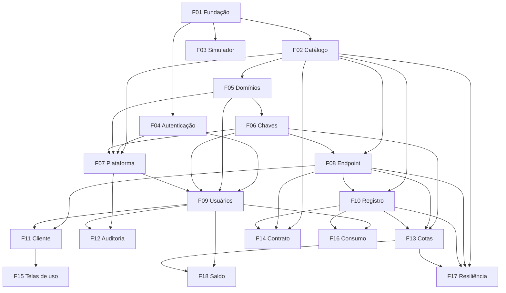

# AI Gateway

## 1. Resumo Executivo

O AI Gateway é um proxy de IA multi-tenant que fica entre os sistemas de uma organização e os provedores de modelos de linguagem. Os sistemas não chamam mais a OpenAI ou o Google direto. Eles pedem uma **capacidade**, um nome lógico como `developer-assistant` ou `ticket-classifier`, a uma API compatível com a da OpenAI. O gateway decide qual modelo físico atende, aplica as permissões, as cotas e os limites de quem pediu, trata falhas com retry, cooldown e fallback, e registra cada chamada com tokens, custo e latência.

O produto atende quatro públicos. O **administrador da plataforma** cadastra domínios (tenants) e opera o catálogo. O **administrador de domínio** define quais capacidades cada usuário pode usar e quanto pode consumir por dia. O **usuário** consome IA pelas telas do sistema e acompanha o próprio saldo. O **desenvolvedor integrador** conecta scripts e serviços com o SDK oficial da OpenAI, usando uma chave de aplicação. O valor central é controlar, por usuário e por capacidade, **quem pode usar o quê, quanto pode usar e quanto já usou**, sem que nenhum cliente conheça provedor, modelo ou chave real.

A solução é um monorepo de apps independentes, que rodam em containers numa rede interna:
- **O proxy** (`apps/ia`, Node.js com Express em TypeScript), com a API compatível com OpenAI e a API administrativa, que guarda domínios, chaves, limites e registros de uso em MySQL e Redis.
- **O sistema web**, em duas partes:
  - o frontend (`apps/frontend`, Angular 19 com Angular Material), que oferece login, as telas de administração, o playground, o classificador de tickets e as telas de consumo;
  - o backend (`apps/backend`, Node.js com Express em JavaScript), que atende essas telas pela API `/v2`, guarda os usuários e fala com o proxy.
- **O destino simulado** (`apps/ia_simulator`), usado só nos testes e no ambiente local.

Nesta versão, os destinos são a OpenAI e o Google Gemini (pela chave do Google AI Studio), cada um servindo como primário ou fallback conforme a capacidade. O projeto nasce como trabalho do MBA em Arquitetura de IA: reproduz as demonstrações da aula de AI Gateway e é a base para as próximas fases, que são cache, RAG, observabilidade com Langfuse e evals. Ele também serve de laboratório: segue a stack e as convenções do sistema para onde as tecnologias testadas aqui serão levadas, para que o aprendido possa ser portado sem tradução.

## 2. Problema e Oportunidade

### O Problema

**Acoplamento direto aos provedores**
- Cada ponto do sistema passa a conhecer o SDK, o modelo, o formato de request e response, os parâmetros e o tratamento de erro de cada provedor.
- Os SDKs não têm interface comum: a OpenAI usa `chat.completions.create`, e a Anthropic usa `messages.create`, o que espalha `if` por provedor pelo código.
- Até dentro do mesmo provedor os parâmetros mudam. O GPT-5.4-mini rejeita `max_tokens` e exige `max_completion_tokens`, e a mesma chamada que funcionava com o GPT-4.1 passa a falhar.
- Trocar o modelo de uma funcionalidade exige alterar e reimplantar cada cliente que a usa.

**Uso de IA sem limite nem dono**
- Não há como definir quais modelos cada pessoa pode usar, nem quanto cada uma pode consumir por dia.
- Uma única chamada com `max_tokens` alto ou um prompt de vários MB pode consumir, sozinha, o que deveria durar o dia inteiro.
- Um batch ou uma feature experimental pode esgotar a cota do provedor e derrubar funcionalidades críticas que dividem a mesma chave.
- A chave real do provedor fica espalhada por aplicações e ambientes. Se ela vazar, a rotação afeta todos os sistemas de uma vez.

**Consumo invisível**
- Ninguém sabe quanto cada usuário, domínio ou capacidade gastou, nem em qual provedor e modelo.
- Quando uma chamada falha, não há um identificador que ligue o erro visto pelo usuário ao registro técnico.
- O custo real depende do modelo, do tamanho do prompt, do tamanho da resposta e do volume. Sem registro por chamada, a fatura só é conhecida no fim do mês.

**Falhas que viram falso sucesso**
- Um provedor fora do ar derruba a funcionalidade inteira se não houver um caminho alternativo.
- O fallback técnico responde "consegui outro caminho", mas não "a resposta serve". Na aula, o modelo de backup devolveu HTTP 200 com o JSON entre crases, e o fluxo quebrou.
- Retry sem critério multiplica chamadas. O SDK oficial da OpenAI tenta de novo 2 vezes por padrão em 429 e 5xx, e somado aos retries do gateway um único clique pode gerar mais de 10 chamadas aos provedores.

**Áreas diferentes, mesma chave**
- Áreas ou clientes distintos compartilham orçamento, limites e dados de uso, sem isolamento.
- Um administrador não tem como gerenciar só os usuários da sua área sem enxergar as outras.

### A Oportunidade

- **Acoplamento → capacidades.** Os clientes pedem uma capacidade por meio de uma API compatível com a da OpenAI, e o catálogo mapeia cada capacidade para modelos físicos. Trocar de modelo ou de provedor é uma mudança só de configuração, com zero linhas alteradas nos clientes. O gateway traduz as diferenças de parâmetro por deployment.
- **Uso sem limite → governança por usuário e capacidade.** Cada chave tem uma lista de capacidades permitidas, uma **cota diária em tokens por capacidade**, um budget mensal em US$ e rate limits. Os domínios e a plataforma têm os seus próprios tetos. Há também um limite máximo de `max_tokens` e de tamanho por requisição, e as chaves reais dos provedores existem só dentro do gateway.
- **Consumo invisível → registro de toda chamada.** Toda chamada, com sucesso ou erro, vira um registro com request ID, domínio, usuário, capacidade, provedor, modelo, tokens, custo e latência. As telas de consumo separam por capacidade, por provedor e modelo, e por tipo de consumo, com exportação em CSV e alertas de saldo.
- **Falso sucesso → resiliência com critério.** O gateway aplica timeout por capacidade, retry só para falhas transitórias, cooldown de destinos que falham e fallback com teto de gasto. As respostas são validadas contra o contrato da capacidade, e toda violação é registrada por deployment. Headers padronizados impedem que os clientes repitam o que não adianta repetir.
- **Mesma chave → multi-tenant.** Cada domínio é um tenant isolado. A chave carrega o domínio, então o isolamento não depende de o cliente informar o tenant certo.

**Diferencial:** um gateway enxuto e auditável, sem os endpoints e a superfície de ataque de produtos genéricos, e com governança pensada para o domínio desde o primeiro dia. Ele também já prepara os pontos de encaixe das próximas fases: o estágio de cache, o request ID no formato de trace do Langfuse e o tipo de capacidade para embeddings.

## 3. Público-Alvo

### Usuários Principais

**Administrador da plataforma**
- Opera o gateway inteiro: cadastra e desativa domínios, cria o primeiro administrador de cada um e define as capacidades habilitadas, o budget e os limites de cada domínio.
- Acompanha o consumo de todos os domínios e o estado de cada capacidade e deployment (ativo, suspenso, em cooldown).
- Precisa suspender uma capacidade ou um provedor na hora, diante de um incidente, de uma chave vazada ou de um pico de custo.

**Administrador de domínio**
- Gerencia só o seu domínio: cria usuários e chaves de aplicação, define papéis, capacidades permitidas, cotas diárias, budgets e limites.
- Acompanha o consumo do domínio por usuário e por capacidade, e sabe quem está perto de esgotar a cota.
- Precisa de trilha de auditoria para saber quem mudou qual permissão, e quando.

**Usuário do domínio**
- Usa as capacidades pelo playground e pela tela do classificador de tickets.
- Quer saber quanto ainda pode usar hoje e receber um aviso antes de a cota acabar.
- Precisa de mensagens de erro claras (sem permissão, cota esgotada, capacidade indisponível), sem jargão técnico.

**Desenvolvedor integrador**
- Conecta scripts e serviços ao gateway com o SDK oficial da OpenAI, apenas trocando a `baseURL` e usando uma chave de aplicação.
- Precisa de códigos de erro estáveis, headers de rate limit e de retry no padrão da OpenAI, e um request ID para rastrear falhas.
- Quer trocar de modelo sem mudar código, pedindo sempre a mesma capacidade.

### Perfil Comportamental

Todos os perfis trabalham num ambiente técnico interno, pelo navegador em desktop e em português. Eles usam dados sintéticos, porque nesta versão todos os destinos são provedores externos. Valorizam previsibilidade acima de tudo: saber antes quanto podem gastar, entender na hora por que uma chamada foi negada e conseguir rastrear qualquer chamada até o seu registro.

## 4. Objetivos

### Objetivos do Produto

1. **Reproduzir** pelo gateway as demonstrações da aula de AI Gateway: interface única para vários provedores, capacidades desacopladas do modelo físico, fallback transparente e fallback com resposta inadequada.
2. **Controlar** o uso de IA por usuário e por capacidade: quais capacidades cada chave pode usar, a cota diária em tokens de cada uma, o budget mensal e os rate limits.
3. **Dar visibilidade** ao consumo de cada usuário e de cada domínio, separado por capacidade, por provedor e modelo, e por tipo de consumo.
4. **Isolar** os domínios: nenhum dado, limite ou ação administrativa de um domínio alcança outro.
5. **Tornar** as falhas resilientes e honestas: retry, cooldown e fallback com critério, contrato de resposta registrado e erros que não se repetem à toa.

### Métricas de Sucesso

1. **Demonstrações da aula**
   - As 6 demonstrações mediadas pelo gateway (D2 a D7) têm testes automatizados passando no `npm run gate`, com cobertura ≥ 80%.
   - As demonstrações D4 a D6 rodam contra a OpenAI e o Gemini reais numa execução manual.
   - Trocar o modelo físico de uma capacidade exige 0 linhas alteradas no sistema web e no script de exemplo, verificado trocando o primário de `developer-assistant` da OpenAI para o Gemini só no catálogo.
2. **Controle de uso**
   - Em testes automatizados, 0 chamadas são atendidas depois que a cota diária, o budget ou o rate limit da chave, do domínio ou global se esgota.
   - 0 chamadas a capacidades fora da permissão efetiva são atendidas.
   - A cota diária nunca é ultrapassada em mais do que o `max_tokens` máximo de uma requisição da capacidade.
3. **Visibilidade**
   - 100% das chamadas, com sucesso ou erro, geram um registro de uso disponível para consulta em até 5 s.
   - Os totais das telas de consumo e do CSV batem com a soma dos registros em 100% dos casos de teste.
   - Os alertas aparecem ao atingir 80% e 100% da cota ou do budget.
4. **Isolamento**
   - 0 vazamentos nos testes de isolamento. Cada tela e cada endpoint administrativo é testado com um administrador de outro domínio, que recebe negação sem revelar se o recurso existe.
5. **Resiliência**
   - Com o primário fora do ar, 100% das chamadas de capacidades com fallback são atendidas pelo fallback, e o cliente vê o nome da capacidade.
   - Com o primário em cooldown, o fallback é chamado sem esperar o timeout do primário, e o gateway adiciona no máximo 200 ms de latência além da latência do fallback.
   - Erros de cota, budget, permissão e indisponibilidade saem com `x-should-retry: false`, e um clique gera no máximo 1 requisição ao gateway.

## 5. Histórias de Usuário

### F01. Fundação: monorepo e ambiente local
- Como desenvolvedor do projeto, quero subir o frontend, o backend, o proxy, o destino simulado, o MySQL e o Redis com um único `./dev.sh`, para ter o ambiente completo em minutos.
- Como desenvolvedor do projeto, quero que o `npm run gate` verifique todos os apps, para que nenhuma mudança quebre outro app sem ser notada.
- Como desenvolvedor do projeto, quero que cada app siga a stack e as convenções do sistema para onde as tecnologias serão levadas, para levar para lá o que eu testar aqui sem reescrever.
- Como sistema, quero atribuir a toda requisição um request ID no formato de trace ID W3C, para correlacionar erros, registros de uso e, no futuro, traces do Langfuse.

### F02. Catálogo de capacidades
- Como administrador da plataforma, quero declarar num arquivo versionado cada capacidade, com o seu primário, o seu fallback, o timeout, o retry, o `max_tokens` máximo e o contrato de resposta, para mudar o comportamento sem alterar código.
- Como administrador da plataforma, quero suspender e reativar uma capacidade ou um deployment na hora, para reagir a incidentes sem reiniciar o gateway.
- Como sistema, quero recusar a inicialização quando o catálogo estiver inválido, para nunca operar com uma configuração quebrada.

### F03. Destino de IA simulado
- Como desenvolvedor do projeto, quero um destino compatível com a API da OpenAI que eu consiga mandar falhar, atrasar ou responder fora do formato, para testar resiliência e contrato sem gastar com provedores.
- Como desenvolvedor do projeto, quero que o destino simulado devolva o JSON entre crases sob comando, para reproduzir de forma previsível a demonstração D7 da aula.

### F04. Autenticação do sistema
- Como usuário, quero entrar com e-mail e senha, para acessar as telas do meu papel.
- Como usuário, quero sair da sessão, para que ninguém use o meu acesso no mesmo computador.
- Como administrador da plataforma, quero que o primeiro administrador seja criado a partir de variáveis de ambiente, para acessar um sistema recém-instalado.
- Como sistema, quero bloquear a conta por 15 minutos após 5 tentativas erradas seguidas, para dificultar ataques de força bruta.

### F05. Domínios
- Como administrador da plataforma, quero criar um domínio com nome, capacidades habilitadas, budget mensal, rate limits e cota diária padrão por capacidade, para abrir um novo tenant.
- Como administrador da plataforma, quero desativar um domínio e ver todas as chaves dele pararem na hora, para cortar o acesso de uma área inteira.
- Como administrador da plataforma, quero remover um domínio que não será mais usado, mantendo os registros dele, para tirá-lo da operação sem perder o histórico.
- Como administrador da plataforma, quero restaurar um domínio removido numa emergência, para recuperar o tenant sem reconstruí-lo.

### F06. Virtual keys e permissões
- Como sistema, quero emitir uma virtual key para cada usuário e para cada aplicação, vinculada ao domínio, para que o domínio e o dono sejam derivados da própria credencial.
- Como sistema, quero calcular a permissão efetiva como a interseção entre o que o domínio habilita e o que a chave permite, para que nenhuma chave use uma capacidade que o domínio não liberou.
- Como sistema, quero guardar apenas o hash das chaves e compará-las em tempo constante, para que um vazamento do banco não exponha credenciais utilizáveis.
- Como administrador de domínio, quero revogar, regenerar e definir uma data de expiração para uma chave, e ver o seu último uso, para manter o controle do ciclo de vida das credenciais.

### F07. Administração da plataforma
- Como administrador da plataforma, quero listar, criar, editar, desativar, remover e restaurar domínios numa tela, para gerenciar os tenants sem usar a API.
- Como administrador da plataforma, quero confirmar a remoção de um domínio duas vezes, a segunda digitando o nome dele, para não remover o domínio errado por engano.
- Como administrador da plataforma, quero criar o primeiro administrador de um domínio junto com o domínio, para que a área já possa se autogerir.
- Como administrador da plataforma, quero ver cada capacidade e deployment com o seu estado (ativo, suspenso, em cooldown) e suspendê-los com um clique, para operar incidentes e demonstrar o fallback.

### F08. Endpoint compatível com OpenAI
- Como desenvolvedor integrador, quero chamar `POST /v1/chat/completions` com o SDK oficial da OpenAI apenas trocando a `baseURL`, para integrar sem aprender outra API.
- Como desenvolvedor integrador, quero listar em `GET /v1/models` só as capacidades que a minha chave pode usar, para saber o que está disponível.
- Como desenvolvedor integrador, quero receber `model` igual ao nome da capacidade que pedi, para que o meu código nunca dependa do modelo físico.
- Como desenvolvedor integrador, quero um erro 400 explícito quando enviar `stream`, `tools` ou `n` maior que 1, para não ter o parâmetro ignorado em silêncio.
- Como sistema, quero traduzir `max_tokens` para o parâmetro que cada deployment exige, para que a mudança de parâmetro da OpenAI não quebre os clientes.

### F09. Gestão de usuários, permissões e chaves de aplicação
- Como administrador de domínio, quero criar um usuário com nome, e-mail, senha inicial e papel, e já definir as capacidades e as cotas diárias dele, para liberar o acesso em uma única tela.
- Como administrador de domínio, quero ajustar a cota diária de um usuário por capacidade, partindo da cota padrão do domínio, para dar mais ou menos uso a quem precisa.
- Como administrador de domínio, quero criar uma chave de aplicação e copiar o seu valor exibido uma única vez, para conectar um script ou serviço ao gateway.
- Como administrador de domínio, quero remover um usuário e ver a chave dele deixar de funcionar na próxima chamada, para encerrar acessos imediatamente.

### F10. Registro de uso e custo
- Como sistema, quero gravar cada chamada, com sucesso ou erro, com request ID, domínio, usuário, capacidade, provedor, modelo físico, tokens, custo, latência e status, sem atrasar a resposta, para que nada seja cobrado ou gasto sem registro.
- Como sistema, quero calcular o custo pela tabela de preços do deployment que efetivamente atendeu, para que o fallback seja cobrado pelo preço certo.

### F11. Cliente do gateway e script de exemplo
- Como sistema web, quero chamar as capacidades em nome do usuário logado usando a virtual key dele, para que as permissões e as cotas do usuário sejam aplicadas pelo gateway.
- Como usuário, quero ver mensagens claras em português, com o request ID, quando uma chamada for negada ou falhar, para saber o que aconteceu e como pedir ajuda.
- Como desenvolvedor integrador, quero um script de exemplo que reproduza o `main.py` da aula com o SDK da OpenAI e uma chave de aplicação, para ter um ponto de partida.

### F12. Auditoria administrativa
- Como administrador de domínio, quero ver quem criou, alterou ou removeu usuários, permissões, cotas e chaves do meu domínio, com data e valores anteriores e novos, para responder por qualquer mudança.
- Como administrador da plataforma, quero ver a auditoria de todos os domínios, incluindo as mudanças nos próprios domínios e as suspensões no catálogo, para investigar incidentes.

### F13. Cotas diárias, budgets e rate limits
- Como sistema, quero reservar a cota antes de chamar o destino, com os tokens estimados de entrada mais o `max_tokens` efetivo, e acertar pelo uso real depois, para que a cota diária não seja ultrapassada.
- Como sistema, quero aplicar o budget mensal e o RPM/TPM da chave, do domínio e global, para impedir abusos e surpresas na fatura.
- Como desenvolvedor integrador, quero receber `Retry-After` e os headers `x-ratelimit-*` nos rate limits, e `x-should-retry: false` quando a cota ou o budget acabou, para que o meu cliente saiba se deve tentar de novo.
- Como sistema, quero zerar as cotas diárias à meia-noite de Brasília e os budgets no dia 1 de cada mês (UTC), para que os limites se renovem sem ação manual.

### F14. Validação do contrato de resposta
- Como sistema, quero pedir JSON nativo ao provedor quando a capacidade exigir JSON, para reduzir respostas fora do formato.
- Como sistema, quero verificar se a resposta cumpre o contrato da capacidade e registrar a violação com o deployment que a causou, para medir se o fallback é equivalente ao primário.

### F15. Telas de uso: playground e classificador de tickets
- Como usuário, quero escolher uma das minhas capacidades no playground, escrever uma mensagem e ver a resposta com tokens, latência e request ID, para experimentar o gateway.
- Como usuário, quero colar a mensagem de um ticket e ver a categoria e o motivo extraídos, ou um aviso quando a resposta vier fora do formato, para usar o classificador da aula.

### F16. Consumo e exportação
- Como usuário, quero ver o meu consumo por capacidade, por provedor e modelo e por tipo (tokens de entrada, tokens de saída, requisições e custo) num período, para entender como uso a IA.
- Como administrador de domínio, quero ver o consumo de todos os usuários e chaves do domínio, com as mesmas divisões, para saber quem e o que mais consome.
- Como administrador da plataforma, quero ver o consumo de todos os domínios, para acompanhar o custo total.
- Como administrador, quero exportar o consumo filtrado em CSV, para analisar fora do sistema.

### F17. Resiliência: retry, timeout, cooldown e fallback
- Como sistema, quero tentar de novo só as falhas transitórias, com limite de tentativas e backoff, para não pressionar um provedor que já está falhando.
- Como sistema, quero tirar de rotação um deployment após falhas seguidas e ir direto ao fallback enquanto durar o cooldown, para não fazer o usuário esperar o timeout a cada chamada.
- Como usuário, quero continuar recebendo resposta quando o provedor primário cair, sem perceber a troca, para não ser afetado pela indisponibilidade de um provedor.
- Como sistema, quero bloquear o fallback quando o teto de gasto do deployment de fallback for atingido, para que uma queda do primário não vire uma fatura surpresa.

### F18. Saldo de cota e alertas
- Como usuário, quero ver quanto resta hoje da minha cota em cada capacidade e quando ela renova, para planejar o meu uso.
- Como usuário, quero ser avisado ao atingir 80% e 100% da cota ou do budget, para não ser surpreendido por um bloqueio.
- Como administrador de domínio, quero ver quais usuários e chaves passaram de 80% da cota ou do budget, para decidir se ajusto os limites.

## 6. Funcionalidades

### F01. Fundação: monorepo e ambiente local

**Regras e limites:**
- **Apps independentes em `apps/`, sem npm workspaces.** Cada app tem o próprio `package.json`, lockfile e configuração de lint, formatação e testes:
  - `apps/frontend`: Angular 19.2 com Angular Material 19, componentes standalone, testes com Jest e `jest-preset-angular`;
  - `apps/backend`: Node.js 22 com Express 4, em JavaScript transpilado pelo Babel, testes com Jest e Supertest;
  - `apps/ia`: o proxy, Node.js 22 com Express 4 em TypeScript, testes com Jest e `ts-jest`;
  - `apps/ia_simulator`: o destino simulado (F03), no mesmo molde do `apps/ia`, sem banco.
- **Acesso a dados:** o backend e o proxy usam Knex 3 com `mysql2` e o cliente `redis` 4. Cada um usa conexões separadas de leitura e de escrita, que nesta versão apontam para o mesmo MySQL.
- **Raiz:** só as ferramentas comuns (Husky com lint-staged, Prettier 3.8.3, ESLint 8, Playwright) e scripts que entram em cada app (`cd apps/<app> && ...`). O Node fica fixado em 22.13.0 no `.nvmrc`. O script de exemplo da F11 fica em `examples/`, com `package.json` e lockfile próprios.
- **Fronteira entre os apps:**
  - nenhum app importa código de outro, e o gate `arch` verifica a regra;
  - o frontend fala só com o backend, e só o backend fala com o proxy, sempre pela API HTTP;
  - o backend descreve, em testes de contrato, o que espera de cada endpoint do proxy que usa (`/v1` e `/admin/*`): status, códigos de erro, headers e campos de request e response. O proxy verifica esses contratos nos testes dele. Os arquivos de contrato ficam em `contracts/`, na raiz, a única pasta lida pelos dois apps. A F01 cria o mecanismo e o primeiro contrato (o 401 da master key), e cada feature que passa a usar um endpoint do proxy acrescenta o contrato dele.
- **Ambiente local em dois arquivos compose**, numa rede Docker compartilhada:
  - infraestrutura (`docker-compose.infra.dev.yml`): MySQL 8 e Redis 7.4. O MySQL tem um schema por serviço (`gateway` para o proxy e `web` para o backend) e um schema de teste para cada um (`gateway_test` e `web_test`), e cada serviço usa um usuário MySQL que só acessa os próprios schemas. O Redis tem bancos lógicos separados para o proxy e para o backend, e um banco de teste para cada um;
  - apps (`docker-compose.app.dev.yml`): frontend, backend, proxy e destino simulado, com o código montado no container e recarga automática;
  - o script `./dev.sh` sobe os dois, aplica as migrations pendentes e derruba tudo com `./dev.sh --down`.
- **Portas, todas em `127.0.0.1`:** 4200 (frontend), 3030 (backend) e 3131 (proxy, para o script de exemplo). No ambiente de desenvolvimento, também 3306 (MySQL) e 6379 (Redis), para os testes que rodam fora dos containers. Nenhuma porta é publicada em `0.0.0.0`, e o destino simulado existe só na rede interna.
- **Banco de dados:** cada serviço com banco tem as próprias migrations Knex (`YYYYMMDDHHMMSS_descricao`, com `up` e `down`) e seeds. Nenhuma tabela de um schema tem chave estrangeira para o outro.
- **Testes com banco:** os testes que usam MySQL ou Redis rodam fora dos containers, com `NODE_ENV=testing`, contra os schemas de teste.
- **Health checks:**
  - o backend e o proxy expõem `GET /health/live` e `GET /health/ready`, e o `ready` verifica o MySQL e o Redis;
  - o destino simulado expõe `GET /health/live`;
  - o frontend está saudável quando `/` responde 200;
  - os healthchecks do compose usam esses endpoints.
- **Comunicação entre frontend e backend:**
  - o frontend chama o backend em `http://127.0.0.1:3030/v2`;
  - o backend aceita CORS só da origem do frontend, configurada em `FRONTEND_ORIGIN` (padrão `http://127.0.0.1:4200`), permite o header `Authorization` e expõe o header `x-request-id`;
  - os erros do backend têm o formato `{ "message": "..." }`, com o status HTTP correspondente.
- **Request ID:**
  - O backend e o proxy aceitam um `x-request-id` recebido se ele tiver 32 caracteres hexadecimais minúsculos (formato de trace ID W3C); caso contrário, geram um novo.
  - O ID é devolvido no header `x-request-id` de toda resposta.
  - O backend repassa o ID dele ao proxy.
  - O frontend lê o ID do header das respostas para mostrá-lo nas mensagens de erro.
- **API administrativa do proxy** (`/admin/*`): autenticada pela master key (`GATEWAY_MASTER_KEY`, com no mínimo 32 caracteres, comparada em tempo constante). Só o backend e o proxy a conhecem.
- **Segredos:**
  - os apps de servidor (backend, proxy e destino simulado) leem as variáveis de um arquivo `.env.<ambiente>` (`development`, `testing` e `production`), no módulo de configuração do app;
  - esses arquivos ficam fora do Git, e cada app versiona os modelos em `config/.env.<ambiente>.example`, com todas as variáveis;
  - o segredo do JWT (`JWT_SECRET`) tem no mínimo 32 caracteres;
  - o frontend não guarda segredos: a URL do backend fica no `environment.ts` do Angular.
- **`npm run gate`:**
  - typecheck nos apps em TypeScript (frontend, proxy e destino simulado) e no `examples/`;
  - em todos os apps, lint com zero warnings, build (com o Babel, no backend), arch, testes (cobertura ≥ 80%) e deadcode. O `examples/` também passa pelo lint e pelo deadcode;
  - gates de navegador, com Playwright e contra o ambiente do `./dev.sh`: um visual, que mede valores renderizados, e um e2e, que percorre fluxos de usuário;
  - nenhum teste chama um provedor real.
- **Convenções de código:** a mesma configuração do Prettier em todos os apps, nomes e comentários de teste em inglês, e nenhum comentário em código de produção.
- **Dependências:** fixadas pelo lockfile de cada app e instaladas com `npm ci`. As imagens Docker são fixadas por digest.

**Experiência:**
- O desenvolvedor copia o modelo `config/.env.development.example` de cada app de servidor para `.env.development` e preenche as chaves da OpenAI e do Google AI Studio (no proxy), a master key (no backend e no proxy), a chave de cifragem, o segredo do JWT e o e-mail e a senha do primeiro administrador (no backend).
- Depois de `./dev.sh`, com as dependências já instaladas, em até 2 minutos todos os serviços ficam `healthy`, e o sistema abre em `http://127.0.0.1:4200`.
- Se faltar uma variável obrigatória, o serviço não sobe, e o log informa o nome da variável que falta.

### F02. Catálogo de capacidades

**Fornece:**
- Definições de capacidade: nome, tipo, descrição, deployment primário, deployment de fallback, timeout, política de retry, `max_tokens` máximo, contrato de resposta e modo JSON nativo (usado por F05, F07, F08, F14, F17)
- Definições de deployment: provedor, modelo físico, referência à credencial, parâmetros aceitos e mapeamentos, e preço por milhão de tokens de entrada e de saída (usado por F07, F08, F10, F17)
- Estado em tempo real de capacidades e deployments: ativo, suspenso ou em cooldown, com o horário de fim do cooldown (usado por F07, F08, F17)

**Regras e limites:**
- **Onde fica:** num arquivo versionado dentro de `apps/ia`. A mudança no arquivo exige reiniciar o proxy; não há recarga a quente na v1.
- **Capacidade:**
  - nome em kebab-case, de 3 a 40 caracteres, que descreva o uso esperado; nomes genéricos como `modelo-1` são proibidos;
  - tipo `chat` na v1 (o campo já existe para receber `embedding` na fase de RAG);
  - 1 deployment primário e 0 ou 1 deployment de fallback;
  - timeout de 1 a 120 s;
  - retry de 0 a 3 tentativas, com backoff exponencial a partir de 0,5 s;
  - `max_tokens` máximo de 1 a 8.192;
  - contrato de resposta opcional;
  - modo JSON nativo ligado ou desligado.
- **Deployment:**
  - provedor `openai`, `gemini` ou `simulated`;
  - modelo físico;
  - credencial referenciada pelo nome da variável de ambiente, nunca pelo valor;
  - lista de parâmetros aceitos e seus mapeamentos (ex.: `max_tokens` → `max_completion_tokens`);
  - preço em US$ por milhão de tokens de entrada e de saída.
- **Validação na inicialização:** o proxy não sobe e registra no log o campo com problema quando encontra nome duplicado, deployment inexistente, credencial ausente no ambiente ou valor fora das faixas.
- **Catálogo inicial:**

| Capacidade | Primário | Fallback | Timeout | Retry | `max_tokens` máx. | Contrato |
|---|---|---|---|---|---|---|
| `developer-assistant` | OpenAI `gpt-4.1-mini` | Gemini, família Flash | 30 s | 2 (0,5 s e 1 s) | 1.024 | nenhum |
| `architecture-advisor` | Gemini, família Pro | OpenAI, modelo de porte equivalente | 60 s | 2 (0,5 s e 1 s) | 2.048 | nenhum |
| `ticket-classifier` | OpenAI `gpt-4.1-mini` | Gemini, o modelo mais barato | 10 s | 1 (0,5 s) | 256 | JSON com `category` (`billing`, `technical`, `account` ou `other`) e `reason` (texto não vazio), com JSON nativo ligado |

  Os IDs dos modelos do Gemini são confirmados na conta do Google AI Studio antes da primeira execução real.
- **Estado em tempo real:**
  - A suspensão é guardada no MySQL, para sobreviver a um reinício, e replicada no Redis.
  - O cooldown fica só no Redis.
  - A suspensão e a reativação são feitas por `POST /admin/capabilities/{nome}/suspend` e `/resume`, e pelos equivalentes em `/admin/deployments/{nome}`. O efeito vale em até 1 s.

**Experiência:**
- **Nova capacidade:** o administrador da plataforma edita o arquivo e reinicia o proxy. A partir daí, `GET /v1/models` lista a nova capacidade para as chaves que têm permissão para ela.
- **Suspensão:** chamadas a uma capacidade suspensa recebem 503 `capability_unavailable`. Um deployment suspenso é pulado pelo roteamento, como se estivesse em cooldown.

**Tratamento de erros:**
- Catálogo inválido na inicialização: o proxy não sobe, e o log diz, por exemplo, *"catálogo: a capacidade 'ticket-classifier' aponta para o fallback 'gemini-lite', que não existe"*.
- Suspensão de um recurso inexistente: 404 `not_found`.
- Suspensão do primário de uma capacidade sem fallback: a operação é aceita, e a resposta avisa *"A capacidade 'x' ficará indisponível enquanto o deployment estiver suspenso."*

### F03. Destino de IA simulado

**Regras e limites:**
- É o app `apps/ia_simulator`: um servidor compatível com o `POST /v1/chat/completions` da OpenAI, disponível só na rede interna. Aceita qualquer Bearer.
- **Modos por nome de modelo**, configurados por `POST /control/modes`:
  - `ok`: resposta fixa configurável;
  - `error`: status configurável entre 401, 429, 500, 502 e 503;
  - `slow`: atraso de 0 a 120.000 ms;
  - `timeout`: nunca responde;
  - `fenced-json`: JSON válido embrulhado em crases;
  - `invalid-json`: texto que não é JSON.
- **Uso de tokens determinístico:** `prompt_tokens` é o número de caracteres da entrada dividido por 4, arredondado para cima, e `completion_tokens` é o tamanho da resposta configurada dividido por 4.
- `GET /control/stats` informa quantas chamadas cada modelo recebeu, para verificar o número de retries.
- Só é usado nos testes e no ambiente local. Nunca recebe dados reais.

**Experiência:**
- Um teste configura o modo, chama o proxy e confere tanto a resposta quanto o número de chamadas recebidas pelo destino.
- O catálogo de testes aponta os deployments para o destino simulado, com os mesmos nomes de capacidade do catálogo real.

### F04. Autenticação do sistema

**Regras e limites:**
- **Login:** e-mail de até 254 caracteres e senha de 10 a 64 caracteres, com no máximo 72 bytes em UTF-8, guardada com hash bcrypt (custo 10). O teto existe porque o bcrypt só considera os primeiros 72 bytes. A mesma regra vale para toda senha do sistema (F07, F09 e o primeiro administrador).
- **Identidades e papéis:**
  - o `platform_admin` é uma identidade de plataforma, guardada separada dos usuários dos domínios e sem domínio. As rotas exclusivas da plataforma (domínios, catálogo, e consumo e auditoria de todos os domínios) exigem essa identidade;
  - os usuários de um domínio pertencem a exatamente 1 domínio e têm o papel `domain_admin` ou `user`;
  - o e-mail é único entre as duas identidades. O login procura primeiro a identidade de plataforma e depois os usuários de domínio.
- **Permissões de acesso:**
  - cada papel concede um conjunto de permissões de acesso ao sistema no formato área + ação (`read`, `add`, `edit` ou `remove`), por exemplo `users` + `edit`. Elas não se confundem com as capacidades de IA permitidas a cada chave (F06 e F09);
  - o catálogo de permissões de acesso é criado por migration, com identificadores numéricos fixos. Cada feature cria as permissões das áreas que introduz, numa faixa própria de identificadores (a centena do número da feature: a F04 usa de 400 a 499, a F09 de 900 a 999), e a spec da feature define quais papéis recebem cada uma;
  - o `platform_admin` tem todas as permissões de acesso nas rotas que divide com os usuários de domínio, aplicadas ao domínio escolhido no seletor;
  - toda rota do backend declara a permissão que exige, e o frontend esconde do menu e bloqueia nas rotas o que o usuário não pode usar;
  - as permissões são lidas a cada requisição, então uma mudança de papel vale na requisição seguinte;
  - o frontend obtém nome, papel, domínio e permissões em `GET /v2/me`, ao carregar e depois de um 403, e não do token guardado.
- **Sessão:**
  - o login emite um token JWT, que o frontend guarda no `localStorage` e envia no header `Authorization: Bearer`. O token é apagado ao sair ou ao receber 401;
  - o token expira 8 horas após o login, e não há renovação;
  - cada login cria uma sessão ativa no MySQL, conferida a cada requisição. Sair, ser removido ou ter o domínio desativado ou removido revoga a sessão, e o token deixa de valer na requisição seguinte;
  - se a sessão não puder ser conferida porque o MySQL está indisponível, a requisição recebe 503, e o usuário continua logado.
- **Bloqueio:** 5 tentativas erradas seguidas bloqueiam a conta por 15 minutos.
- **Limite por IP:** no máximo 20 tentativas de login a cada 15 minutos por endereço IP, contadas no Redis. Sem o Redis, o login é recusado com 503, porque o limite não pode ser garantido. As demais requisições seguem, porque a sessão fica no MySQL.
- **Primeiro administrador:** ao subir, o backend cria um administrador da plataforma com `PLATFORM_ADMIN_EMAIL` e `PLATFORM_ADMIN_PASSWORD` se não houver nenhum. Se já houver, nada é criado ou alterado. A senha segue as regras do login; se não seguir, o backend não sobe, e o log diz por quê.
- **Domínio no login:** a F04 cria, no schema `web`, a tabela com a cópia dos domínios (id, nome e status), que a F07 preenche e atualiza. O login recusa o usuário de um domínio inativo ou removido.
- **Autorização:** para usuários de domínio, o domínio vem sempre do token, nunca da URL ou do formulário. O domínio que o `platform_admin` escolhe num seletor é validado no backend.
- **Acesso negado no frontend:** o backend devolve 403 quando falta permissão e 404 quando o recurso é de outro domínio ou não existe. O frontend leva o 401 ao login, mostra *"Você não tem permissão para acessar esta página."* no 403 e *"Página não encontrada."* no 404, inclusive quando a tela foi aberta pela URL.
- **Layout base:** todas as telas seguem o design system do projeto (`docs/design-system/angular-material.md`), que a F04 cria a partir do design system de referência, sem nomes de outros sistemas. O shell tem cabeçalho com nome, papel, domínio e o botão Sair, menu lateral conforme as permissões, breadcrumbs e tema claro e escuro.

**Experiência:**
- A tela de login tem os campos e-mail e senha e o botão Entrar.
- Depois do login, cada papel vai para uma tela: o `platform_admin` para Domínios, o `domain_admin` para Usuários e o `user` para o Playground.
- Sair encerra a sessão e volta para o login com a mensagem *"Você saiu do sistema."*

**Tratamento de erros:**
- Credenciais erradas, inclusive e-mail inexistente: *"E-mail ou senha inválidos."*
- Senha correta, mas domínio desativado ou removido: *"O domínio da sua conta está desativado. Fale com o administrador da plataforma."*
- Proteção contra força bruta: na quinta tentativa errada, *"Conta bloqueada por 15 minutos após várias tentativas. Tente novamente às HH:MM."*; com mais de 20 tentativas do mesmo IP em 15 minutos, 429 com *"Muitas tentativas de login. Tente novamente em alguns minutos."*
- Token expirado ou sessão revogada: volta ao login com *"Sua sessão expirou. Entre novamente."*
- MySQL indisponível, ou Redis indisponível durante o login: 503 com *"Serviço temporariamente indisponível. Tente novamente em instantes."*, sem levar o usuário logado ao login, e o erro é registrado com o request ID.

### F05. Domínios

**Consome:**
- F02: nomes das capacidades do catálogo

**Fornece:**
- Domínio: identificador, nome, status (ativo, inativo ou removido), capacidades habilitadas, budget mensal, RPM, TPM e cota diária padrão por capacidade (usado por F06, F07, F09)

**Regras e limites:**
- **Dono e identificador:**
  - o proxy é o dono do domínio: a tabela `dr_domain` fica no schema `gateway`, com id UUID guardado em binário (16 bytes);
  - o backend guarda no schema `web` uma cópia do id, do nome e do status de cada domínio, sem chave estrangeira entre schemas, e as tabelas dele referenciam o domínio pela coluna `dr_domain_id`;
  - a F07 atualiza a cópia no mesmo fluxo em que chama o proxy, e o login e o cabeçalho usam essa cópia.
- **API administrativa:** `POST /admin/domains`, `GET /admin/domains`, `GET` e `PATCH /admin/domains/{id}`, e `POST /admin/domains/{id}/deactivate`, `/activate`, `/remove` e `/restore`.
- **Nome:** de 3 a 60 caracteres, único entre os domínios não removidos.
- **Capacidades habilitadas:** um subconjunto do catálogo. Se uma capacidade sai do catálogo, ela deixa de valer para o domínio.
- **Padrões na criação:** budget de US$ 20/mês, 300 RPM, 500.000 TPM e cota diária padrão de 50.000 tokens por capacidade habilitada.
- **Faixas aceitas:** budget de US$ 0 a 10.000; RPM de 1 a 10.000; TPM de 1.000 a 10.000.000; cota diária de 0 a 10.000.000 tokens.
- **Desativação:** as chaves do domínio passam a receber 403 `domain_inactive` em até 1 s, porque o cache de validação é invalidado na hora.
- **Transições de status:**
  - ativo ↔ inativo, por `/deactivate` e `/activate`;
  - ativo ou inativo → removido, por `/remove`;
  - removido → inativo, por `/restore`;
  - qualquer outra operação de escrita sobre um domínio removido, inclusive `PATCH`, `/activate`, `/deactivate` e criar ou editar chaves dele (F06), retorna 409 `invalid_state`. As leituras continuam permitidas e mostram o status removido.
- **Remoção (lógica):**
  - nenhum domínio é apagado do banco. A remoção marca o domínio como removido e guarda a data, o autor e o motivo;
  - o pedido leva o nome digitado (`confirm_name`), o motivo (`reason`, até 200 caracteres) e o autor (`actor`, informado pelo backend, o único cliente da API administrativa). A API confere que o nome é idêntico, inclusive maiúsculas e minúsculas, e recusa o pedido se não for. A confirmação não depende só da tela;
  - efeitos no proxy: as chaves recebem 403 `domain_inactive` em até 1 s, o domínio deixa de aparecer em `GET /admin/domains` (só aparece com `include_removed=true`, com data, autor e motivo) e o nome fica livre para um novo domínio;
  - os registros de uso, as chaves e os limites continuam guardados, com as retenções de sempre;
  - quem pode remover e os efeitos sobre usuários e sessões ficam na F07.
- **Restauração:** o pedido leva o motivo (`reason`, até 200 caracteres) e o autor (`actor`). O domínio volta **inativo**, com as chaves e os limites que tinha, e precisa ser reativado de propósito. Se outro domínio já usa o nome, a restauração é recusada.

**Experiência:**
- A API devolve o domínio completo em JSON a cada operação. A operação humana é feita pela tela da F07.

**Tratamento de erros:**
- Nome já usado por um domínio não removido, na criação, na edição ou na restauração: 409 `domain_name_taken`.
- Capacidade que não existe no catálogo: 400 `unknown_capability`, com o nome da capacidade.
- Valor fora da faixa, ou motivo ausente ou acima de 200 caracteres: 400 `invalid_value`, citando o campo.
- Nome de confirmação diferente do nome do domínio: 400 `confirmation_mismatch`. Operação que o status atual não permite: 409 `invalid_state`. Nos dois casos, nada é alterado.
- Master key ausente ou errada: 401 `invalid_admin_key`.

### F06. Virtual keys e permissões

**Consome:**
- F05: status, capacidades habilitadas, budget mensal, RPM e TPM do domínio

**Fornece:**
- Chaves do domínio para administração: identificador, tipo (usuário ou aplicação), dono, prefixo visível, capacidades permitidas, cota diária por capacidade, budget mensal, RPM, TPM, status, expiração e último uso (usado por F07, F09)
- Identidade resolvida de cada chamada: domínio (status, budget mensal, RPM e TPM) e chave (tipo, dono, capacidades efetivas, cota diária por capacidade, budget mensal, RPM e TPM) (usado por F08, F13)

**Regras e limites:**
- **Formato:** prefixo `gw_` seguido de 43 caracteres aleatórios (256 bits). O prefixo visível são os 8 primeiros caracteres.
- **Armazenamento:** o MySQL guarda só o hash SHA-256 da chave. A comparação é feita em tempo constante, e toda consulta é parametrizada.
- **Cache de validação:** fica no Redis por 60 s e é invalidado na hora quando a chave é revogada, editada ou regenerada, ou quando o domínio é desativado ou removido.
- **Tipos de chave:**
  - chave de usuário: exatamente 1 por usuário, emitida pela F07 ou pela F09;
  - chave de aplicação: até 20 por domínio.
- **Permissão efetiva:** a interseção entre as capacidades habilitadas no domínio e as capacidades permitidas na chave.
- **Padrões:** 60 RPM, 100.000 TPM, budget de US$ 5/mês e cota diária igual à cota padrão do domínio para cada capacidade.
- **Expiração:** opcional, numa data futura de até 365 dias. Depois dela, a chave recebe 401.
- **Regeneração:** gera um novo valor e mantém o identificador e as permissões. O valor antigo deixa de valer na hora.
- **Último uso:** data e hora da última chamada autenticada, atualizada com atraso de até 60 s.
- **API administrativa:** `/admin/domains/{id}/keys` (criar, listar, editar), e `/regenerate` e `/revoke` para cada chave.
- **Autenticação do `/v1`:** o domínio e o dono vêm exclusivamente da chave enviada em `Authorization: Bearer`. Nenhum header ou campo do corpo pode informar o domínio.
- **Exibição do valor:** o valor da chave só aparece na resposta da criação ou da regeneração.

**Experiência:**
- O backend cria, edita e revoga chaves pela API administrativa, e as telas mostram ao administrador só o prefixo, o status, a expiração e o último uso.

**Tratamento de erros:**
- Chave ausente, inválida, revogada ou expirada: 401 `invalid_api_key`, *"Chave inválida, expirada ou revogada."*
- Domínio inativo ou removido: as chamadas ao `/v1` recebem 403 `domain_inactive`, *"O domínio desta chave está desativado."*, e criar ou editar chaves de um domínio removido retorna 409 `invalid_state`.
- Capacidade fora da permissão efetiva: 403 `capability_not_allowed`, *"Esta chave não tem permissão para a capacidade 'x'."*
- Operação sobre uma chave de outro domínio pela API: 404 `not_found`, sem revelar se a chave existe.
- Mais de 20 chaves de aplicação no domínio: 409 `app_key_limit_reached`.

### F07. Administração da plataforma

**Consome:**
- F02: definições de capacidade e de deployment, e estado em tempo real
- F05: domínios com status, capacidades habilitadas, budget mensal, RPM, TPM e cota diária padrão
- F06: chaves do domínio para administração, para emitir a chave do primeiro administrador

**Fornece:**
- Eventos administrativos: autor, papel, domínio, ação, alvo, valores anteriores e novos, request ID e data (usado por F12)

**Regras e limites:**
- **Acesso:** só o `platform_admin`.
- **Lista de domínios:** 25 por página, com nome, status, capacidades habilitadas, budget mensal e data de criação, e busca por nome. Os domínios removidos só aparecem com o filtro "Mostrar removidos", com a data, o autor e o motivo da remoção.
- **Domínios removidos no resto do sistema:** ficam fora do seletor de domínio do `platform_admin` (F09) e da tela Limites (F18), e continuam filtráveis, marcados como removidos, no consumo (F16) e na auditoria (F12), para consultar o histórico.
- **Criação de domínio:** num único formulário, o administrador informa o nome, as capacidades (checkboxes com o catálogo), o budget, o RPM, o TPM, a cota padrão por capacidade e o primeiro administrador do domínio (nome, e-mail e senha inicial, com as regras de senha da F04).
  - O sistema cria o domínio, depois o usuário, depois a chave desse usuário.
  - Se uma etapa falhar, as anteriores são desfeitas. O domínio criado é removido (remoção lógica da F05) com o motivo "criação desfeita", então o nome fica livre para uma nova tentativa, e o usuário criado é apagado.
  - Se essa compensação também falhar, vale a regra de falha no meio de uma ação, abaixo, e o domínio aparece como "criação incompleta".
- **Edição:** os mesmos campos, exceto o primeiro administrador.
- **Desativação:** exige digitar o nome do domínio para confirmar. As chaves param (F05), os usuários do domínio deixam de conseguir entrar, e as sessões ativas são revogadas, então a requisição seguinte de qualquer usuário do domínio recebe 401.
  - Ordem: o backend chama primeiro o proxy. Só depois que o proxy confirma, ele marca o domínio como inativo na cópia dele e revoga as sessões, numa transação. Se essa transação falhar, o backend reativa o domínio no proxy e mostra o erro. Com o proxy fora do ar, nada é alterado.
  - Depois de um timeout na chamada ao proxy, o backend confere o status com `GET /admin/domains/{id}` antes de decidir.
  - A reativação faz as chaves voltarem a funcionar (F05) e permite entrar de novo.
- **Remoção:** exige duas confirmações seguidas.
  - A primeira é um diálogo que explica as consequências, com os botões Cancelar e Continuar.
  - A segunda pede o nome do domínio e um motivo de até 200 caracteres. O botão Remover domínio só se habilita quando o nome digitado é idêntico ao do domínio, inclusive maiúsculas e minúsculas, e o motivo está preenchido.
  - O backend repete a conferência do nome antes de chamar o proxy (F05) e envia o autor.
  - Efeitos no backend: os usuários do domínio deixam de conseguir entrar, e as sessões são revogadas. Os usuários continuam guardados, e os e-mails deles continuam ocupados.
  - Ordem: o backend chama primeiro o proxy. Só depois que o proxy confirma, ele marca a cópia como removida e revoga as sessões, numa transação. Se essa transação falhar, o backend restaura o domínio no proxy e, se ele estava ativo, o reativa. Depois de um timeout, o backend confere o status com `GET /admin/domains/{id}` antes de decidir.
  - Um usuário de domínio que chama as rotas de remoção ou de restauração do backend recebe 403.
- **Restauração:** na lista com o filtro "Mostrar removidos", a ação Restaurar pede uma confirmação e um motivo de até 200 caracteres. A ordem é a mesma da remoção: proxy primeiro, depois a cópia, com a mesma conferência depois de um timeout. Se a transação do backend falhar, o backend remove o domínio de novo no proxy. O domínio volta inativo, com os usuários que tinha, e a reativação continua sendo um passo separado.
- **Falha no meio de uma ação:** vale para criação, desativação, remoção e restauração.
  - Quando o proxy já aplicou a ação e o backend não consegue concluir a parte dele, o backend desfaz a ação no proxy. Essa é a compensação: ela envia o nome do domínio como confirmação e, quando o proxy exige motivo, usa "<ação> desfeita" (por exemplo, "remoção desfeita").
  - As compensações geram eventos de auditoria como qualquer ação (F12).
  - Se a compensação também falhar, prevalece o status do proxy, que é o dono do domínio. O backend tenta de novo aplicar a parte dele até conseguir, e a lista marca o domínio como "sincronização pendente" enquanto isso. A exceção é uma criação desfeita que não pôde ser compensada: ela aparece como "criação incompleta" e pode ser removida pela lista.
- **Catálogo:** uma tabela de capacidades e deployments, com provedor, modelo físico, preço, estado (ativo, suspenso, em cooldown até HH:MM:SS) e os botões Suspender e Reativar.
  - A suspensão exige um motivo de até 200 caracteres, que vai para a auditoria.
  - A tabela se atualiza a cada 10 s.
- **Auditoria:** cada ação gera um evento administrativo.

**Experiência:**
- O menu Domínios abre a lista, onde o botão "Novo domínio" leva ao formulário. Ao salvar, o sistema mostra *"Domínio 'X' criado. O administrador já pode entrar com o e-mail informado."*
- O menu Catálogo mostra a tabela. Suspender abre uma confirmação com o campo de motivo e, ao confirmar, o estado muda para "suspenso" em até 1 s.
- Remover um domínio:
  - o primeiro diálogo diz *"Remover o domínio 'X'? Os usuários perdem o acesso, as chaves param de funcionar e o domínio sai da lista. O histórico de uso e a auditoria são mantidos, e o domínio pode ser restaurado."*;
  - o segundo diz *"Para confirmar, digite o nome do domínio: X"*;
  - ao concluir, o sistema mostra *"Domínio 'X' removido."*
- Restaurar mostra *"Domínio 'X' restaurado como inativo. Reative-o quando quiser liberar o acesso."*

**Tratamento de erros:**
- Proxy inacessível antes da primeira escrita: *"Não foi possível falar com o gateway. Nada foi alterado."*, sem deixar estado parcial. Se o proxy cair no meio de uma ação e a compensação falhar, a tela mostra *"A operação no domínio 'X' ficou incompleta. O sistema conclui a sincronização quando o gateway voltar."* No caso da criação, a mensagem é *"O domínio 'X' ficou incompleto. Remova-o pela lista quando o gateway voltar."*
- Falha ao criar o primeiro administrador ou a chave dele: o domínio é desfeito, e o sistema mostra *"O domínio não foi criado: <motivo>."*
- Nome já usado por outro domínio: na criação, mensagem no campo, *"Já existe um domínio com este nome."*; na restauração, *"Já existe um domínio com este nome. Renomeie o outro domínio antes de restaurar este."*
- E-mail do primeiro administrador já em uso: mensagem no campo, *"Este e-mail já está em uso."*
- Confirmação de desativação ou de remoção com nome errado: o botão continua desabilitado.

### F08. Endpoint compatível com OpenAI

**Consome:**
- F02: definições de capacidade e de deployment, e estado em tempo real
- F06: identidade resolvida de cada chamada

**Fornece:**
- Requisição validada e resultado de cada tentativa: request ID, domínio, chave, capacidade, deployment, tokens de entrada estimados, `max_tokens` efetivo, conteúdo da resposta, uso de tokens informado pelo provedor, latência, status e código de erro (usado por F10, F13, F14, F17)
- Respostas no formato OpenAI com `model` igual à capacidade, códigos de erro e os headers `x-request-id`, `x-should-retry`, `Retry-After` e `x-ratelimit-*` (usado por F11)

**Regras e limites:**
- **Endpoints:** `POST /v1/chat/completions` (sem streaming) e `GET /v1/models`, que lista só as capacidades da permissão efetiva da chave, sem nomes físicos.
- **Pipeline em estágios, nesta ordem:** autenticação → limites (F13) → cache (reservado e vazio na v1) → roteamento (F17) → contrato (F14) → registro (F10).
- **Validação da requisição:**
  - corpo de até 1 MB;
  - `messages` obrigatório, com de 1 a 100 mensagens, nos papéis `system`, `user` e `assistant`;
  - `model` precisa ser o nome de uma capacidade;
  - `max_tokens` (ou `max_completion_tokens`) até o máximo da capacidade. Se vier ausente, vale o máximo da capacidade;
  - `temperature` entre 0 e 2;
  - parâmetros aceitos: `model`, `messages`, `max_tokens`, `max_completion_tokens`, `temperature`, `top_p`, `stop` e `user` (este é aceito e ignorado, porque a identidade vem da chave);
  - qualquer outro parâmetro, como `stream`, `tools`, `tool_choice`, `functions`, `n` ou `response_format`, recebe 400 `unsupported_parameter`. O `response_format` é aplicado pelo catálogo, não pelo cliente.
- **Repasse:**
  - no formato OpenAI, para a OpenAI e para o Gemini (`https://generativelanguage.googleapis.com/v1beta/openai/`), com os parâmetros convertidos pelo mapeamento do deployment;
  - o que o deployment não aceita é removido antes do envio, em vez de ser ignorado em silêncio pelo provedor.
- **Resposta:** no formato OpenAI, com `model` igual ao nome da capacidade e `id` no formato `chatcmpl-<request id>`.
- **Capacidade suspensa:** 503 `capability_unavailable`.
- **Erros:** no formato `{ "error": { "message", "type", "code" } }`, com as mensagens em português:

| Status | Código | `x-should-retry` |
|---|---|---|
| 400 | `invalid_request`, `unsupported_parameter`, `max_tokens_exceeded` | `false` |
| 401 | `invalid_api_key` | `false` |
| 403 | `capability_not_allowed`, `domain_inactive` | `false` |
| 404 | `model_not_found` | `false` |
| 413 | `request_too_large` | `false` |
| 429 | `rate_limit_exceeded` (com `Retry-After`) | `true` |
| 429 | `quota_exceeded`, `budget_exceeded` | `false` |
| 502 | `upstream_error` | `false` (o gateway já tentou) |
| 503 | `capability_unavailable` | `false` |
| 504 | `upstream_timeout` | `false` (o gateway já tentou) |

**Experiência:**
- O desenvolvedor configura o SDK oficial da OpenAI com `baseURL: http://127.0.0.1:3131/v1`, a chave de aplicação e `model: "developer-assistant"`, e recebe a resposta com `model: "developer-assistant"` e o header `x-request-id`.
- A chamada é idêntica se o catálogo trocar o modelo físico.

**Tratamento de erros:**
- Capacidade inexistente: 404 `model_not_found`, *"A capacidade 'x' não existe."*
- Parâmetro não suportado: 400 `unsupported_parameter`, *"O parâmetro 'stream' não é suportado nesta versão do gateway."*
- `max_tokens` acima do limite: 400 `max_tokens_exceeded`, *"O máximo para 'ticket-classifier' é 256 tokens."*
- Provedor recusa a credencial do deployment: 502 `upstream_error`, *"O provedor recusou a chamada."* O registro guarda o deployment e o status do provedor, e a chave do provedor nunca aparece em mensagens ou logs.
- Provedor sem resposta dentro do timeout da capacidade: 504 `upstream_timeout`, *"O provedor não respondeu a tempo."*

### F09. Gestão de usuários, permissões e chaves de aplicação

**Consome:**
- F05: status, capacidades habilitadas e cota diária padrão do domínio
- F06: chaves do domínio para administração

**Fornece:**
- Virtual key cifrada de cada usuário (usado por F11)
- Usuários e chaves do domínio: nome, e-mail, papel, tipo de chave e identificador da chave (usado por F16, F18)
- Eventos administrativos: autor, papel, domínio, ação, alvo, valores anteriores e novos, request ID e data (usado por F12)

**Regras e limites:**
- **Acesso:** o `domain_admin` gerencia só o próprio domínio. O `platform_admin` escolhe qualquer domínio não removido num seletor.
- **Usuário:** nome de 2 a 100 caracteres, e-mail único na plataforma, senha inicial com as regras de senha da F04 e papel (`domain_admin` ou `user`). O papel define o conjunto de permissões do usuário (F04). O limite é de 500 usuários por domínio.
- **Chave do usuário:** criar um usuário emite a chave dele no proxy. O sistema guarda a chave cifrada com AES-256-GCM (`KEY_ENCRYPTION_KEY`) e nunca a exibe.
- **Permissões por usuário:**
  - capacidades permitidas, entre as habilitadas no domínio;
  - cota diária por capacidade, preenchida com a cota padrão do domínio e ajustável de 0 a 10.000.000 tokens;
  - budget mensal de US$ 0 a 1.000;
  - RPM e TPM.
- **Chave de aplicação:**
  - nome de 3 a 60 caracteres, com as mesmas permissões e limites de um usuário, e expiração opcional;
  - o valor é exibido uma única vez, com um botão Copiar;
  - a lista mostra nome, prefixo, status, expiração e último uso, com as ações editar, regenerar (o novo valor também aparece uma única vez) e revogar.
- **Remoção de usuário:**
  - revoga a chave dele e as sessões dele, e o token que ele estiver usando recebe 401 na requisição seguinte;
  - os registros de uso e a auditoria são preservados, com o usuário marcado como removido.
- **Proteções:** um `domain_admin` não pode remover a si mesmo, nem remover o último `domain_admin` do domínio.
- **Auditoria:** cada alteração gera um evento administrativo com os valores anteriores e os novos.

**Experiência:**
- O menu Usuários lista nome, e-mail, papel, capacidades e status, 25 por página, com busca por nome ou e-mail.
- **Novo usuário:** o formulário tem os dados pessoais e uma tabela de capacidades, uma linha por capacidade habilitada no domínio, com checkbox e cota diária já preenchida. Ao salvar, o sistema mostra *"Usuário criado. Ele já pode entrar com o e-mail e a senha informados."*
- **Chaves de aplicação:** o menu tem o botão "Nova chave". Depois de salvar, um quadro mostra o valor com o aviso *"Copie agora. Este valor não será exibido novamente."*

**Tratamento de erros:**
- E-mail já cadastrado: *"Este e-mail já está em uso."*
- Falha ao emitir a chave no proxy: o usuário não é criado, e o sistema mostra *"Não foi possível criar a chave do usuário no gateway. Nada foi salvo."*
- Usuário ou chave de outro domínio acessado pela URL: 404, *"Página não encontrada."*
- Cota fora da faixa ou capacidade não habilitada no domínio: mensagem no campo.
- Tentativa de remover o último administrador: *"O domínio precisa de pelo menos um administrador."*

### F10. Registro de uso e custo

**Consome:**
- F02: preço por milhão de tokens de entrada e de saída de cada deployment
- F08: resultado de cada tentativa, com request ID, domínio, chave, capacidade, deployment, uso de tokens informado pelo provedor, latência, status e código de erro

**Fornece:**
- Registros de uso com consulta agregada: request ID, domínio, chave, dono, capacidade, provedor, modelo físico, fallback, violação de contrato, estado de cache, tokens de entrada e de saída, custo, latência, status e código de erro. Podem ser agregados por usuário, chave, domínio, capacidade, provedor e modelo, tipo de consumo e período (usado por F16)
- Totais acumulados: tokens por chave e capacidade no dia, e gasto em US$ por chave, domínio, deployment e global no mês (usado por F13)

**Regras e limites:**
- **O que é registrado:** toda requisição ao `/v1`, com sucesso ou erro.
  - Requisições sem chave válida ficam sem domínio e só aparecem para o administrador da plataforma.
  - Cada tentativa a um provedor (retry ou fallback) gera um item ligado ao registro, com o deployment, o status e a latência.
- **Custo:** tokens de entrada × preço de entrada + tokens de saída × preço de saída, **do deployment que respondeu**. Tentativas com erro custam zero.
- **Provedor sem informação de uso:** os tokens são estimados (caracteres ÷ 4), e o registro é marcado como "uso estimado".
- **Gravação assíncrona:**
  - a resposta ao cliente não espera o MySQL, e o registro fica consultável em até 5 s;
  - os registros passam por uma fila no Redis, que guarda até 100.000 pendentes.
- **Totais acumulados:** atualizados no Redis de forma atômica no momento do acerto, sem depender da gravação no MySQL. Assim, a F13 aplica os limites sem atraso.
- **Estado de cache:** sempre "não se aplica" na v1. O campo existe para a fase de cache, que registrará custo zero nos acertos.
- **Conteúdo:** prompts e respostas nunca são gravados.
- **Retenção:** 90 dias. Um processo diário às 03:00 remove os registros mais antigos.
- **API de consulta:**
  - `GET /admin/usage`, com filtros por domínio, usuário ou chave, capacidade, provedor, modelo e período de até 90 dias, agrupamentos e paginação de 100 linhas;
  - `GET /admin/usage.csv`, com até 100.000 linhas.

**Experiência:**
- O registro não tem tela própria. O consumo aparece na F16 e o saldo na F18, e o request ID mostrado ao usuário localiza o registro.

**Tratamento de erros:**
- MySQL indisponível: os registros esperam na fila do Redis e são gravados quando o banco volta. O log recebe um alerta a cada minuto.
- Fila com 100.000 pendentes: o proxy recusa novas chamadas com 503 `capability_unavailable` até a fila baixar, para que nenhum gasto fique sem registro.
- Uso de tokens ausente na resposta do provedor: o registro fica com uso estimado e a marcação correspondente.

### F11. Cliente do gateway e script de exemplo

**Consome:**
- F08: respostas no formato OpenAI com `model` igual à capacidade, códigos de erro e os headers `x-request-id`, `x-should-retry`, `Retry-After` e `x-ratelimit-*`
- F09: virtual key cifrada de cada usuário

**Fornece:**
- Chamadas às capacidades em nome do usuário logado: capacidades permitidas, resposta, uso de tokens, latência, request ID e erro traduzido (usado por F15)

**Regras e limites:**
- **Um único módulo no backend** (`apps/backend/src/services/`), sobre o SDK oficial `openai`:
  - `baseURL` do proxy na rede interna (`http://ia:3131/v1`);
  - `maxRetries: 0`, porque quem tenta de novo é o proxy;
  - timeout do cliente igual ao prazo total da capacidade mais 5 s.
- **Chave do usuário:** decifrada só em memória, no momento da chamada, e nunca registrada em log.
- **Request ID:** o módulo repassa o request ID do backend ao proxy.
- **Capacidades permitidas:** vêm do `GET /v1/models` com a chave do usuário, em cache por 60 s.
- **Tradução de erros:** toda mensagem termina com *"Código para suporte: <request id>"*.

| Código | Mensagem ao usuário |
|---|---|
| `capability_not_allowed` | *"Você não tem permissão para usar esta capacidade. Fale com o administrador do seu domínio."* |
| `quota_exceeded` | *"Sua cota diária de 'x' acabou. Ela renova às 00:00 (horário de Brasília)."* |
| `budget_exceeded` | *"O budget mensal foi atingido. Fale com o administrador do seu domínio."* |
| `rate_limit_exceeded` | *"Muitas requisições seguidas. Aguarde N segundos e tente novamente."* |
| `capability_unavailable` | *"Esta capacidade está indisponível no momento. Tente mais tarde."* |
| `upstream_error`, `upstream_timeout` | *"O provedor de IA não conseguiu responder. Tente novamente."* |
| proxy inacessível | *"Não foi possível falar com o gateway. Tente novamente em instantes."* |

- **Script de exemplo** (`examples/ask.ts`, num pacote próprio com `openai` e `tsx`), que reproduz o `main.py` da aula:
  - lê `AI_GATEWAY_URL` (padrão `http://127.0.0.1:3131/v1`), `AI_GATEWAY_KEY` (chave de aplicação) e `AI_GATEWAY_MODEL`;
  - usa o system prompt e a pergunta padrão da aula, ou a pergunta recebida como argumento;
  - imprime a capacidade, a pergunta, a resposta, os tokens e o request ID;
  - o modo `--ticket` envia a mensagem da demo D7 para o `ticket-classifier` e informa se o JSON veio válido.

**Experiência:**
- **No sistema:** o usuário não percebe o módulo. Ele vê só a resposta ou a mensagem traduzida, sempre com o request ID.
- **No terminal:** o desenvolvedor roda `cd examples && npx tsx ask.ts "O que é uma AI Gateway?"` e vê a capacidade, a resposta e o request ID.

### F12. Auditoria administrativa

**Consome:**
- F07: eventos administrativos
- F09: eventos administrativos

**Regras e limites:**
- **Ações registradas:**
  - criar, editar, desativar e reativar um domínio;
  - remover e restaurar um domínio, com o motivo, inclusive as compensações automáticas da F07;
  - suspender e reativar uma capacidade ou um deployment, com o motivo;
  - criar, editar e remover um usuário;
  - alterar permissões, cotas, budgets e limites;
  - criar, editar, regenerar e revogar uma chave.
- **Campos de cada evento:** data e hora, autor (nome e papel), domínio, ação, alvo, valores anteriores e novos, request ID e resultado (pendente, sucesso ou falha). Senhas e valores de chave nunca são registrados.
- **Consistência:** uma ação administrativa só é concluída se o seu evento de auditoria for gravado. Os eventos ficam na tabela `audit_logs` do schema `web`:
  - ações que mudam só dados do backend (papéis e sessões) gravam o evento na mesma transação da ação;
  - toda ação que chama a API administrativa do proxy, inclusive as que também mudam o backend (criar e remover usuário, desativar, remover e restaurar domínio), grava o evento como pendente antes da chamada e o marca como sucesso ou falha depois. Se o evento não puder ser gravado, o proxy não é chamado;
  - um evento que continua pendente depois de 5 minutos aparece na tela como "resultado desconhecido";
  - o evento de uma ação que falhou continua gravado, fora da transação que foi desfeita.
- **Imutabilidade:** a única alteração permitida é a troca, uma única vez, do resultado pendente para sucesso ou falha. Fora isso, os eventos não podem ser editados nem excluídos pela aplicação. A retenção é de 90 dias.
- **Escopo:** o `domain_admin` vê só o seu domínio; o `platform_admin` vê todos.
- **Tela:**
  - filtros por período (até 90 dias), autor, ação e alvo, e, para o `platform_admin`, por domínio, inclusive os removidos, marcados como tal;
  - 50 eventos por página, dos mais recentes aos mais antigos;
  - o detalhe mostra os valores anteriores e os novos, lado a lado.

**Experiência:**
- No menu Auditoria, o administrador filtra, abre um evento e vê, por exemplo, *"Maria (domain_admin) alterou a cota diária de João em ticket-classifier de 50.000 para 80.000 tokens, em 23/09/2026 às 14:05. Request ID 4bf92f3577b34da6a3ce929d0e0e4736."*

### F13. Cotas diárias, budgets e rate limits

**Consome:**
- F06: identidade resolvida de cada chamada, com as capacidades efetivas, a cota diária por capacidade, o budget mensal, o RPM e o TPM da chave e do domínio
- F08: requisição validada, com os tokens de entrada estimados e o `max_tokens` efetivo
- F10: totais acumulados de tokens e de gasto

**Fornece:**
- Situação de cota e budget por chave: para cada capacidade, tokens usados, restantes, percentual e horário de renovação; e o budget mensal usado, restante e o percentual, da chave e do domínio, com o status do domínio (usado por F18)
- Decisão de gasto no deployment de fallback: permitido ou teto atingido (usado por F17)

**Regras e limites:**
- **Ordem das verificações** antes de chamar o destino:
  1. rate limit global de 600 RPM;
  2. RPM e TPM do domínio;
  3. RPM e TPM da chave;
  4. budget mensal do domínio;
  5. budget mensal da chave;
  6. teto global de US$ 30/mês;
  7. cota diária da chave para a capacidade.
- **Reserva de cota:**
  - antes da chamada, o proxy reserva na cota da capacidade e no TPM os tokens de entrada estimados (caracteres ÷ 4) mais o `max_tokens` efetivo;
  - se a reserva não couber no saldo, a chamada recebe 429 `quota_exceeded`;
  - depois da resposta, a reserva é trocada pelo uso real; se a chamada falhar sem uso, a reserva é liberada.
- **Budget:** verificado com o gasto acumulado do mês. A última chamada antes do bloqueio pode ultrapassar o budget, no máximo, pelo custo de uma resposta com o `max_tokens` da capacidade.
- **Atomicidade:** todas as operações usam o Redis de forma atômica e valem para várias réplicas.
- **Renovação:** as cotas diárias zeram às 00:00 de Brasília (America/Sao_Paulo). Os budgets e os tetos mensais zeram no dia 1, às 00:00 UTC.
- **Teto do fallback:** US$ 20/mês por deployment de fallback, consultado pela F17 antes de usar o fallback.
- **Headers em toda resposta do `/v1`:** `x-ratelimit-limit-requests`, `x-ratelimit-remaining-requests`, `x-ratelimit-reset-requests`, `x-ratelimit-limit-tokens`, `x-ratelimit-remaining-tokens` e `x-ratelimit-reset-tokens`, referentes ao limite mais restritivo da chave.
  - O 429 de rate limit traz `Retry-After` (de 1 a 60 s) e `x-should-retry: true`.
  - O 429 de cota ou de budget traz `x-should-retry: false`, sem `Retry-After`, e a mensagem informa o horário de renovação.
- **API de situação:** `GET /admin/keys/{id}/status` e `GET /admin/domains/{id}/status`.

**Experiência:**
- Um cliente que respeita os headers para sozinho ao atingir um limite. Um cliente do SDK oficial não repete as chamadas negadas por cota ou budget.

**Tratamento de erros:**
- Redis indisponível: o proxy recusa as chamadas com 503 `capability_unavailable` e a mensagem *"Limites temporariamente indisponíveis."* A falha é fechada, porque sem o Redis os limites não podem ser garantidos.
- Cota esgotada: 429 `quota_exceeded`, *"A cota diária de 'ticket-classifier' desta chave acabou. Ela renova às 00:00 (horário de Brasília)."*
- Budget da chave ou do domínio atingido: 429 `budget_exceeded`, *"O budget mensal <da chave / do domínio> foi atingido. Ele renova em 01/MM (UTC)."*
- Teto global atingido: 429 `budget_exceeded`, *"O teto de gasto mensal da plataforma foi atingido."*
- Rate limit: 429 `rate_limit_exceeded`, *"Limite de requisições por minuto atingido. Tente novamente em N segundos."*

### F14. Validação do contrato de resposta

**Consome:**
- F02: contrato de resposta e modo JSON nativo de cada capacidade
- F08: conteúdo da resposta de cada tentativa

**Regras e limites:**
- **O contrato declara:** que a resposta é JSON, os campos obrigatórios, o tipo de cada campo (texto, número ou booleano) e, opcionalmente, a lista de valores permitidos.
- **JSON nativo:** quando o modo está ligado, o proxy envia `response_format: {"type": "json_object"}` ao deployment, desde que o deployment declare suporte. Se não declarar, o parâmetro não é enviado, e isso fica registrado.
- **Ordem da validação:** JSON válido → campos obrigatórios presentes → tipos → valores permitidos. A primeira regra violada define o motivo: `invalid_json`, `missing_field:<campo>`, `wrong_type:<campo>` ou `value_not_allowed:<campo>`.
- **Resultado:**
  - a resposta é devolvida ao cliente **como veio**, sem alteração e sem header de sinalização;
  - a violação, o motivo e o deployment ficam no registro de uso.
- **Sem correção automática:** crases ou blocos de código não são removidos.
- **Capacidade sem contrato** não é validada.

**Experiência:**
- As violações aparecem nas telas de consumo (F16), por provedor e modelo. É ali que se vê qual deployment quebra o formato, que é a lição da demo D7.

### F15. Telas de uso: playground e classificador de tickets

**Consome:**
- F11: capacidades permitidas ao usuário e chamadas em nome dele, com resposta, uso de tokens, latência, request ID e erro traduzido

**Escopo essencial:**
- Playground.

**Adições do escopo completo:**
- Tela do classificador de tickets.

**Regras e limites:**
- **Playground:**
  - o seletor lista só as capacidades permitidas ao usuário;
  - instrução de sistema opcional, com até 4.000 caracteres;
  - mensagem com até 20.000 caracteres;
  - `max_tokens` de 1 até o máximo da capacidade (o padrão é o máximo);
  - `temperature` de 0 a 2 (o padrão é 1);
  - cada envio é independente, sem histórico de conversa.
- **Classificador de tickets:**
  - só aparece para quem tem permissão para `ticket-classifier`;
  - a mensagem tem até 5.000 caracteres e vem preenchida com *"Fui cobrado duas vezes na minha assinatura e quero resolver isso."*;
  - o sistema envia o prompt da aula: *"responda estritamente em JSON válido, sem texto fora do JSON, sem blocos de código Markdown e sem crases, no formato {category, reason}"*;
  - o sistema valida a resposta. Se for válida, mostra a categoria com rótulo em português (Cobrança, Técnico, Conta ou Outros) e o motivo. Se for inválida, mostra *"A resposta veio fora do formato esperado."* e a resposta crua.

**Experiência:**
- Ao enviar, o botão fica desabilitado e aparece *"Consultando o gateway..."*.
- A resposta aparece com os tokens de entrada e de saída, a latência e o request ID.
- Em erro, a mensagem traduzida da F11 aparece no lugar da resposta, e o formulário mantém o texto digitado.

### F16. Consumo e exportação

**Consome:**
- F09: usuários e chaves do domínio, com nome, e-mail, papel, tipo de chave e identificador da chave
- F10: registros de uso com consulta agregada

**Regras e limites:**
- **Escopo por papel:** o `user` vê o próprio consumo; o `domain_admin` vê todos os usuários e chaves de aplicação do domínio; o `platform_admin` vê todos os domínios, com filtro por domínio.
- **Filtros:** período (hoje, 7 dias, 30 dias, mês atual ou personalizado de até 90 dias), usuário ou chave, capacidade, provedor e modelo.
- **Divisões:**
  - por capacidade;
  - por provedor e modelo físico, incluindo quantas chamadas vieram de fallback e quantas violaram o contrato;
  - por tipo de consumo: tokens de entrada, tokens de saída, requisições e custo em US$;
  - para os administradores, também por usuário e chave.
- **Totais no topo:** requisições, requisições com erro, tokens de entrada, tokens de saída e custo, com uma tabela por dia do período.
- **Custos:** 4 casas decimais nas telas e 6 no CSV.
- **Exportação em CSV:**
  - uma linha por chamada, com data e hora, request ID, domínio, usuário ou chave, capacidade, provedor, modelo, fallback, violação de contrato, tokens de entrada e de saída, custo, latência e status;
  - UTF-8, com separador vírgula;
  - até 100.000 linhas.
- **Atualidade:** os dados refletem chamadas feitas até 5 s antes.

**Experiência:**
- O menu Consumo abre no período "mês atual", na divisão por capacidade.
- Trocar o filtro ou a divisão atualiza a tabela sem recarregar a página.
- Sem dados no período, aparece *"Nenhum consumo no período selecionado."*
- Se o filtro passar de 100.000 linhas, o botão Exportar mostra *"O filtro passa de 100.000 linhas. Reduza o período."*

### F17. Resiliência: retry, timeout, cooldown e fallback

**Consome:**
- F02: definições de capacidade e de deployment, e estado em tempo real
- F08: resultado de cada tentativa
- F13: decisão de gasto no deployment de fallback

**Regras e limites:**
- **Falhas transitórias**, que recebem retry: erro de rede, timeout de uma tentativa, e 429 e 5xx do provedor.
- **Falhas definitivas**, que vão direto ao fallback sem retry: 400, 401, 403 e 404 do provedor.
- **Retry:**
  - até o número de tentativas da capacidade;
  - backoff exponencial de 0,5 s, 1 s e 2 s, com jitter de até 20%;
  - o `Retry-After` do provedor é respeitado quando for de até 5 s; acima disso, o proxy desiste daquele deployment.
- **Prazos:** o timeout da capacidade vale para cada tentativa, e o prazo total da chamada é de 2 × o timeout. Nenhuma nova tentativa começa se não couber no prazo total.
- **Cooldown:**
  - 3 falhas de um deployment em 60 s o colocam em cooldown por 30 s, registrado no estado em tempo real da F02;
  - durante o cooldown, as chamadas vão direto ao fallback;
  - no fim do cooldown, a próxima chamada testa o deployment de novo; se ele falhar outra vez, entra em novo cooldown.
- **Fallback:** acionado quando o primário esgota as tentativas, está em cooldown ou está suspenso. Só acontece se três condições valem:
  - a capacidade tem um fallback;
  - o fallback não está suspenso nem em cooldown;
  - a F13 permite o gasto nele.
- **Transparência:** o cliente sempre recebe `model` igual à capacidade. O registro marca o fallback e cada tentativa.

**Experiência:**
- **Para o usuário:** uma queda do primário aparece, no máximo, como uma resposta mais lenta.
- **Para o administrador da plataforma:** o catálogo (F07) mostra o deployment em cooldown, com o horário de término.

**Tratamento de erros:**
- Primário com 5xx depois dos retries: o fallback atende, e o cliente recebe 200.
- Primário e fallback falham: 502 `upstream_error`, *"Os provedores desta capacidade falharam."*, com `x-should-retry: false`.
- Prazo total esgotado: 504 `upstream_timeout`, *"O provedor não respondeu a tempo."*
- Fallback bloqueado pelo teto: 503 `capability_unavailable`, *"O provedor principal está indisponível, e o fallback atingiu o teto de gasto do mês."*
- Primário recusa a credencial (o caso da demo D6): não há retry; a falha conta para o cooldown, e o fallback atende.

### F18. Saldo de cota e alertas

**Consome:**
- F09: usuários e chaves do domínio, com nome, e-mail, papel, tipo de chave e identificador da chave
- F13: situação de cota e budget por chave, com o status do domínio

**Escopo essencial:**
- Saldo de cota e de budget visível para o usuário e para os administradores.

**Adições do escopo completo:**
- Alertas aos 80% e aos 100%.

**Regras e limites:**
- **Saldo do usuário:** para cada capacidade permitida, tokens usados e cota, percentual e horário de renovação; e o budget mensal usado e restante. Aparece num painel no cabeçalho e no playground.
- **Atualização:** depois de cada chamada feita pelo sistema e a cada 60 s.
- **Alertas:**
  - faixa amarela ao atingir 80% e vermelha ao atingir 100% de qualquer cota ou budget, da chave ou do domínio;
  - o alerta aparece para o usuário dono da chave, uma vez por limite em cada período, e pode ser dispensado;
  - só dentro do sistema, sem e-mail.
- **Administrador do domínio:** a tela Limites lista os usuários e as chaves com ≥ 80% em alguma cota ou budget, ordenados pelo percentual, e mostra o budget do domínio.
- **Administrador da plataforma:** a mesma tela mostra os domínios não removidos com ≥ 80% do budget e a situação do teto global.

**Experiência:**
- O painel mostra, por exemplo, *"ticket-classifier: 41.200 de 50.000 tokens (82%). Renova às 00:00."*, com a barra em amarelo.
- Ao chegar em 100%, a faixa vermelha diz *"Sua cota diária de ticket-classifier acabou. Ela renova às 00:00 (horário de Brasília)."*

## 7. Fora do Escopo

**Topologia da empresa**
- Servidores de IA próprios, e o balanceamento entre vários destinos no pool primário.
- A regra, por capacidade, de poder ou não usar um destino externo.
- Várias réplicas do proxy e alta disponibilidade. A v1 roda 1 réplica, mas os limites já usam o Redis de forma atômica.
- Proxy reverso e balanceamento entre réplicas do backend.
- Separação física entre leitura e escrita no MySQL. O código já usa conexões distintas, mas as duas apontam para o mesmo banco.

**Recursos da API**
- Streaming (`stream: true`), tool calling, `n` maior que 1 e entrada de imagem, áudio ou arquivo. Todos são recusados com 400 `unsupported_parameter`.
- Os endpoints de embeddings e de responses.
- A Anthropic como destino e qualquer adapter de formato diferente do da OpenAI.
- Recarga do catálogo sem reiniciar o proxy.

**Próximas fases do roadmap**
- Cache de respostas, exato ou semântico. A v1 só reserva o estágio no pipeline e o campo no registro de uso.
- RAG e o Qdrant.
- Observabilidade com Langfuse, tracing distribuído e painel de saúde com latência p50/p95. A v1 entrega o request ID no formato de trace ID.
- Evals e avaliação de qualidade das respostas. A v1 valida só a forma, pelo contrato.
- Guardrails: mascaramento de dados pessoais e detecção de prompt injection.
- Gestão de prompts e tags por requisição.

**Identidade e multi-tenant**
- SSO, autenticação em dois fatores, recuperação de senha por e-mail e cadastro público.
- Renovação do token de login. Depois de 8 horas, o usuário entra de novo.
- reCAPTCHA no login, impersonação e troca de domínio pela equipe da plataforma.
- Grupos de permissões de acesso e permissões de acesso escolhidas uma a uma por usuário. Na v1, o papel define o que cada usuário pode fazer no sistema.
- Usuário em mais de um domínio, níveis acima do domínio e cadastro de domínios por autoatendimento.
- Chaves de provedor próprias por domínio (BYOK) e catálogo diferente por domínio.
- Chaves administrativas por domínio no proxy. Na v1, só o backend tem a master key.
- Exclusão física de domínios. A remoção é lógica: o registro fica guardado e pode ser restaurado.
- Expurgo automático de domínios removidos depois de um prazo.

**Registro e notificações**
- Gravação do conteúdo de prompts e respostas.
- Header de sinalização de violação de contrato e correção automática de respostas fora do formato.
- Notificações por e-mail, Slack ou outro canal fora do sistema.
- Atualização em tempo real por WebSocket. As telas que se atualizam sozinhas fazem consultas periódicas.

## 8. Grafo de Dependências

| # | Funcionalidade | Prioridade | Dependências |
|---|---|---|---|
| F01 | Fundação: monorepo e ambiente local | 1 | Nenhuma |
| F02 | Catálogo de capacidades | 1 | F01 |
| F03 | Destino de IA simulado | 1 | F01 |
| F04 | Autenticação do sistema | 1 | F01 |
| F05 | Domínios | 1 | F02 |
| F06 | Virtual keys e permissões | 1 | F05 |
| F07 | Administração da plataforma | 1 | F02, F04, F05, F06 |
| F08 | Endpoint compatível com OpenAI | 1 | F02, F06 |
| F09 | Gestão de usuários, permissões e chaves de aplicação | 1 | F04, F05, F06, F07 |
| F10 | Registro de uso e custo | 1 | F02, F08 |
| F11 | Cliente do gateway e script de exemplo | 1 | F08, F09 |
| F12 | Auditoria administrativa | 2 | F07, F09 |
| F13 | Cotas diárias, budgets e rate limits | 1 | F06, F08, F10 |
| F14 | Validação do contrato de resposta | 2 | F02, F08, F10 |
| F15 | Telas de uso: playground e classificador de tickets | 1 | F11 |
| F16 | Consumo e exportação | 1 | F09, F10 |
| F17 | Resiliência: retry, timeout, cooldown e fallback | 1 | F02, F08, F10, F13 |
| F18 | Saldo de cota e alertas | 1 | F09, F13 |

### Funcionalidades de Fundação
Estas funcionalidades montam a infraestrutura compartilhada do projeto. Num projeto greenfield, elas precisam ser implementadas em sequência, antes ou junto de qualquer funcionalidade que dependa delas:
- **F01 Fundação: monorepo e ambiente local** — cria os apps (`apps/frontend`, `apps/backend`, `apps/ia` e `apps/ia_simulator`) e as ferramentas da raiz, os dois arquivos compose com MySQL e Redis e o `./dev.sh`, as migrations, os health checks, o middleware de request ID, o CORS do backend, a autenticação da API administrativa por master key, o mecanismo de contratos em `contracts/`, o pacote `examples/` e os gates de todos os apps.
- **F04 Autenticação do sistema** — cria o login com JWT e sessões ativas, a cópia dos domínios no backend, o catálogo de permissões e o middleware de autorização do backend, o `GET /v2/me`, o guard de rotas e o tratamento de erros do frontend, o design system do projeto e o shell do frontend (cabeçalho, menu por permissão, tema), usados por todas as telas do sistema web.

### Ondas de Execução
As funcionalidades de uma mesma onda podem ser construídas em paralelo. Uma onda só começa depois que todas as funcionalidades das ondas anteriores estiverem concluídas.

**Nota:** as funcionalidades de fundação (ver "Funcionalidades de Fundação" acima) não podem rodar em paralelo num projeto greenfield, mesmo que apareçam juntas numa onda. Elas compartilham arquivos de estrutura e precisam ser implementadas em sequência até a base estar pronta.

- **Onda 1**: F01
- **Onda 2**: F02, F03, F04
- **Onda 3**: F05
- **Onda 4**: F06
- **Onda 5**: F07, F08
- **Onda 6**: F09, F10
- **Onda 7**: F11, F13, F16, F12, F14
- **Onda 8**: F15, F17, F18

### Níveis de prioridade
- **1** = Essencial — o produto não funciona sem ela
- **2** = Importante — agrega valor significativo
- **3** = Desejável — melhoria incremental

## 9. Critérios de Aceite

### F01. Fundação: monorepo e ambiente local
- [ ] Com as dependências já instaladas, `./dev.sh` deixa frontend, backend, proxy, destino simulado, MySQL e Redis `healthy` em até 2 minutos, com as migrations aplicadas, e `./dev.sh --down` para todos os containers dos dois arquivos compose.
- [ ] O usuário MySQL do backend não consegue ler o schema `gateway`, e o do proxy não consegue ler o schema `web`.
- [ ] Cada app de servidor versiona `config/.env.<ambiente>.example` com todas as variáveis que o seu módulo de configuração lê.
- [ ] Só as portas `127.0.0.1:4200` (frontend), `127.0.0.1:3030` (backend) e `127.0.0.1:3131` (proxy) ficam publicadas no host, mais `127.0.0.1:3306` (MySQL) e `127.0.0.1:6379` (Redis) no ambiente de desenvolvimento. Nada é publicado em `0.0.0.0`, e o destino simulado não é acessível a partir do host.
- [ ] Cada app tem o próprio `package.json` e lockfile, e o `package.json` da raiz não declara workspaces.
- [ ] Um serviço iniciado sem uma variável obrigatória não sobe, e o log mostra o nome da variável.
- [ ] Toda resposta do backend e do proxy traz `x-request-id` com 32 caracteres hexadecimais minúsculos. Um ID válido recebido é devolvido igual; um ID inválido é substituído.
- [ ] `/admin/*` responde 401 sem a master key e 401 com uma master key errada.
- [ ] Mudar no proxy um código de erro, um header ou um campo de resposta que o backend usa faz um teste de contrato falhar.
- [ ] O backend recusa pelo CORS uma requisição vinda de outra origem que não a do frontend, e o frontend consegue ler o header `x-request-id` das respostas.
- [ ] `npm run gate` passa em todos os apps, e o gate `arch` falha se um app importar código de outro.
- [ ] Nenhum teste da suíte faz chamada de rede para a OpenAI ou para o Google.

### F02. Catálogo de capacidades
- [ ] Com o catálogo inicial, `GET /v1/models` lista `developer-assistant`, `architecture-advisor` e `ticket-classifier` para uma chave com as três permissões, e nenhum nome físico aparece.
- [ ] Um catálogo com fallback apontando para um deployment inexistente impede o proxy de subir, e o log cita a capacidade e o deployment.
- [ ] Um catálogo com um nome de capacidade fora do padrão kebab-case (3 a 40 caracteres), ou com `max_tokens` máximo acima de 8.192, impede o proxy de subir.
- [ ] Adicionar uma capacidade nova só no catálogo e reiniciar o proxy a torna utilizável, sem nenhuma alteração no sistema web ou no script (demo D5).
- [ ] Suspender uma capacidade faz as chamadas seguintes receberem 503 `capability_unavailable` em até 1 s, e reativá-la restabelece o atendimento em até 1 s.
- [ ] Uma suspensão continua valendo depois de reiniciar o proxy.
- [ ] Suspender um recurso inexistente retorna 404.

### F03. Destino de IA simulado
- [ ] No modo `ok`, o destino responde no formato OpenAI com `usage` determinístico (caracteres ÷ 4, arredondado para cima).
- [ ] No modo `error` com status 503, toda chamada recebe 503, e `GET /control/stats` conta cada chamada recebida.
- [ ] No modo `slow` com 15.000 ms, a resposta só chega depois de 15 s.
- [ ] No modo `fenced-json`, o conteúdo é um JSON válido entre crases, com a marcação `json`.
- [ ] O destino não é acessível a partir do host, só pela rede interna do compose.

### F04. Autenticação do sistema
- [ ] Na primeira inicialização, o administrador da plataforma é criado com `PLATFORM_ADMIN_EMAIL` e `PLATFORM_ADMIN_PASSWORD`. Numa segunda inicialização, nenhum usuário é criado ou alterado.
- [ ] O backend não sobe com `PLATFORM_ADMIN_PASSWORD` fora das regras de senha, e o log diz qual regra falhou.
- [ ] Uma senha de até 64 caracteres que passa de 72 bytes em UTF-8 é recusada.
- [ ] Um usuário de um domínio desativado ou removido que acerta a senha vê *"O domínio da sua conta está desativado. Fale com o administrador da plataforma."*
- [ ] `GET /v2/me` devolve nome, papel, domínio e permissões do usuário logado, e o menu reflete uma mudança de papel depois do primeiro 403.
- [ ] O login correto leva o `platform_admin` para Domínios, o `domain_admin` para Usuários e o `user` para o Playground.
- [ ] Senha errada e e-mail inexistente mostram a mesma mensagem, *"E-mail ou senha inválidos."*
- [ ] A 5ª tentativa errada seguida bloqueia a conta por 15 minutos, inclusive para a senha correta.
- [ ] Uma sessão com mais de 8 horas é recusada e leva ao login com *"Sua sessão expirou. Entre novamente."*
- [ ] Uma requisição ao backend sem token, com token adulterado ou com a sessão revogada recebe 401.
- [ ] Depois de Sair, o mesmo token recebe 401 na requisição seguinte.
- [ ] A 21ª tentativa de login do mesmo IP em 15 minutos recebe 429.
- [ ] Um `user` que acessa uma rota de administração recebe 403, o menu dele não mostra as telas de administração, e a tela aberta pela URL mostra *"Você não tem permissão para acessar esta página."*
- [ ] Com o MySQL parado, a requisição de um usuário logado recebe 503, e o frontend mostra *"Serviço temporariamente indisponível. Tente novamente em instantes."* sem levá-lo ao login.
- [ ] Com o Redis parado, o login recebe 503, e as requisições de um usuário já logado não recebem 401 nem 503 por causa da sessão. As telas que dependem do proxy mostram a mensagem de indisponibilidade da F11.
- [ ] Um e-mail que já existe como administrador da plataforma não pode ser usado por um usuário de domínio, e vice-versa.
- [ ] A senha é guardada com bcrypt e nunca aparece em logs.

### F05. Domínios
- [ ] Criar um domínio sem informar limites aplica US$ 20/mês, 300 RPM, 500.000 TPM e 50.000 tokens/dia por capacidade habilitada.
- [ ] Criar um domínio com nome já existente retorna 409 `domain_name_taken`.
- [ ] Habilitar uma capacidade que não existe no catálogo retorna 400 `unknown_capability` com o nome dela.
- [ ] Um budget de US$ 10.001 retorna 400 `invalid_value` citando o campo.
- [ ] Depois de desativar um domínio, qualquer chave dele recebe 403 `domain_inactive` em até 1 s, e reativá-lo restabelece as chaves em até 1 s.
- [ ] Remover um domínio com o nome de confirmação correto e um motivo faz as chaves dele receberem 403 `domain_inactive` em até 1 s, e o registro continua no banco, marcado como removido, com data, autor e motivo.
- [ ] Remover com um nome de confirmação diferente, inclusive só na caixa das letras, retorna 400 `confirmation_mismatch`, e o domínio não muda.
- [ ] Depois da remoção, é possível criar um novo domínio com o mesmo nome.
- [ ] Restaurar um domínio removido o devolve inativo, com as mesmas chaves e limites. Restaurá-lo sem motivo retorna 400 `invalid_value`, e restaurá-lo quando outro domínio já usa o nome retorna 409 `domain_name_taken`.
- [ ] `PATCH` ou `/activate` num domínio removido retornam 409 `invalid_state`, e o domínio não muda. `GET /admin/domains/{id}` continua respondendo, com o status removido.

### F06. Virtual keys e permissões
- [ ] A chave criada tem o prefixo `gw_` e 43 caracteres aleatórios. O MySQL guarda só o hash SHA-256, e o valor não aparece em nenhuma tabela.
- [ ] Com o domínio habilitando `developer-assistant` e `ticket-classifier` e a chave permitindo `ticket-classifier` e `architecture-advisor`, a chave só consegue usar `ticket-classifier`. As outras duas recebem 403 `capability_not_allowed`.
- [ ] Uma chave revogada recebe 401 `invalid_api_key` na chamada seguinte, sem esperar os 60 s do cache.
- [ ] Uma chave expirada recebe 401. Depois da regeneração, o valor antigo recebe 401, e o novo funciona com as mesmas permissões.
- [ ] O último uso é atualizado até 60 s depois de uma chamada autenticada.
- [ ] A 21ª chave de aplicação de um domínio retorna 409 `app_key_limit_reached`.
- [ ] Criar ou editar uma chave de um domínio removido retorna 409 `invalid_state`.
- [ ] Uma chamada à API administrativa com o identificador de um domínio sobre uma chave de outro domínio retorna 404.
- [ ] Um header ou campo que tente informar outro domínio numa chamada ao `/v1` é ignorado: o domínio vem sempre da chave.

### F07. Administração da plataforma
- [ ] Criar um domínio com o primeiro administrador permite que esse administrador entre logo em seguida com o e-mail e a senha informados.
- [ ] Se a emissão da chave do primeiro administrador falhar, o usuário não fica gravado, o domínio fica removido com o motivo "criação desfeita", a tela mostra *"O domínio não foi criado: <motivo>."*, e uma nova tentativa com o mesmo nome funciona.
- [ ] Desativar um domínio impede o login dos seus usuários, e a requisição seguinte de um usuário já logado recebe 401.
- [ ] O botão de desativar só se habilita depois de digitar o nome exato do domínio.
- [ ] Remover um domínio pela tela exige as duas confirmações. Na segunda, o botão Remover domínio só se habilita com o nome idêntico, inclusive na caixa das letras, e o motivo preenchido.
- [ ] Um domínio removido some da lista e só aparece com o filtro "Mostrar removidos", com data, autor e motivo. Os usuários dele não conseguem entrar.
- [ ] Restaurar pela tela exige um motivo e devolve o domínio inativo, com os mesmos usuários. Só a reativação libera o acesso dos usuários e das chaves. Com o nome já usado por outro domínio, a tela mostra *"Já existe um domínio com este nome. Renomeie o outro domínio antes de restaurar este."*
- [ ] Um `domain_admin` que chama a rota de remoção ou de restauração do backend recebe 403.
- [ ] Se a transação do backend falhar depois que o proxy removeu um domínio ativo, o domínio volta a ficar ativo no proxy e na cópia do backend.
- [ ] Se a compensação de uma criação desfeita falhar, o domínio aparece na lista como "criação incompleta", a tela mostra *"O domínio 'X' ficou incompleto. Remova-o pela lista quando o gateway voltar."*, e o evento de auditoria fica como falha.
- [ ] Se uma remoção e a compensação dela falharem, a lista marca o domínio como "sincronização pendente", e a cópia do backend passa a removida assim que o backend consegue concluir a parte dele.
- [ ] A tabela do catálogo mostra cada deployment como ativo, suspenso ou em cooldown até HH:MM:SS, atualizada a cada 10 s.
- [ ] Suspender o deployment da OpenAI de `developer-assistant` pela tela faz as chamadas seguintes serem atendidas pelo Gemini, sem reiniciar nada (a demo D6 em um clique).
- [ ] Suspender sem informar o motivo não é possível.
- [ ] Com o proxy fora do ar desde o início, qualquer operação mostra *"Não foi possível falar com o gateway. Nada foi alterado."*

### F08. Endpoint compatível com OpenAI
- [ ] O SDK oficial da OpenAI, apenas com `baseURL` e a chave trocadas, recebe uma resposta de `developer-assistant` com `model: "developer-assistant"` (demo D4).
- [ ] Uma chamada com `max_tokens: 200` a um deployment que exige `max_completion_tokens` chega ao provedor com `max_completion_tokens: 200` e sem `max_tokens` (demo D2).
- [ ] `stream: true`, `tools`, `n: 2` ou `response_format` retornam 400 `unsupported_parameter` com o nome do parâmetro, sem chamar o provedor.
- [ ] `max_tokens: 300` em `ticket-classifier` retorna 400 `max_tokens_exceeded`. Sem `max_tokens`, a chamada usa 256.
- [ ] Um corpo acima de 1 MB retorna 413 `request_too_large`.
- [ ] Uma capacidade inexistente retorna 404 `model_not_found`.
- [ ] Todos os erros de cota, budget, permissão, capacidade indisponível e falha do provedor trazem `x-should-retry: false`, e o SDK oficial não repete a chamada.
- [ ] O provedor recusando a credencial do deployment resulta em 502 `upstream_error`, sem mostrar a chave do provedor na resposta ou nos logs.
- [ ] A mesma chamada funciona com o primário na OpenAI e depois com o primário trocado para o Gemini só no catálogo, sem mudança no cliente (demo D3).

### F09. Gestão de usuários, permissões e chaves de aplicação
- [ ] Criar um usuário já emite a chave dele. A tela nunca mostra o valor, e o banco do sistema guarda a chave cifrada com AES-256-GCM.
- [ ] A tabela de capacidades do novo usuário vem preenchida com a cota padrão do domínio e só mostra as capacidades habilitadas no domínio.
- [ ] O valor de uma chave de aplicação aparece uma única vez, e reabrir a chave mostra só o prefixo.
- [ ] Remover um usuário faz a chave dele receber 401 na chamada seguinte, e o token de login dele recebe 401 na requisição seguinte.
- [ ] Um `domain_admin` não consegue remover a si mesmo nem o último `domain_admin` do domínio.
- [ ] Mudar o papel de um usuário de `domain_admin` para `user` tira dele o acesso às telas de administração na requisição seguinte.
- [ ] Um `domain_admin` do domínio A que abre pela URL um usuário do domínio B recebe 404.
- [ ] Se a emissão da chave no proxy falhar, o usuário não é criado, e a tela mostra *"Não foi possível criar a chave do usuário no gateway. Nada foi salvo."*

### F10. Registro de uso e custo
- [ ] Toda chamada ao `/v1`, com sucesso ou com qualquer erro (400, 401, 403, 429, 502, 503, 504), gera um registro consultável em até 5 s.
- [ ] O custo de uma chamada é igual a tokens de entrada × preço de entrada + tokens de saída × preço de saída do deployment que respondeu.
- [ ] Uma chamada atendida pelo fallback registra o deployment do fallback, a marcação de fallback e um item para cada tentativa.
- [ ] Com o MySQL parado, as chamadas continuam sendo atendidas, e todos os registros aparecem depois que o banco volta.
- [ ] Com 100.000 registros pendentes na fila, novas chamadas recebem 503 `capability_unavailable`.
- [ ] Nenhuma tabela ou log contém o conteúdo de prompts ou de respostas.
- [ ] Registros com mais de 90 dias são removidos pelo processo diário.

### F11. Cliente do gateway e script de exemplo
- [ ] O cliente do sistema web faz exatamente 1 requisição ao proxy por ação do usuário, inclusive quando o proxy responde 429 ou 503 (`maxRetries: 0`).
- [ ] Cada código de erro do proxy aparece para o usuário com a mensagem da tabela e com *"Código para suporte: <request id>"*.
- [ ] `cd examples && npx tsx ask.ts` com uma chave de aplicação imprime a capacidade, a pergunta padrão da aula, a resposta, os tokens e o request ID (demo D1 refeita pelo gateway).
- [ ] `cd examples && npx tsx ask.ts --ticket` envia a mensagem da demo D7 ao `ticket-classifier` e informa se o JSON veio válido.
- [ ] A chave decifrada do usuário não aparece em nenhum log do sistema web.

### F12. Auditoria administrativa
- [ ] Alterar a cota diária de um usuário gera um evento com autor, papel, domínio, alvo, valores anteriores e novos, request ID e data.
- [ ] Um evento de criação de chave não contém o valor da chave, e um evento de criação de usuário não contém a senha.
- [ ] O `domain_admin` do domínio A não vê nenhum evento do domínio B, nem pela URL.
- [ ] O `platform_admin` vê os eventos de todos os domínios e as suspensões do catálogo, com o motivo.
- [ ] Remover e restaurar um domínio geram eventos com o autor, o motivo e o status anterior e o novo.
- [ ] Um evento que fica pendente por mais de 5 minutos aparece na tela como "resultado desconhecido".
- [ ] Se a gravação do evento falhar, a ação administrativa não é concluída, e a tela informa o erro.
- [ ] Não há na aplicação nenhuma forma de editar ou excluir um evento, além da troca única do resultado pendente para sucesso ou falha.

### F13. Cotas diárias, budgets e rate limits
- [ ] Com uma cota de 1.000 tokens/dia em `ticket-classifier`, a chave é bloqueada com 429 `quota_exceeded` assim que o saldo não cobre a reserva (entrada estimada + 256), e o total do dia nunca passa de 1.000.
- [ ] A cota zera às 00:00 de Brasília, e o budget mensal zera no dia 1, às 00:00 UTC.
- [ ] A 61ª requisição de uma chave dentro do mesmo minuto recebe 429 `rate_limit_exceeded`, com `Retry-After` entre 1 e 60 e `x-should-retry: true`.
- [ ] 429 `quota_exceeded` e `budget_exceeded` trazem `x-should-retry: false` e nenhum `Retry-After`.
- [ ] O budget do domínio atingido bloqueia todas as chaves do domínio, e as chaves de outros domínios continuam funcionando.
- [ ] O rate limit de um domínio atingido não afeta outros domínios.
- [ ] Com o teto global de US$ 30 atingido, todas as chamadas recebem 429 `budget_exceeded`.
- [ ] Toda resposta do `/v1` traz os seis headers `x-ratelimit-*`.
- [ ] Com o Redis parado, o proxy recusa as chamadas com 503, em vez de atendê-las sem limites.
- [ ] Com 2 réplicas do proxy no teste, os limites valem para a soma das duas.

### F14. Validação do contrato de resposta
- [ ] Com o modo JSON nativo ligado, a chamada ao deployment de `ticket-classifier` leva `response_format: {"type": "json_object"}`.
- [ ] Uma resposta `{"category": "billing", "reason": "cobrança duplicada"}` é registrada sem violação.
- [ ] Com o destino simulado em `fenced-json`, a resposta chega ao cliente sem alteração, e o registro marca a violação `invalid_json` com o deployment (demo D7).
- [ ] `{"category": "refund", "reason": "x"}` é registrada como `value_not_allowed:category`, e `{"category": "billing"}` como `missing_field:reason`.
- [ ] Uma capacidade sem contrato nunca gera registro de violação.

### F15. Telas de uso: playground e classificador de tickets
- [ ] O seletor do playground mostra só as capacidades permitidas ao usuário logado.
- [ ] Uma resposta do playground mostra o texto, os tokens de entrada e de saída, a latência e o request ID.
- [ ] Um erro de cota mostra a mensagem traduzida e mantém o texto digitado no formulário.
- [ ] O classificador mostra "Cobrança" e o motivo para a mensagem padrão da demo D7 quando a resposta é válida.
- [ ] Com o destino simulado devolvendo JSON entre crases, o classificador mostra *"A resposta veio fora do formato esperado."* e a resposta crua.
- [ ] Um usuário sem permissão para `ticket-classifier` não vê a tela do classificador no menu, e, ao abrir a tela pela URL, a API devolve 403 e a tela mostra *"Você não tem permissão para acessar esta página."*

### F16. Consumo e exportação
- [ ] Um `user` vê só o próprio consumo, um `domain_admin` vê todo o domínio, e um `platform_admin` vê todos os domínios.
- [ ] A divisão por provedor e modelo mostra separadamente as chamadas atendidas pela OpenAI e pelo Gemini, com a contagem de fallbacks e de violações de contrato.
- [ ] A divisão por tipo mostra tokens de entrada, tokens de saída, requisições e custo, e os totais batem com a soma dos registros do período.
- [ ] O CSV do mesmo filtro tem uma linha por chamada, e a soma de custo do CSV é igual ao total da tela.
- [ ] Um filtro com mais de 100.000 linhas bloqueia a exportação e mostra a mensagem para reduzir o período.
- [ ] Uma chamada feita agora aparece no consumo em até 5 s.
- [ ] Um `domain_admin` do domínio A não obtém, por nenhum filtro ou URL, dados de consumo do domínio B.

### F17. Resiliência: retry, timeout, cooldown e fallback
- [ ] Com o primário em 503 no destino simulado, `developer-assistant` faz 3 tentativas no primário (1 + 2 retries, com backoff de 0,5 s e 1 s) e depois responde pelo fallback, com status 200 e `model: "developer-assistant"`.
- [ ] Com a chave da OpenAI inválida, `developer-assistant` é atendida pelo Gemini sem retry no primário, e o cliente continua vendo `developer-assistant` (demo D6).
- [ ] Depois de 3 falhas do primário em 60 s, as chamadas dos 30 s seguintes vão direto ao fallback, e o destino simulado do primário não recebe nenhuma delas.
- [ ] Durante o cooldown, a latência medida pelo cliente fica no máximo 200 ms acima da latência do fallback.
- [ ] Com o primário e o fallback falhando, a resposta é 502 `upstream_error` com `x-should-retry: false`.
- [ ] Com o teto de US$ 20 do fallback atingido e o primário fora, a resposta é 503 com a mensagem do teto, e o fallback não é chamado.
- [ ] Nenhuma chamada passa do prazo total de 2 × o timeout da capacidade.
- [ ] Um 400 do provedor não gera retry.

### F18. Saldo de cota e alertas
- [ ] O painel de saldo mostra, para cada capacidade permitida, os tokens usados, a cota, o percentual e o horário de renovação, e o valor bate com a situação da F13.
- [ ] Ao cruzar 80% de uma cota, o usuário vê a faixa amarela uma única vez naquele dia, e ela pode ser dispensada.
- [ ] Ao chegar em 100%, aparece a faixa vermelha com o horário de renovação.
- [ ] A tela Limites do `domain_admin` lista só os usuários e chaves do seu domínio com ≥ 80%, ordenados pelo percentual.
- [ ] O `platform_admin` vê os domínios com ≥ 80% do budget e a situação do teto global.

### Integração entre Funcionalidades
- [ ] F02 → F05: um domínio só consegue habilitar capacidades cujos nomes existem no catálogo, e uma capacidade removida do catálogo some das capacidades efetivas do domínio.
- [ ] F05 → F06: a permissão efetiva de uma chave muda na hora quando o domínio desabilita uma capacidade.
- [ ] F02 → F07: a tabela do catálogo mostra exatamente as capacidades, os deployments, os preços e os estados definidos no catálogo e no estado em tempo real.
- [ ] F05 → F07: um domínio criado ou editado pela tela aparece na API administrativa com os mesmos limites e a mesma cota padrão, e um domínio removido ou restaurado pela tela aparece na API com o mesmo status.
- [ ] F06 → F07: o primeiro administrador criado com o domínio recebe uma chave de usuário válida, que funciona no `/v1` com as capacidades do domínio.
- [ ] F02 → F08: o `max_tokens` máximo, os parâmetros aceitos e o mapeamento de cada deployment do catálogo são aplicados pelo endpoint.
- [ ] F06 → F08: o endpoint atende ou recusa conforme a permissão efetiva e o status do domínio resolvidos a partir da chave.
- [ ] F05 → F09: o formulário de usuário usa as capacidades habilitadas e a cota padrão do domínio, e o seletor do `platform_admin` não mostra domínios removidos.
- [ ] F06 → F09: as permissões, as cotas e os limites salvos na tela de usuários são exatamente os que a API de chaves devolve.
- [ ] F02 → F10: o custo registrado usa o preço do deployment que respondeu, definido no catálogo.
- [ ] F08 → F10: cada chamada ao endpoint gera um registro com o mesmo request ID devolvido ao cliente.
- [ ] F08 → F11: o request ID, os códigos de erro e o `x-should-retry` devolvidos pelo endpoint são os que o cliente usa para montar as mensagens e decidir não repetir.
- [ ] F09 → F11: o cliente usa a chave do usuário logado, e o registro de uso atribui a chamada a esse usuário.
- [ ] F07 → F12: uma suspensão feita na tela da plataforma aparece na auditoria com o motivo.
- [ ] F09 → F12: uma alteração de cota feita na tela de usuários aparece na auditoria com os valores anteriores e os novos.
- [ ] F06 → F13: a cota diária por capacidade, o budget e o RPM/TPM configurados na chave e no domínio são os limites aplicados.
- [ ] F08 → F13: a reserva de cota usa os tokens de entrada estimados e o `max_tokens` efetivo da requisição validada.
- [ ] F10 → F13: os totais que bloqueiam uma chave batem com a soma dos registros de uso dela no dia e no mês.
- [ ] F02 → F14: o contrato e o modo JSON nativo aplicados são os definidos no catálogo para a capacidade.
- [ ] F08 → F14: a validação usa o conteúdo exato da resposta do deployment que atendeu.
- [ ] F11 → F15: o playground mostra as capacidades, os tokens, a latência e o request ID vindos do cliente do gateway.
- [ ] F09 → F16: o consumo mostra o nome e o e-mail do usuário, ou o nome da chave de aplicação, dono de cada registro.
- [ ] F10 → F16: os totais e o CSV de consumo batem com os registros de uso do mesmo filtro.
- [ ] F02 → F17: o timeout, o retry, o fallback e o estado de suspensão ou cooldown definidos no catálogo são os que o roteamento aplica.
- [ ] F08 → F17: cada tentativa feita pelo roteamento aparece como um item do registro de uso da chamada.
- [ ] F13 → F17: quando a F13 informa o teto do fallback atingido, o roteamento não chama o fallback.
- [ ] F09 → F18: a tela Limites mostra o nome do usuário ou da chave de aplicação de cada linha.
- [ ] F13 → F18: o saldo e os alertas mostrados batem com a situação de cota e budget informada pela F13, e a tela Limites não mostra domínios removidos.
